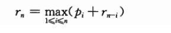
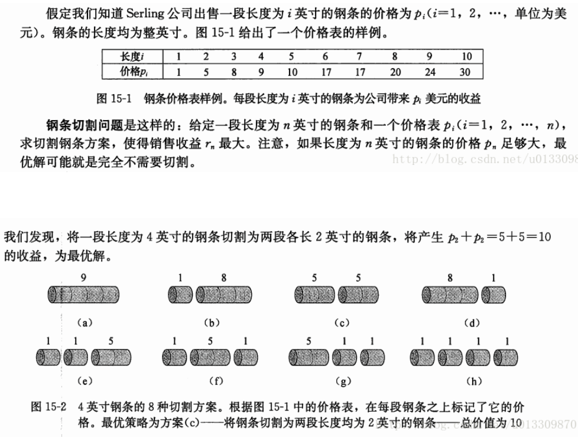

> 难度：中等偏下 完成于2020/7/26
# 解法：   


| 变量  | 描述                    |
| ----- | ----------------------- |
| n     | 钢条长度                |
| i和pi | 长度i的钢条对应的价格pi |
| rn    | 长度为n时，价格最优解   |
| IMAX | 有钢条售价的最大长度 |

- 最优子结构：最优解等于“ 切除一定分量的铁条 的价格 再加上剩下长度铁条的最优解，最优解是从中取出的价格最大值”(`""`里面是一个for循环)
- 重叠子结构：在求每一个rn的时候需要求`r1---r(n-1)`，在求r(n-1)的时候，需要求`r1---r(n-2)`
- 公式
  - 个人觉得这里i还要小于IMAX才比较严谨
<div align="center"></div>


- 体会：


> 题目描述
<div align="center"></div>

- 这里提供三种解法：
  - 直接暴力（不通过记录来剪枝，每个子问题都会被算多次）
  - 备忘录版本（自顶向下求解，记住子问题，对递归进行剪枝）
  - 自底向上的动态规划（不用递归，两重循环）


```cpp

#include <iostream>
#include <string>
#include <stdexcept>
#include <initializer_list>
#include <vector>
#include <algorithm>
using std::string;
using std::cout;
using std::endl;
using std::vector;
using std::max;
class CutSteal{
public:
    CutSteal(const int *ta,int timax):a(ta),imax(timax){};
    void print(){cout << a[3];};
    // 递归
    void cut1(const int);
    // 记录，剪枝
    void cut2(const int);
    void cut3(const int);
private:
    const int *a;
    const int imax;
    vector<int> history;
    int _dfs1(const int);
    int _dfs2(const int);
};

// 1.递归版本
// n：代表现在的钢管多长；res：代表当钢管长度为n时，能取到的最优价。
int CutSteal::_dfs1(const int n){
    int res = 0;
    // 退出条件
    if(n == 0){
        return 0;
    }
    // 当可以取自己的时候i==n，且i <= imax;
    for (size_t i = 1; i <= n && i <= imax; i++) {
        int t = _dfs1(n - i) + a[i];
        res = res < t ? t : res;
    }

    return res;
}

// 1.递归版本
void CutSteal::cut1(const int n){
    cout << _dfs1(n) << endl;
}
// 2.备忘录版本
int CutSteal::_dfs2(const int n){
    int res = 0;
    // 退出条件
    if(n == 0){
        return 0;
    }
    if(history[n] != 0){
        return history[n];
    }
    // 当可以取自己的时候i==n，且i <= imax;
    for (size_t i = 1; i <= n && i <= imax; i++) {
        int t = _dfs1(n - i) + this->a[i];
        res = res < t ? t : res;
    }
    this->history[n]=res;
    return res;
}
// 2.备忘录版本
void CutSteal::cut2(const int n) {
    history.resize(n+1,0);
    cout << _dfs2(n) << endl;
}

void CutSteal::cut3(const int n) {
    history.resize(n+1,0);
    for(size_t i = 1; i <= n; i++){
        int res = 0;
        for(size_t j = 1; j <= i && j <= imax;j++){
            res = max(res,history[i-j] + this->a[j]);
        }
        history[i] = res;
    }
    cout << history[n];
}

int main(){
    int *a= new int[11]{0, 1, 5, 8, 9, 10, 17, 17, 20, 24, 30};
    CutSteal c  = CutSteal(a,4);
    c.cut3(4);
}
```