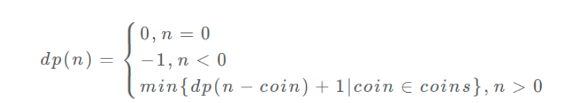

> 题目

给定不同面额的硬币 coins 和一个总金额 amount。编写一个函数来计算可以凑成总金额所需的最少的硬币个数。如果没有任何一种硬币组合能组成总金额，返回 -1。

你可以认为每种硬币的数量是无限的。

- 示例1：
```
输入：coins = [1, 2, 5], amount = 11
输出：3 
解释：11 = 5 + 5 + 1
```

### 解法
- 列出状态转移方程
  - **确定base case**：金额为0的时候，直接返回0.
  - **确定「状态」，也就是原问题和子问题中会变化的变量**：因为硬币的数量无限，所以会变的只有目标金额树，所以唯一状态就是amount
  - **确定「选择」，也就是导致状态产生变化的行为**：目标金额为什么变化呢，因为你在选择硬币，你每选择一枚硬币，就相当于减少了目标金额。所以说所有硬币的面值，就是你的「选择」。
  - **明确 dp 函数/数组的定义**：我们这里讲的是自顶向下的解法，所以会有一个递归的 dp 函数，一般来说函数的参数就是状态转移中会变化的量，也就是上面说到的「状态」；函数的返回值就是题目要求我们计算的量。就本题来说，状态只有一个，即「目标金额」，题目要求我们计算凑出目标金额所需的最少硬币数量。所以我们可以这样定义 dp 函数：
    - **dp(n) 的定义**：输入一个目标金额 n，返回凑出目标金额 n 的最少硬币数量。
    - **dp 数组的定义**：当目标金额为 i 时，至少需要 dp[i] 枚硬币凑出。
  - 根据dp(n) 写出伪代码
    - 先写主体：
    ```py
    def coinChange(coins: List[int], amount: int):

    # 定义：要凑出金额 n，至少要 dp(n) 个硬币
    def dp(n):
        # 做选择，选择需要硬币最少的那个结果
        for coin in coins:
            res = min(res, 1 + dp(n - coin))
        return res

    # 题目要求的最终结果是 dp(amount)
    return dp(amount)
    ```
    - 再写base case，限制穷举的结束
    ```py
    def coinChange(coins: List[int], amount: int):

    def dp(n):
        # base case
        if n == 0: return 0
        if n < 0: return -1
        # 求最小值，所以初始化为正无穷
        res = float('INF')
        for coin in coins:
            subproblem = dp(n - coin)
            # 子问题无解，跳过
            if subproblem == -1: continue
            res = min(res, 1 + subproblem)

        return res if res != float('INF') else -1

    return dp(amount)
    ```

至此，得到状态转移方程：
<div style="zoom:60%" align="center"></div>

- 这道题不适合状态压缩
```cpp
// 方法1：穷举
int coinChange1(const vector<int>& coins, int amount){
    // 状态为 amount
    int res = -1;
    int subProblem;
    // base case
    if(amount < 0) return -1;
    else if(amount == 0) return 0;
    // 确定选择，导致状态产生变化的行为，就是对硬币的选择
    for(auto i:coins){
        subProblem = coinChange1(coins,amount-i);
        if(subProblem == -1) continue;
        if(res == -1)
            res = subProblem+1;
        else
            res = min(subProblem+1,res);
    }
    return res;
}

// 方法2：备忘录
map<int,int> memo;
int coinChange2(const vector<int>& coins, int amount){
    int res = -1;
    int subProblem;
    if(amount < 0) return -1;
    for(auto i:coins){
        if(memo.find(amount-i) != memo.end())
            subProblem = memo[amount-i];
        else
            subProblem = coinChange1(coins,amount-i);
        if(subProblem == -1) continue;
        if(res == -1) res = subProblem+1;
        else res = min(subProblem+1,res);
    }
    return res;
}

// 方法3：DP table 自底向上,这个时候因为不是递归，可以保存最终想要，所以初始化可以变一个值
int coinChange3(const vector<int>& coins, int amount){
    vector<int> dp(amount+1, amount+1);
    // base case
    dp[0] = 0;

    // 从amount=1开始，自底向上
    for(int i = 1;i <= amount; i++){
        // 选择状态
        for(auto c : coins){
            if(i - c < 0 ) continue;
            // 如果未被初始化过
            dp[i] = min(dp[i-c]+1,dp[i]);

        }
    }
    return dp[amount] == amount+1? -1:dp[amount];
}
```