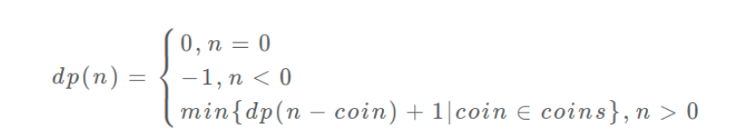

# 简介
> https://labuladong.gitbook.io/algo/dong-tai-gui-hua-xi-lie/1.1-dong-tai-gui-hua-ji-ben-ji-qiao/dong-tai-gui-hua-xiang-jie-jin-jie

- 一般形式：动态规划问题的一般形式就是求**最值**。
- 核心问题：求解动态规划的核心问题是**穷举**。把所有的答案穷举出来，找到最合适的。

- 动态规划三要素：
  - **重叠子问题**：在穷举中有重叠子问题。导致穷举效率低，所以需要 **「备忘录」** 或者 **「DP table」** 来优化穷举过程，避免不必要的计算。
  - **最优子结构**：**具备「最优子结构」**，才能通过子问题的最值得到原问题的最值。
  - **状态转移方程（最难的地方）**：虽然动态规划的核心思想就是穷举求最值，但是问题可以千变万化，穷举所有可行解其实并不是一件容易的事，**只有列出正确的「状态转移方程」才能正确地穷举**。

- 关于什么是最优子结构
  - 比如说，假设你考试，每门科目的成绩都是互相独立的。你的原问题是考出最高的总成绩，那么你的子问题就是要把语文考到最高，数学考到最高…… 为了每门课考到最高，你要把每门课相应的选择题分数拿到最高，填空题分数拿到最高…… 当然，最终就是你每门课都是满分，这就是最高的总成绩。
  - 得到了正确的结果：最高的总成绩就是总分。因为这个过程符合最优子结构，“每门科目考到最高”这些子问题是互相独立，互不干扰的。
  - 但是，如果加一个条件：你的语文成绩和数学成绩会互相制约，数学分数高，语文分数就会降低，反之亦然。这样的话，显然你能考到的最高总成绩就达不到总分了，按刚才那个思路就会得到错误的结果。因为子问题并不独立，语文数学成绩无法同时最优，所以最优子结构被破坏。

- 思考状态转移方程的思维框架
  - 明确base case -> 明确「状态」-> 明确「选择」 -> 定义 dp 数组/函数的含义
  - 最后可以套以下框架：
  ```py
  # 初始化 base case
    dp[0][0][...] = base
    # 进行状态转移
    for 状态1 in 状态1的所有取值：
        for 状态2 in 状态2的所有取值：
            for ...
                dp[状态1][状态2][...] = 求最值(选择1，选择2...)
  ```

# 题目
## 斐波那契
> 这里讲的真好：https://labuladong.gitbook.io/algo/dong-tai-gui-hua-xi-lie/1.1-dong-tai-gui-hua-ji-ben-ji-qiao/dong-tai-gui-hua-xiang-jie-jin-jie
- 入门级的DP，但是不是严格上的DP，因为不满足**最优子结构**特性
- 方法（逐渐优化）
  1. 递归暴力，画出递归树，看看**重叠子问题**
  2. 备忘录，同样是自顶向下
  3. DP table，在备忘录基础上自底向上，需要**确定base case**
  4. DP 状态压缩，在3的基础上在空间中进行优化

- 代码：
```cpp
// 方法1：穷举解法
int fib1(int n){
    if(n == 1 || n == 2)
        return 1;
    return fib1(n-1) + fib1(n-2);
}

// 方法2：备忘录,自顶向下
// 一般是map或者vector
struct fib2{
    fib2(){memo[1] = 1;memo[2] = 1;}
    map<int,int> memo;
    int operator()(int n){
        if(memo.find(n) != memo.end())
            return memo[n];
        memo[n] = this->operator()(n-1)+this->operator()(n-2);
        return memo[n];
    }

};

// 方法3：dp table，自底向上
// 效率是和备忘录一样的，只是反过来了
int fib3(int n){
    vector<int> dp(n+1,0);
    dp[1] = 1;
    dp[2] = 1;
    for(int i = 3; i <= n; ++i){
        dp[i] = dp[i-1] + dp[i-2];
    }
    return dp[n];
}

// 方法4:dp + 状态压缩
int fib4(int n){
    if(n == 0) return 0;
    vector<int> dp(2,0);
    dp[0] = 1;
    dp[1] = 1;
    for(int i = 2; i < n; ++i){
        dp[i%2] = dp[(i-1)%2] + dp[i%2];
    }
    return dp[(n-1)%2];
}

void test(){
    cout<<fib4(4);
}
```
## 凑零钱问题
> 题目

给定不同面额的硬币 coins 和一个总金额 amount。编写一个函数来计算可以凑成总金额所需的最少的硬币个数。如果没有任何一种硬币组合能组成总金额，返回 -1。

你可以认为每种硬币的数量是无限的。

- 示例1：
```
输入：coins = [1, 2, 5], amount = 11
输出：3 
解释：11 = 5 + 5 + 1
```

### 解法
- 列出状态转移方程
  - **确定base case**：金额为0的时候，直接返回0.
  - **确定「状态」，也就是原问题和子问题中会变化的变量**：因为硬币的数量无限，所以会变的只有目标金额树，所以唯一状态就是amount
  - **确定「选择」，也就是导致状态产生变化的行为**：目标金额为什么变化呢，因为你在选择硬币，你每选择一枚硬币，就相当于减少了目标金额。所以说所有硬币的面值，就是你的「选择」。
  - **明确 dp 函数/数组的定义**：我们这里讲的是自顶向下的解法，所以会有一个递归的 dp 函数，一般来说函数的参数就是状态转移中会变化的量，也就是上面说到的「状态」；函数的返回值就是题目要求我们计算的量。就本题来说，状态只有一个，即「目标金额」，题目要求我们计算凑出目标金额所需的最少硬币数量。所以我们可以这样定义 dp 函数：
    - **dp(n) 的定义**：输入一个目标金额 n，返回凑出目标金额 n 的最少硬币数量。
    - **dp 数组的定义**：当目标金额为 i 时，至少需要 dp[i] 枚硬币凑出。
  - 根据dp(n) 写出伪代码
    - 先写主体：
    ```py
    def coinChange(coins: List[int], amount: int):

    # 定义：要凑出金额 n，至少要 dp(n) 个硬币
    def dp(n):
        # 做选择，选择需要硬币最少的那个结果
        for coin in coins:
            res = min(res, 1 + dp(n - coin))
        return res

    # 题目要求的最终结果是 dp(amount)
    return dp(amount)
    ```
    - 再写base case，限制穷举的结束
    ```py
    def coinChange(coins: List[int], amount: int):

    def dp(n):
        # base case
        if n == 0: return 0
        if n < 0: return -1
        # 求最小值，所以初始化为正无穷
        res = float('INF')
        for coin in coins:
            subproblem = dp(n - coin)
            # 子问题无解，跳过
            if subproblem == -1: continue
            res = min(res, 1 + subproblem)

        return res if res != float('INF') else -1

    return dp(amount)
    ```

至此，得到状态转移方程：
<div style="zoom:60%" align="center"></div>

- 这道题不适合状态压缩
```cpp
// 方法1：穷举
int coinChange1(const vector<int>& coins, int amount){
    // 状态为 amount
    int res = -1;
    int subProblem;
    // base case
    if(amount < 0) return -1;
    else if(amount == 0) return 0;
    // 确定选择，导致状态产生变化的行为，就是对硬币的选择
    for(auto i:coins){
        subProblem = coinChange1(coins,amount-i);
        if(subProblem == -1) continue;
        if(res == -1)
            res = subProblem+1;
        else
            res = min(subProblem+1,res);
    }
    return res;
}

// 方法2：备忘录
map<int,int> memo;
int coinChange2(const vector<int>& coins, int amount){
    int res = -1;
    int subProblem;
    if(amount < 0) return -1;
    for(auto i:coins){
        if(memo.find(amount-i) != memo.end())
            subProblem = memo[amount-i];
        else
            subProblem = coinChange1(coins,amount-i);
        if(subProblem == -1) continue;
        if(res == -1) res = subProblem+1;
        else res = min(subProblem+1,res);
    }
    return res;
}

// 方法3：DP table 自底向上,这个时候因为不是递归，可以保存最终想要，所以初始化可以变一个值
int coinChange3(const vector<int>& coins, int amount){
    vector<int> dp(amount+1, amount+1);
    // base case
    dp[0] = 0;

    // 从amount=1开始，自底向上
    for(int i = 1;i <= amount; i++){
        // 选择状态
        for(auto c : coins){
            if(i - c < 0 ) continue;
            // 如果未被初始化过
            dp[i] = min(dp[i-c]+1,dp[i]);

        }
    }
    return dp[amount] == amount+1? -1:dp[amount];
}
```