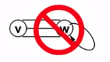
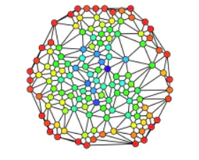
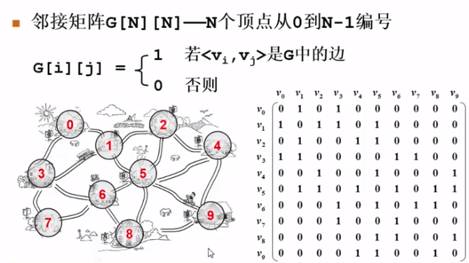
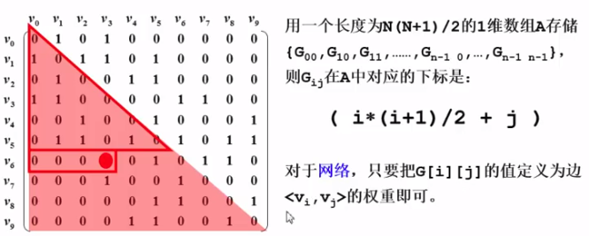
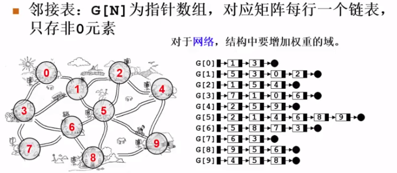
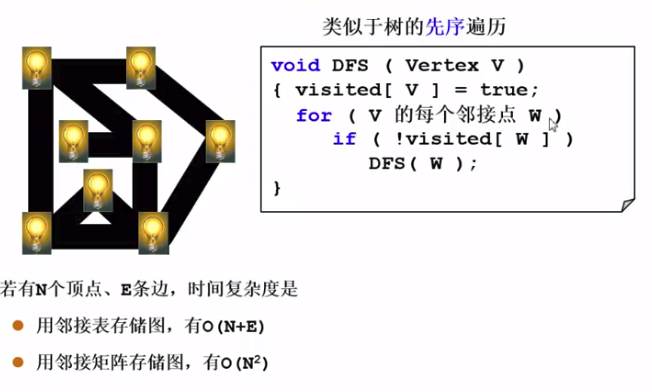
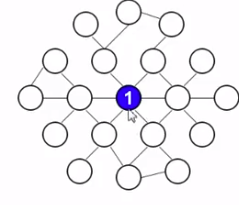
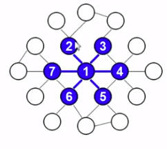
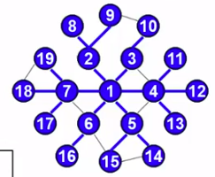
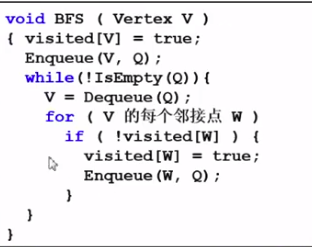

# 什么是图
- 图：一种多对多的关系
- 线性表和树都可以理解为图的特殊情况
- 顶点：通常用V（Vertex）来表示顶点集合
- 边：通常用E(Edge)表示边的集合，边是顶点对。
  - 无向边(v，w) ∈ E，其中v,w ∈ V
  - 有向边<v，w> ∈ E，其中v,w ∈ V
  - 不考虑重边和自回路

 
有向边和无向边

 
重边和自回路

- 邻接点：与某顶点有边直接相连的顶点
- 度：
  - 入度：指向该点的边数
  - 出度：从该点出发的边数
- 稀疏图，稠密图，完全图
  - 稀疏图：点很多，边很少
  - 稠密图：比较接近能拥有的最大边数的图。
  - 完全图：每个点两两连接。邻接矩阵中都是1。

 
稀疏图

 
稠密图和完全图

## 抽象数据类型定义

- 类型名称：图（Graph）
- 数据对象集：G(V,E)由一个非空的有限顶点集合V和一个有限边集合E组成。
  - 可以没有边，但是一定要有一个顶点。
- 操作集：

#图的表示
- 下面介绍两种表示图的方法，但实际上不止，取决于要解决的问题。
## 邻接矩阵表示法

 

> 好处
- 直观，好理解
- 方便检查任意一堆顶点间是否存在边。
  - 无向图：判断其行有没有`1`
  - 有向图：判断其行和列有没有`1`
- 方便找任一顶点的所有邻接点
- 方便计算任意顶点的度
  - 无向图：只需要遍历对应行或列
  - 有向图：`出度`遍历`行`。`入度`遍历`列`

> 缺点
- 浪费空间：在存稀疏图的时候有大量无效元素
  - 对稠密图（特别是完全图）还是很合算的
- 浪费时间：统计稀疏图中一共有多少条边

> 问题

- 对于无向图的存储，怎样可以省一半空间。
  - 对于网络vi和vj之间没有边怎么表示？因为可能存在0也有意义。

 

## 邻接表
- 邻接表是一个链表的集合
- 每个链表节点是不按顺序的

 

> 空间优缺评判
- 一条边的表示需要两个链表节点，比如(5, 9)。
- 而且每个链表节点还需要一个指针指向下一个
- 对于网络，结构中还要增加权重的域。
- 综上：一定要够稀疏才合算。

> 好处
- 方便找任一顶点的所有"邻接点"
  - 这个只针对无向图，只要顺着自身链表一直走下去，没有不必要的0点
- 节约稀疏图空间
  - 若N个节点，E条边。无向图需要N个头指针+2E个节点(每个节点至少两个域)。
- 方便计算任一顶点的“度”？
  - 对于”无向图“：的确
  - 对于”有向图“：只能计算出度，因为链表只是表示节点指出；需要构造”逆邻接表“(存指向自己自己的边)来方便计算"入度"
- 方便检查任意一对顶点间是否存在边？
  - 这对邻接表是一个比较麻烦的事情

# 图的遍历
## DFS
- 先选一个入口，然后选择还没遍历过的一个访问，做标记。如果周围都是访问过了的，直接回溯
  - 如果在遍历的过程中访问到入口且身边的都已经访问过了，不要退出，直接回溯

 

> 时间复杂度

- 参考：https://blog.csdn.net/wusecaiyun/article/details/49562451
- 每个顶点最多调用一次dfs，这里邻接表和邻接矩阵中共同确定了n。
- 接下来讨论dfs中的for
  - 邻接矩阵的比较好理解，每个顶点都是一样的需要遍历n次，所以是o(n^2)。
  - 邻接表中的for，和n没有关系，其遍历次数不稳定，但是因为邻接表的性质：链表节点为2e。所以所有的for遍历的次数，加起来是2e，所以时间复杂度为o(n+e)。

## BFS

- 代码如下

- 时间复杂度
  - 邻接矩阵：o(N^2)
  - 邻接表：o(N+E)

