- 分治：将大问题转化成子问题，子问题相互独立且和原问题性质相同。将子问题的解合并，就可以得到原问题的解。如归并排序

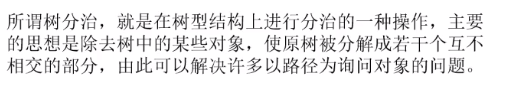

- 数分治
  - 点分治
  - 边分治

# 例子

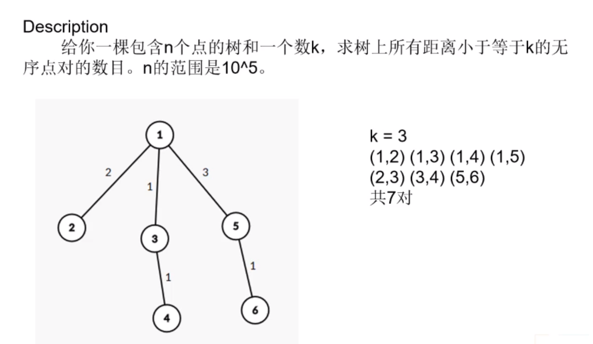

- 如果用暴力来解时间复杂度是n^2的

> 采用点分治

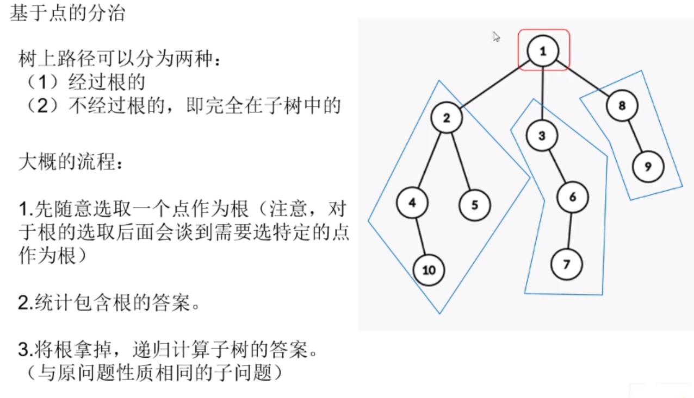

> 复杂度分析

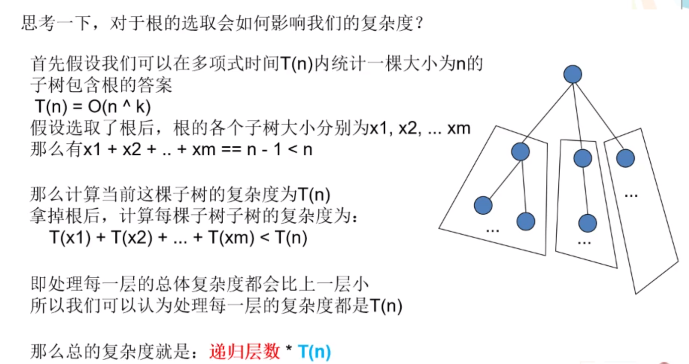

> 提高复杂度关键——树的重心

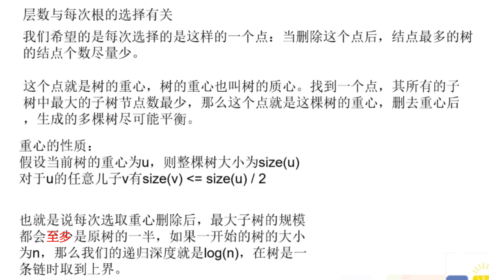

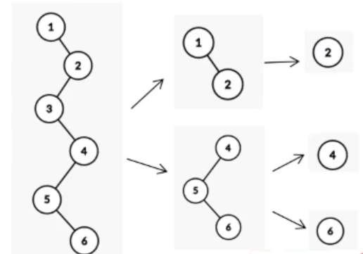

> 重心性质证明

> 找重心代码

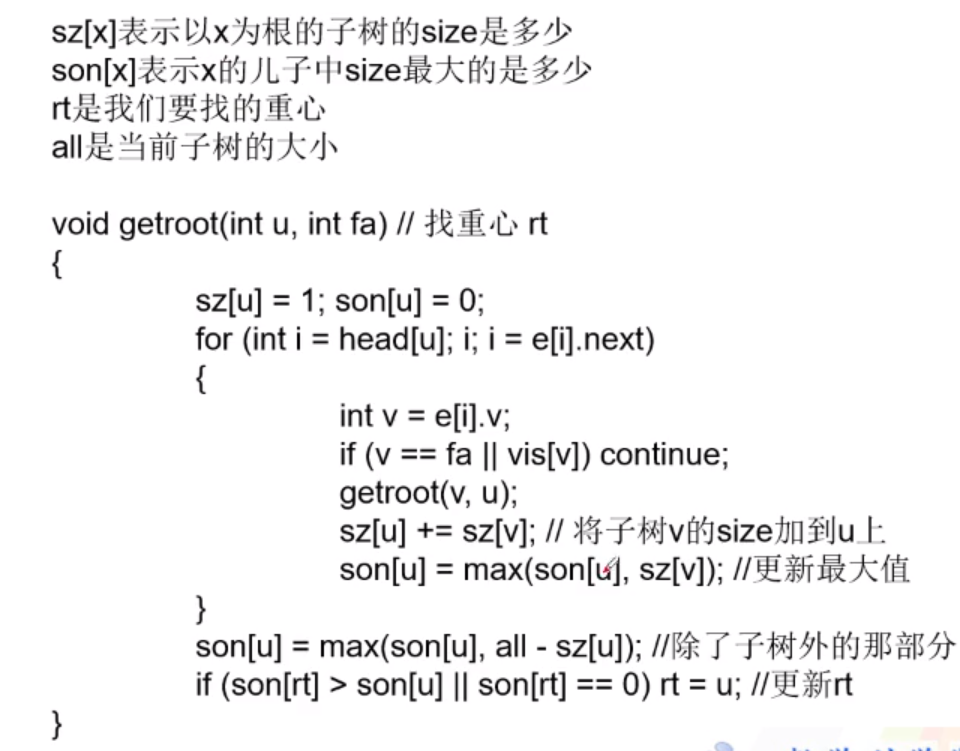

> 基于点分治来分析

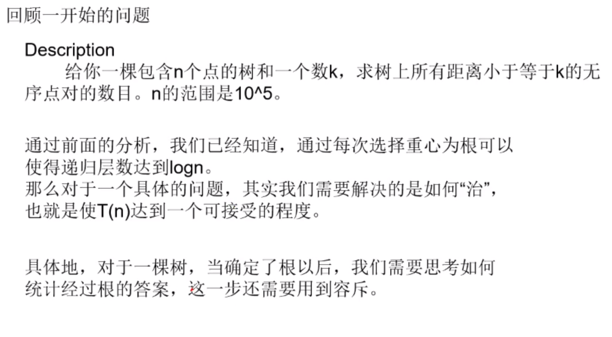

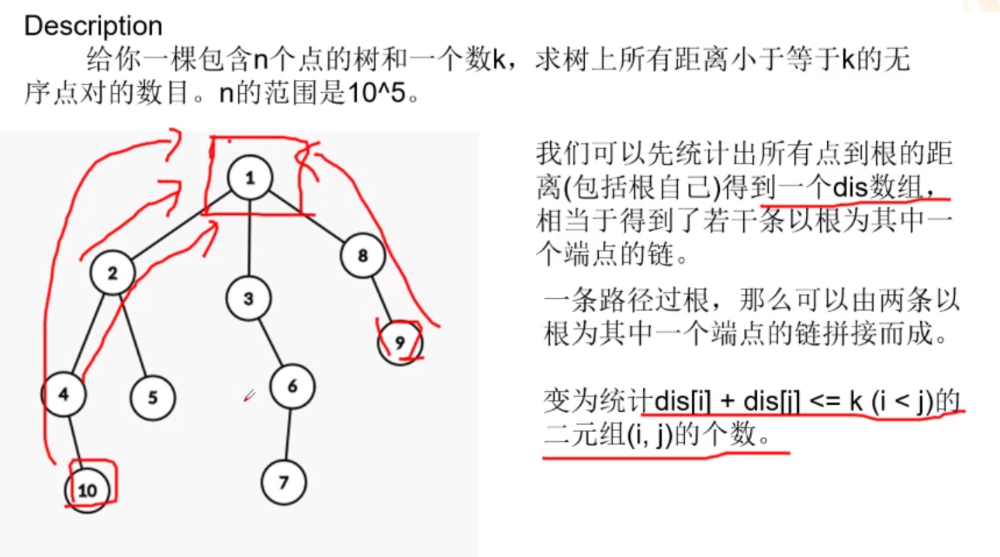

  

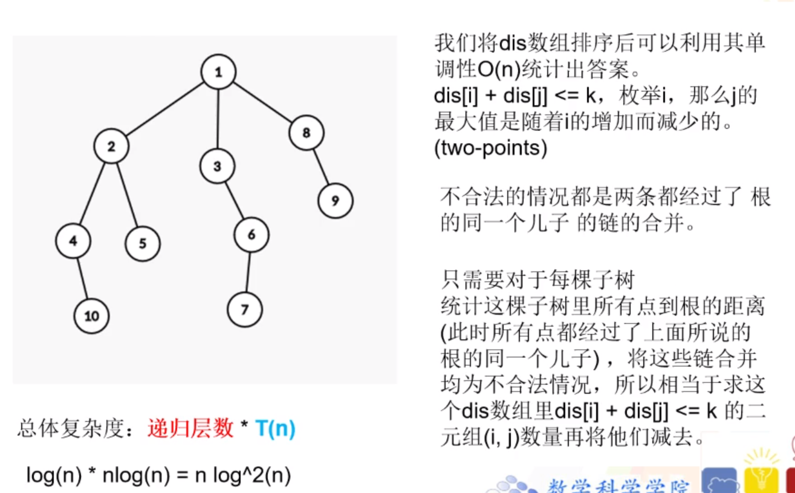

  

> 代码

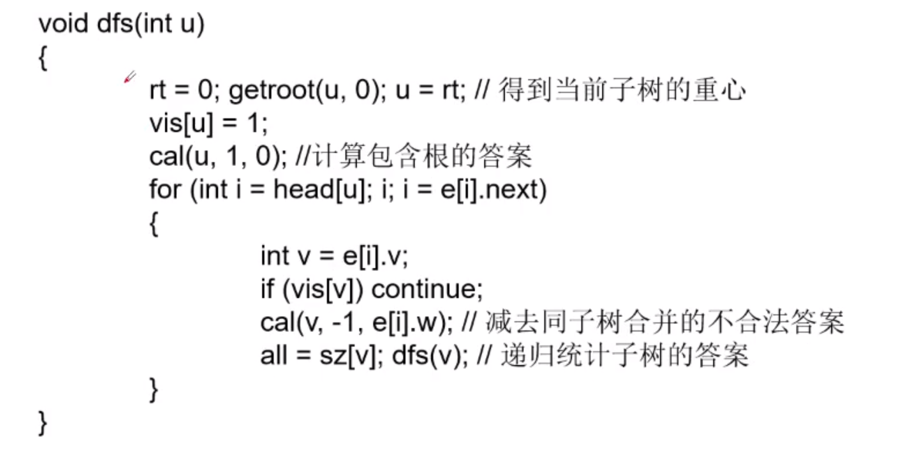

  

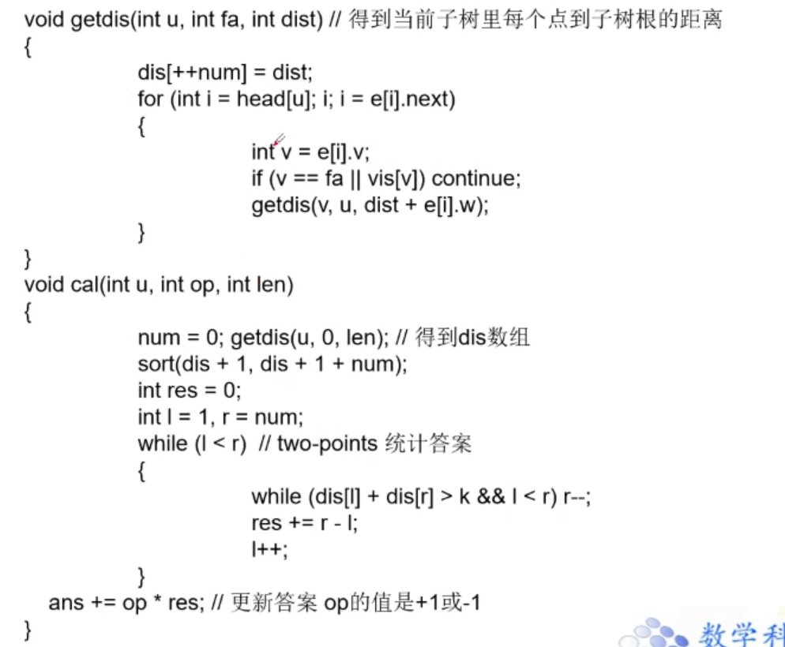

  

> 总结

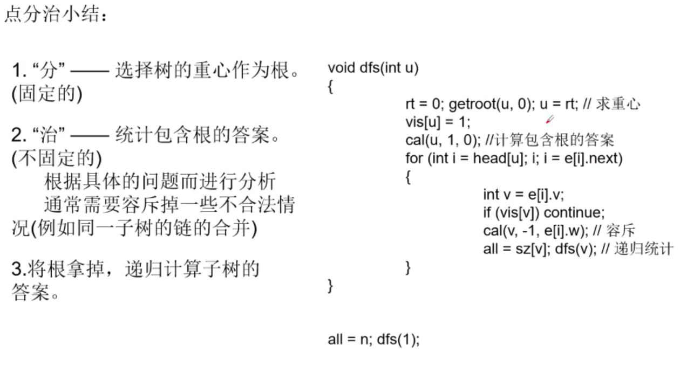

  