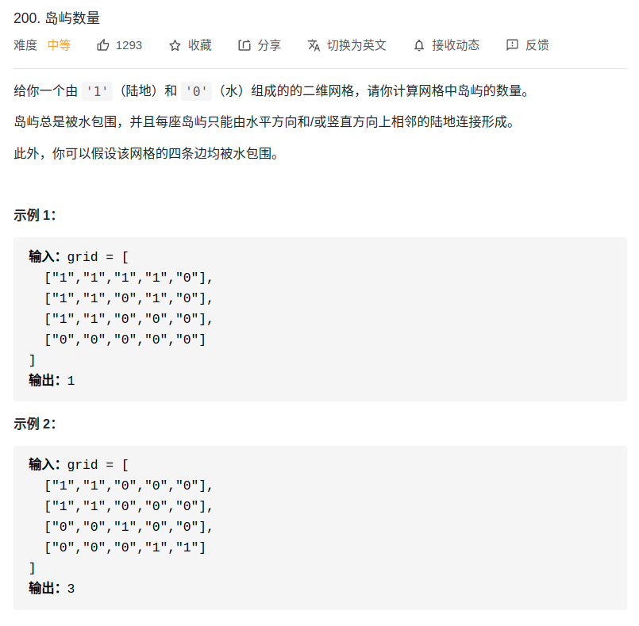

> 难度：简单
- BFS
- 思路：发现陆地后消除与该陆地相连的陆地（消除岛屿）

> 题目

<div align="center" style="zoom:80%"></div>

> 代码

```cpp
class Solution {
public:
    void bfs(vector<vector<char>>& grid, int x, int y){
        int u,b,l,r;
        u = 0;
        b = grid.size();
        l = 0;
        r = grid[0].size();

        int d[4][2]{{0,1},{1,0},{-1,0},{0,-1}};
        queue<pair<int,int> > que;
        que.push({x,y});
        while(!que.empty()){
            auto t = que.front();
            que.pop();
            for(int i = 0; i < 4; ++i){
                auto posx = d[i][0] + t.first;
                auto posy = d[i][1] + t.second;
                if(posx >= u && posx < b && posy >= l && posy < r){// 边界控制
                    if(grid[posx][posy] == '1'){
                        grid[posx][posy] = '0';
                        que.push({posx, posy});
                    }
                }
            }
        }
    }
    int numIslands(vector<vector<char>>& grid) {
        int res = 0;
        for(int i = 0; i < grid.size(); ++i){
            for(int j = 0; j < grid[0].size(); ++j){
                if(grid[i][j] == '1'){
                    bfs(grid,i,j);
                    ++res;
                }
            }
        }
        return res;
    }
};
```