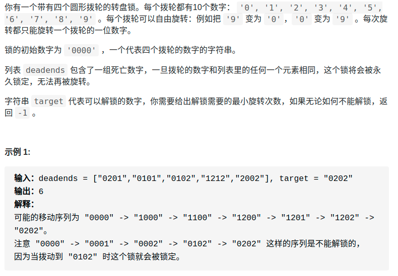

> 难度：简单

- BFS
- 比如说从 "0000" 开始，转一次，可以穷举出 "1000", "9000", "0100", "0900"... 共 8 种密码。然后，再以这 8 种密码作为基础，对每个密码再转一下，穷举出所有可能
- **仔细想想，这就可以抽象成一幅图，每个节点有 8 个相邻的节点**，又让你求最短距离，这不就是典型的 BFS 嘛
> 题目
<div align="center" style="zoom:80%"></div>

> 代码

```cpp
class Solution {
public:
    set<string> record;
    set<string> deads;
    map<char,vector<char>> trans{
            {'0',{'9','1'}},
            {'1',{'0','2'}},
            {'2',{'1','3'}},
            {'3',{'2','4'}},
            {'4',{'3','5'}},
            {'5',{'4','6'}},
            {'6',{'5','7'}},
            {'7',{'6','8'}},
            {'8',{'7','9'}},
            {'9',{'8','0'}},
    };
    int openLock(vector<string>& deadends, string target) {
        if(find(deadends.begin(), deadends.end(), "0000") != deadends.end()){
            return -1;
        }
        if(target == "0000" ){
            return 0;
        }
        for(auto d : deadends){
            deads.insert(d);
        }


        queue<string> q;
        int depth = 1;
        q.push("0000");
        record.insert("0000");
        while(!q.empty()){
            int sz = q.size();
            for(int i = 0; i < sz; ++i){
                auto s = q.front();
                q.pop();
                for(int j = 0; j < 4; ++j){
                    string temp = s;

                    char c = temp[j];
                    temp[j] = trans[c][0];
                    if(temp == target)
                        return depth;
                    if(deads.find(temp) == deads.end() && record.find(temp) == record.end()){
                        q.push(temp);
                        record.insert(temp);
                    }

                    temp[j] = trans[c][1];
                    if(temp == target)
                        return depth;
                    if(deads.find(temp) == deads.end() && record.find(temp) == record.end()){
                        q.push(temp);
                        record.insert(temp);
                    }
                }

            }

            depth++;
        }
        return -1;
    }
};

```
```
执行用时：488 ms, 在所有 C++ 提交中击败了15.28%的用户
内存消耗：31.4 MB, 在所有 C++ 提交中击败了70.71%的用户
```