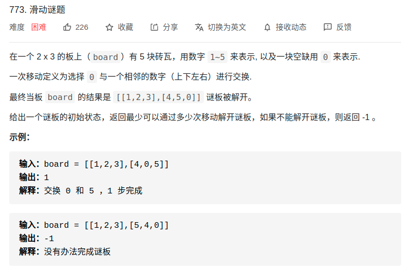
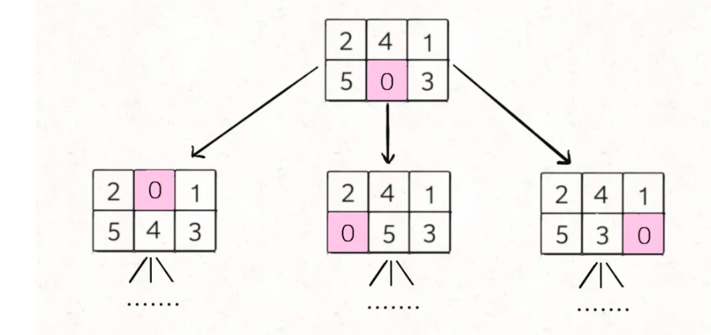

> 难度：中等
- 思路：BFS
  - 通过最小步数联想到


> 题目
- https://mp.weixin.qq.com/s/Xn-oW7QRu8spYzL3B6zLxw

<div align="center" style="zoom:80%"></div>

- 对于这种计算最小步数的问题，我们就要敏感地想到 BFS 算法。
- BFS 算法并不只是一个寻路算法，而是一种暴力搜索算法，只要涉及暴力穷举的问题，BFS 就可以用，而且可以最快地找到答案
- 决策树如下
<div align="center" style="zoom:80%"></div>

> 代码

```cpp
class Solution {
public:
    // 扁平化数组
	map<int, vector<int>> neg = { 
		{0,{1,3}},
		{1,{0,2,4}},
		{2,{1,5}},
		{3,{0,4}},
		{4,{1,3,5}},
		{5,{2,4}},
	};
	int slidingPuzzle(vector<vector<int>>& board) {
		queue<string> q;
		set<string> record;
		string boardStr;
		string target = "123450";
		int heigh = 1;
		for (auto &x : board) {
			for (auto &y : x) {
				boardStr = boardStr + char(y + '0');
			}
		}
		if (boardStr == target)
			return 0;

		q.push(boardStr);
		while (!q.empty()) {
			int num = q.size();
			for (int i = 0; i < num; ++i) {

				auto s = q.front();
				q.pop();
				auto pos = s.find('0');
				// 交换位置
				for (auto j : neg[pos]) {
					string ts = s;
					swap(ts[j], ts[pos]);
					if (ts == target)
						return heigh;
					if (record.find(ts) == record.end()) {
						record.insert(ts);
						q.push(ts);
					}
				}
			}
			
			++heigh;
		}
		return -1;

	}
};
```