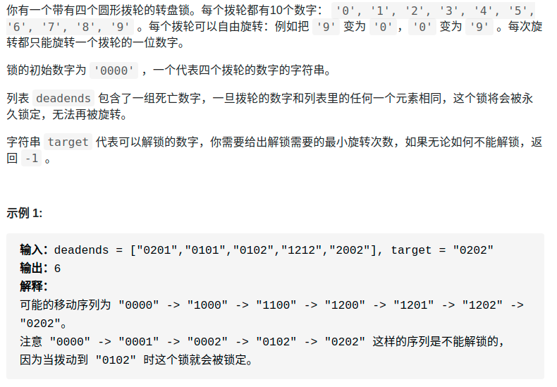
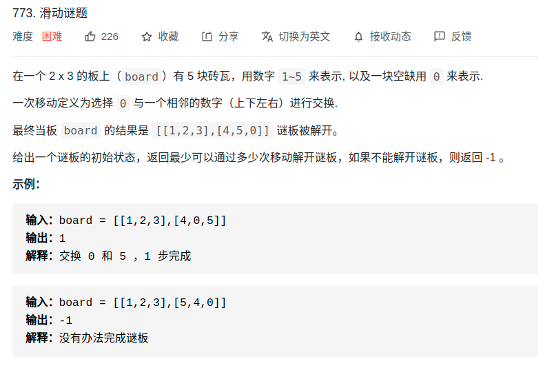

> https://labuladong.gitbook.io/algo/mu-lu-ye-3/mu-lu-ye-1/bfs-kuang-jia

# 概述
- 这类题的本质就是让你在一幅「图」中找到从起点 start 到终点 target 的最近距离

> 框架
```cpp
// 计算从起点 start 到终点 target 的最近距离
int BFS(Node start, Node target) {
    Queue<Node> q; // 核心数据结构
    Set<Node> visited; // 避免走回头路

    q.offer(start); // 将起点加入队列
    visited.add(start);
    int step = 0; // 记录扩散的步数

    while (q not empty) {
        // !!!重点
        int sz = q.size();
        /* 将当前队列中的所有节点向四周扩散 */
        for (int i = 0; i < sz; i++) {
            Node cur = q.poll();
            /* 划重点：这里判断是否到达终点 */
            if (cur is target)
                return step;
            /* 将 cur 的相邻节点加入队列 */
            for (Node x : cur.adj())
                if (x not in visited) {
                    q.offer(x);
                    visited.add(x);
                }
        }
        /* 划重点：更新步数在这里 */
        step++;
    }
}
```

# demo

## leetcode752:解开密码锁的最少次数
<div align="center" style="zoom:80%"></div>


- 比如说从 "0000" 开始，转一次，可以穷举出 "1000", "9000", "0100", "0900"... 共 8 种密码。然后，再以这 8 种密码作为基础，对每个密码再转一下，穷举出所有可能
- **仔细想想，这就可以抽象成一幅图，每个节点有 8 个相邻的节点**，又让你求最短距离，这不就是典型的 BFS 嘛

## leetcode773
- https://mp.weixin.qq.com/s/Xn-oW7QRu8spYzL3B6zLxw

<div align="center" style="zoom:80%"></div>

- 对于这种计算最小步数的问题，我们就要敏感地想到 BFS 算法。
- BFS 算法并不只是一个寻路算法，而是一种暴力搜索算法，只要涉及暴力穷举的问题，BFS 就可以用，而且可以最快地找到答案
- 决策树如下
<div align="center" style="zoom:80%"></div>