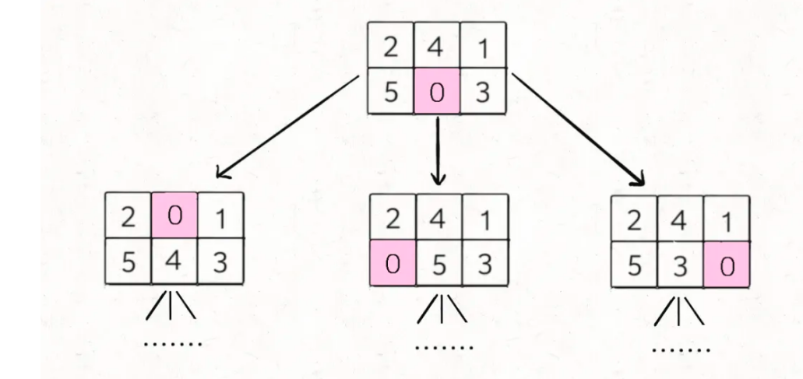
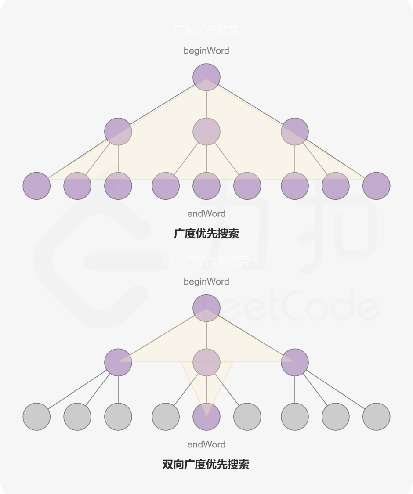

> https://labuladong.gitbook.io/algo/mu-lu-ye-3/mu-lu-ye-1/bfs-kuang-jia

# 概述
- 这类题的本质就是让你在一幅「图」中找到从起点 start 到终点 target 的最近距离

> 框架
```cpp
// 计算从起点 start 到终点 target 的最近距离
int BFS(Node start, Node target) {
    Queue<Node> q; // 核心数据结构
    Set<Node> visited; // 避免走回头路

    q.offer(start); // 将起点加入队列
    visited.add(start);
    int step = 0; // 记录扩散的步数

    while (q not empty) {
        // !!!重点
        int sz = q.size();
        /* 将当前队列中的所有节点向四周扩散 */
        for (int i = 0; i < sz; i++) {
            Node cur = q.poll();
            /* 划重点：这里判断是否到达终点 */
            if (cur is target)
                return step;
            /* 将 cur 的相邻节点加入队列 */
            for (Node x : cur.adj())
                if (x not in visited) {
                    q.offer(x);
                    visited.add(x);
                }
        }
        /* 划重点：更新步数在这里 */
        step++;
    }
}
```

# demo

## leetcode752:解开密码锁的最少次数
<div align="center" style="zoom:80%"></div>


- 比如说从 "0000" 开始，转一次，可以穷举出 "1000", "9000", "0100", "0900"... 共 8 种密码。然后，再以这 8 种密码作为基础，对每个密码再转一下，穷举出所有可能
- **仔细想想，这就可以抽象成一幅图，每个节点有 8 个相邻的节点**，又让你求最短距离，这不就是典型的 BFS 嘛

## leetcode773
- https://mp.weixin.qq.com/s/Xn-oW7QRu8spYzL3B6zLxw

<div align="center" style="zoom:80%"></div>

- 对于这种计算最小步数的问题，我们就要敏感地想到 BFS 算法。
- BFS 算法并不只是一个寻路算法，而是一种暴力搜索算法，只要涉及暴力穷举的问题，BFS 就可以用，而且可以最快地找到答案.
  - 什么情况没法完成呢？就是要维护一个记录，已经有了的状态就不再放入队列，这样队列为空就退出
- 决策树如下
<div align="center" style="zoom:80%"></div>

# 双向BFS
- 本质：从终点和起点同时出发，进行BFS（由此可见需要两个队列），如果这两个方向碰头了，那么就是最优的结果。这样有个好处，可以减少许多遍历的情况，当BFS超时，可以想到这样的方案。
<div align="center" style="zoom:80%"></div>

<div align="center" style="zoom:80%"></div>


<div align="center" style="zoom:80%"></div>

```cpp
class Solution {
public:
    vector<vector<int>> graph;
    unordered_map<string,bool> record;
    unordered_map<string,bool> dict;
    unordered_map<string,int> strToIndex;

    int ladderLength(string beginWord, string endWord, vector<string>& wordList) {
        // init
        for (int i = 0; i < wordList.size(); ++i){
            dict[wordList[i]] = true;
            strToIndex[wordList[i]] = i;
        }
        if(dict.count(beginWord) == 0){
            dict[beginWord] = true;
            wordList.push_back(beginWord);
            strToIndex[beginWord] = wordList.size()-1;
        }
        // check
        if( dict.count(endWord) == 0)
            return 0;
        if(beginWord == endWord)
            return 1;

        // init graph
        graph = vector<vector<int>>(wordList.size(),vector<int>(0,0));
        for(int i = 0; i < wordList.size(); ++i){
            graph[i] = check(wordList[i]);
        }

        // 双向bfs
        queue<int> queStart;
        queue<int> queEnd;
        unordered_set<string> visitStart;
        unordered_set<string> visitEnd;

        // 双向BFS核心
        // init que
        queStart.push(strToIndex[beginWord]);
        queEnd.push(strToIndex[endWord]);
        visitStart.insert(beginWord);
        visitEnd.insert(endWord);
        record[beginWord] = true;
        record[endWord] = true;

        auto res = 1;
        while(!queStart.empty() || !queEnd.empty()){
            // 重点理解queEnd.empty() ||
            if(queEnd.empty() ||  queStart.size() < queEnd.size() ){
                auto n = queStart.size();
                while(n > 0){
                    auto t = queStart.front();
                    queStart.pop();
                    for(auto v : graph[t]){
                        // 必须要在后一个if之前，避免死循环
                        if(visitEnd.count(wordList[v]) != 0)
                            return res+1;

                        if(record.count(wordList[v]) != 0)
                            continue;
                        record[wordList[v]] = true;
                        visitStart.insert(wordList[v]);
                        queStart.push(v);
                    }
                    --n;
                }
            }else{
                auto n = queEnd.size();
                while(n > 0){
                    auto t = queEnd.front();
                    queEnd.pop();
                    for(auto v : graph[t]){
                        if(visitStart.count(wordList[v]) != 0)
                            return res+1;

                        if(record.count(wordList[v]) != 0)
                            continue;
                        record[wordList[v]] = true;
                        visitEnd.insert(wordList[v]);
                        queEnd.push(v);
                    }
                    --n;
                }
            }
            ++res;
        }

        return 0;
    }

    // check 给出source邻接的点
    vector<int> check(string source){
        vector<int> rtn;
        for(int i = 0; i < source.size(); ++i){
            for(int c = 'a'; c <= 'z'; ++c){
                if(source[i] != c){
                    auto t = source[i];
                    source[i] = c;
                    if(dict.count(source) != 0){
                        rtn.push_back(strToIndex[source]);
                    }
                    source[i] = t;
                }
            }
        }
        return rtn;
    }

};
```