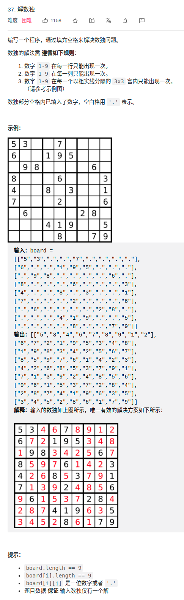

> 难度：简单
- dfs

> 题目
<div align="center" style="zoom:80%"></div>

> 代码

```cpp
class Solution {
public:
    set<char> cube[3][3];
    set<char> line[9];
    set<char> col[9];
    void solveSudoku(vector<vector<char>>& board) {
        for(int i = 0; i < 9; ++i){
            for(int j = 0; j < 9; ++j){
                if(board[i][j]=='.')
                    continue;
                cube[i/3][j/3].insert(board[i][j]);
                line[i].insert(board[i][j]);
                col[j].insert(board[i][j]);
            }
        }

        dfs(board,0,0);
    }

    bool dfs(vector<vector<char>>& board, int x, int y){
        if(x == 9 )
            return true;
        if(board[x][y] != '.'){
            if(y < 8)
                return dfs(board, x, y+1);
            else
                return dfs(board,x+1, 0);
        }

        for(int i = 1; i <=9; ++i){
            if(!check(x, y, i+'0'))
                continue;

            line[x].insert(i+'0');
            col[y].insert(i+'0');
            cube[x/3][y/3].insert(i+'0');
            board[x][y] = i+'0';
            if(y < 8){
                if(dfs(board, x, y+1))
                    return true;
            }else{
                auto t = dfs(board, x+1, 0);
                if(t){
                    return true;
                }
            }
            board[x][y] = '.';
            line[x].erase(i+'0');
            col[y].erase(i+'0');
            cube[x/3][y/3].erase(i+'0');
        }
        return false;

    }
    bool check(int x, int y, int val){
        if(line[x].find(val) != line[x].end())
            return false;

        if(col[y].find(val) != col[y].end())
            return false;

        if(cube[x/3][y/3].find(val) != cube[x/3][y/3].end())
            return false;
        return true;
    }
};
```

```
执行用时：92 ms, 在所有 C++ 提交中击败了7.80%的用户
内存消耗：21.9 MB, 在所有 C++ 提交中击败了5.01%的用户
```