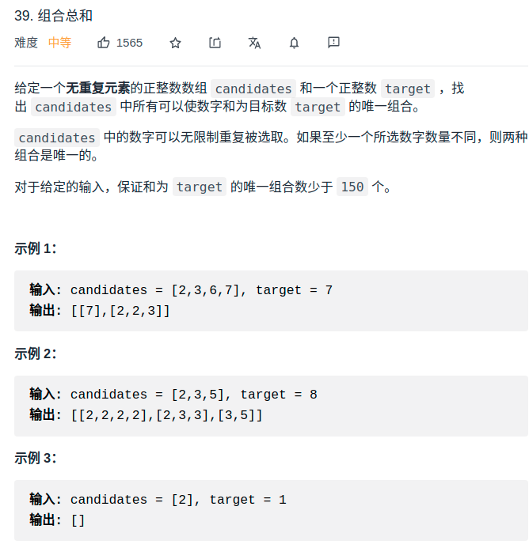

> 难度:简单

> 题目
<div align="center" style="zoom:80%"></div>

> 代码

```cpp
class Solution {
public:
    vector<vector<int>>res;
    vector<vector<int>> combinationSum(vector<int>& candidates, int target) {
        sort(candidates.begin(), candidates.end());
        dfs(candidates, 0, target);
        return res;
    }
    vector<int> record;
    void dfs(vector<int>& candidates, int start, int target){
        if(target < 0)
            return;
        else if(target == 0){
            res.push_back(record);
        }
        for(int i = start; i < candidates.size(); ++i){
            if(target < candidates[i]) break;
            record.push_back(candidates[i]);
            dfs(candidates, i,target-candidates[i]);
            record.pop_back();
        }
    }
};
```
