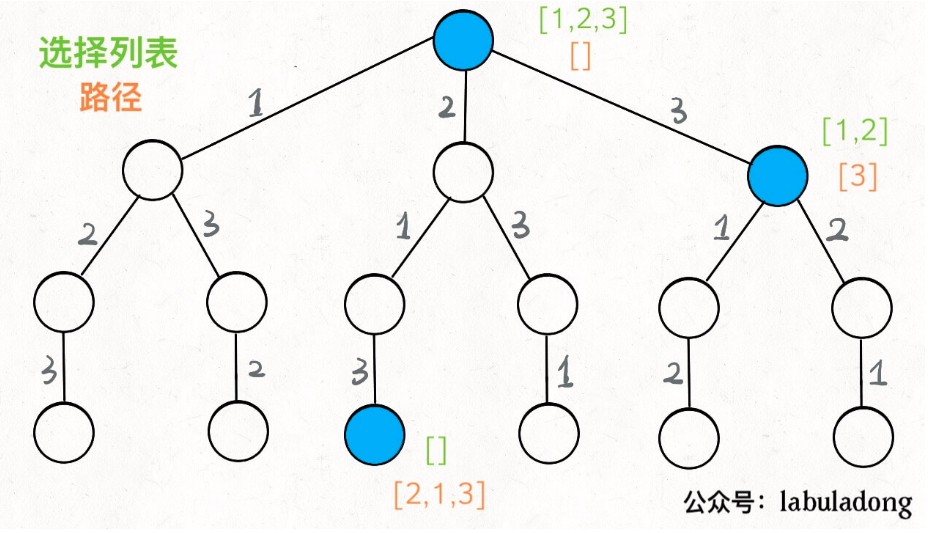

> 难度：简单
- 方法1：DFS
  - O(N!)
<div align="center" style="zoom:80%"></div>

- 方法2：字典序法
  - https://zh.wikipedia.org/wiki/%E5%85%A8%E6%8E%92%E5%88%97%E7%94%9F%E6%88%90%E7%AE%97%E6%B3%95

> 题目
```
给定一个不含重复数字的数组 nums ，返回其 所有可能的全排列 。你可以 按任意顺序 返回答案。
```

> 代码

## dfs
```cpp
class Solution {
public:
    set<int> hasPick;
    list<int> nowChoose;
    vector<vector<int>> res;
    vector<vector<int>> permute(vector<int>& nums) {
        dfs(nums);
        return res;
    }
    void dfs(vector<int>& nums){
        // 退出条件
        if(nowChoose.size() == nums.size()){
            res.push_back(vector<int>(nowChoose.begin(),nowChoose.end()));
            return;
        }
        for(auto n : nums){
            if(hasPick.find(n) != hasPick.end()){
                continue;
            }
            hasPick.insert(n);
            nowChoose.push_back(n);
            dfs(nums);
            hasPick.erase(n);
            nowChoose.pop_back();
        }
    }
};
```

```
执行用时：8 ms, 在所有 C++ 提交中击败了19.28%的用户
内存消耗：8.7 MB, 在所有 C++ 提交中击败了5.03%的用户
```

## 字典序
```cpp
class Solution {
public:
    vector<vector<int>> permute(vector<int>& nums) {
        int pre,next;
        vector<vector<int>> res;
        sort(nums.begin(), nums.end());
        res.push_back(vector<int>(nums.begin(), nums.end()));


        while(true){
            next = nums.size()-1;
            pre = next-1;
            // 1.从右到左，找到递增的
            while(pre >= 0){
                if(nums[pre] < nums[next]){
                    break;
                }
                --pre;
                --next;
            }
            if(pre < 0)// 一直没找到的情况
                break;

            // 2.找到比该数大最小且最靠右边的一个。eg:0122的情况找最后一个2
            int i = nums.size()-1;
            while(i >= next){
                if(nums[i] > nums[pre])
                    break;
                --i;
            }
            if(i < next)
                break;

            swap(nums[pre], nums[i]);
            // 3.倒叙
            int start,end;
            start = next;
            end = nums.size()-1;
            while(start < end){
                swap(nums[start], nums[end]);
                ++start;
                --end;
            }

            res.push_back(vector<int>(nums.begin(),nums.end()));
        }
        return res;
    }
};
```

```
执行用时：0 ms, 在所有 C++ 提交中击败了100.00%的用户
内存消耗：7.6 MB, 在所有 C++ 提交中击败了59.06%的用户
```