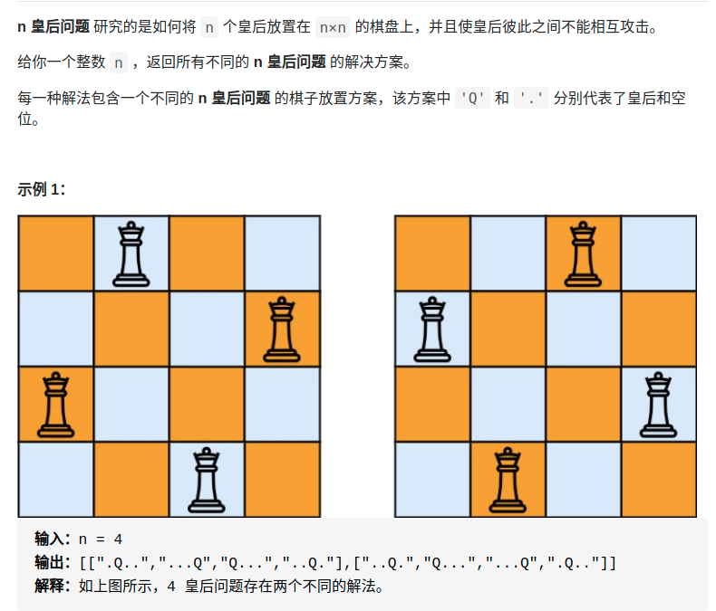

> 难度：简单
- DFS 回溯法


> 题目
<div align="center" style="zoom:80%"></div>

> 代码

```cpp
class Solution {
public:
    const char Queen = 'Q';
    int END  = 0;
    vector<string> mapQ;
    vector<vector<string>> res;
    list<pair<int, int>> record;
    vector<vector<string>> solveNQueens(int n) {
        // 初始化
        END = n;
        auto test = string(n,'.');
        mapQ = vector<string>(n,test);
        dfs(0);
        return res;
    }
    void dfs(int n){
        if(n == END){
            res.push_back(mapQ);
            return;
        }
        for(int i = 0; i < END; ++i){
            if(!check({n,i}))
                continue;
            record.push_back({n,i});
            mapQ[n][i] = 'Q';
            dfs(n+1);
            record.pop_back();
            mapQ[n][i] = '.';
        }

    }

    bool check(pair<int, int> pos){
        for(auto r : record){
            if (r.first == pos.first)
                return false;
            if (r.second == pos.second)
                return false;
            if (abs(r.first-pos.first) == abs(r.second - pos.second))
                return false;
        }
        return true;
    }
};
```

```
执行用时：8 ms, 在所有 C++ 提交中击败了62.98%的用户
内存消耗：8 MB, 在所有 C++ 提交中击败了31.49%的用户
```