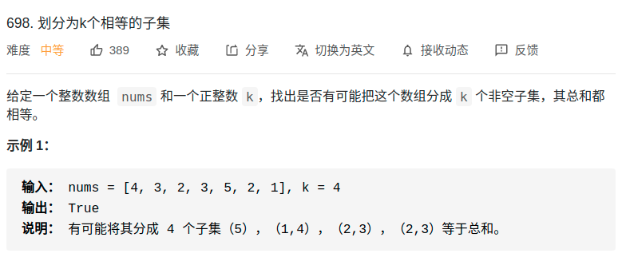

> 难度：简单

- dfs
- 参考:https://labuladong.gitbook.io/algo/mu-lu-ye-3/mu-lu-ye/ji-he-hua-fen#er-yi-shu-zi-de-shi-jiao

- 这个题目可以从 桶的角度 来考虑和 数字的角度 来考虑


> 题目
<div align="center" style="zoom:80%"></div>

> 代码
- 这个代码我拿出错的数据去测，在自己的IDE上跑是对的。系统是错的就很迷
```cpp
class Solution {
public:
    int avg;
    set<int> isChoose;
    vector<int> levelSum;
    int END;

    bool canPartitionKSubsets(vector<int>& nums, int k) {
        // 初始处理
        int sum = 0;
        int END = k;
        for_each(nums.begin(),nums.end(), [&sum](int &n){sum+=n;});
        levelSum.resize(k,0);

        // 过滤1
        if(sum%k != 0)
            return false;
        // 过滤2
        avg = sum/k;
        for(int i = 0; i < nums.size(); ++i){
            if(nums[i] > avg)
                return false;
        }

        return dfs(nums, 0);
    }

    bool dfs(vector<int>& nums, int level){
        if(level == END)
            return true;


        for(int i = 0; i < nums.size(); ++i){
            if(isChoose.find(i) != isChoose.end())
                continue;

            isChoose.insert(i);
            if(check(level, nums[i]) == 0){
                levelSum[level] += nums[i];
                if(dfs(nums,level+1))
                    return true;
            } else if(check(level, nums[i]) == -1){
                levelSum[level] += nums[i];
                if(dfs(nums,level))
                    return true;
            }
            isChoose.erase(i);
        }
        return false;
    }
    int check(int level, int input){
        if(levelSum[level] + input > avg)
            return 1;
        else if (levelSum[level] + input == avg){
            return 0;
        } else{
            return -1;
        }
    }

};
```