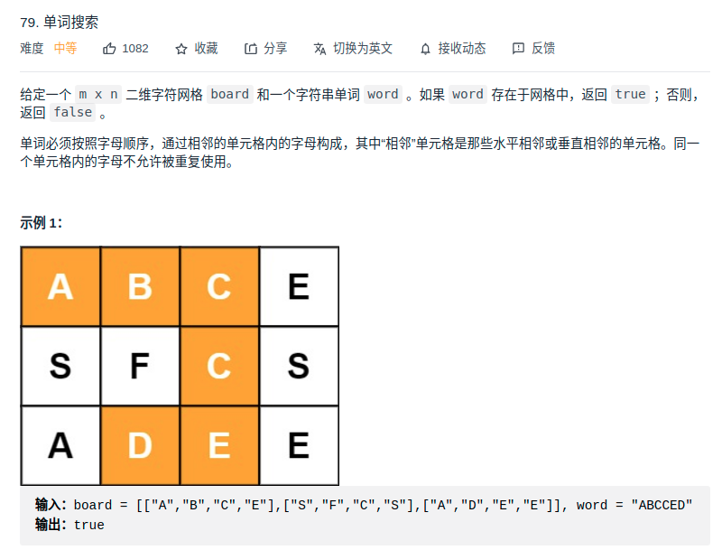

> 思路：dfs
- 如果首字母

> 题目
<div align="center" style="zoom:80%"></div>


> 代码
```cpp
class Solution {
public:
    // 定义：搜索成功返回true
    // x y：表示当前位置
    // n：接下来匹配 word 中的第n个字符
    // board 和 word 不变
    bool dfs(vector<vector<char>>& board, string& word, int x, int y, int n){
        if(n == end)
            return true;
        for(int i = 0; i < 4; ++i){
            int nx, ny;
            // 下一跳
            nx = x+dist[i][0];
            ny = y+dist[i][1];
            if(nx >= 0 && nx < board.size()
                && ny >= 0 && ny < board[0].size() && !record[nx][ny]){
//                cout << x << " " << y << endl; // test
                record[nx][ny] = true;
                if(board[nx][ny] == word[n]){
                    if (dfs(board, word, nx, ny, n+1)){
                        return true;
                    }
                }
                record[nx][ny] = false;
            }
        }
        return false;

    }
    bool exist(vector<vector<char>>& board, string word) {
        end = word.size();
        // 记录
        record = vector<vector<bool>>(board.size(), vector<bool>(board[0].size(), false));
        for(int i = 0; i < board.size(); ++i){
            for(int j = 0; j < board[0].size(); ++j){
                record[i][j] = true;// 记录
                // 如果首字母符合
                if(board[i][j] == word[0] && dfs(board, word, i, j, 1))
                    return true;
                record[i][j] = false;// 记录
            }
        }
        return false;
    }

private:
    int end;
    vector<vector<int>> dist{{0, 1}, {0, -1}, {1, 0}, {-1, 0}};
    vector<vector<bool>> record;
};
```