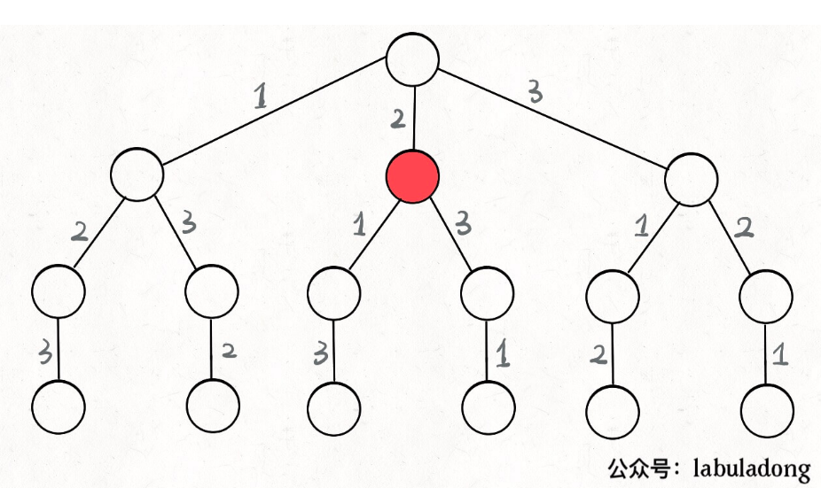
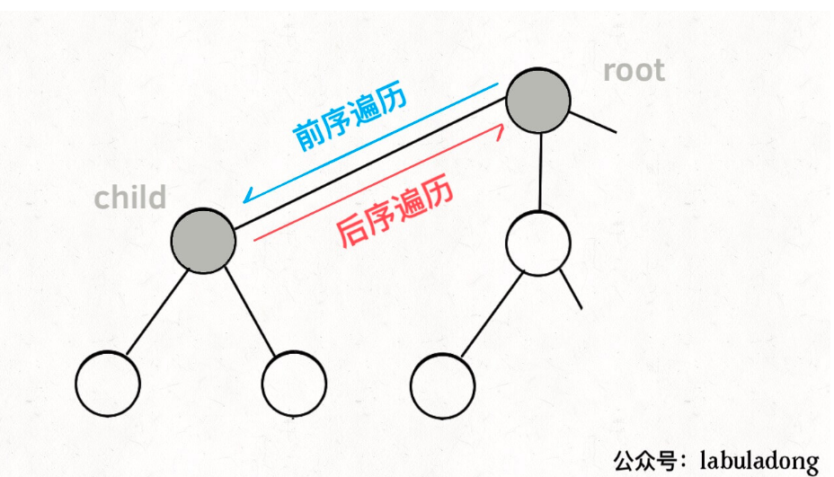
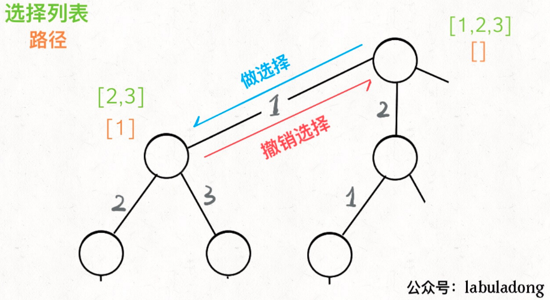
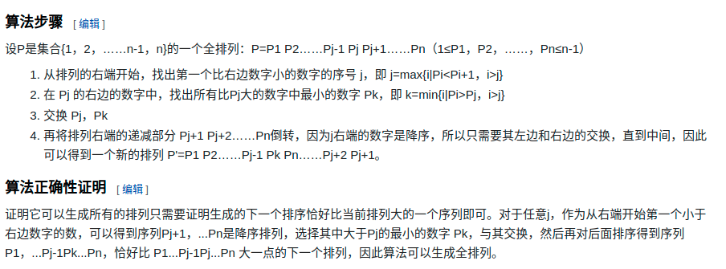
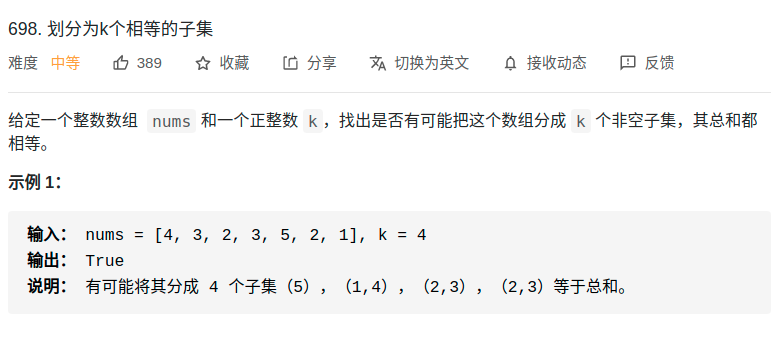
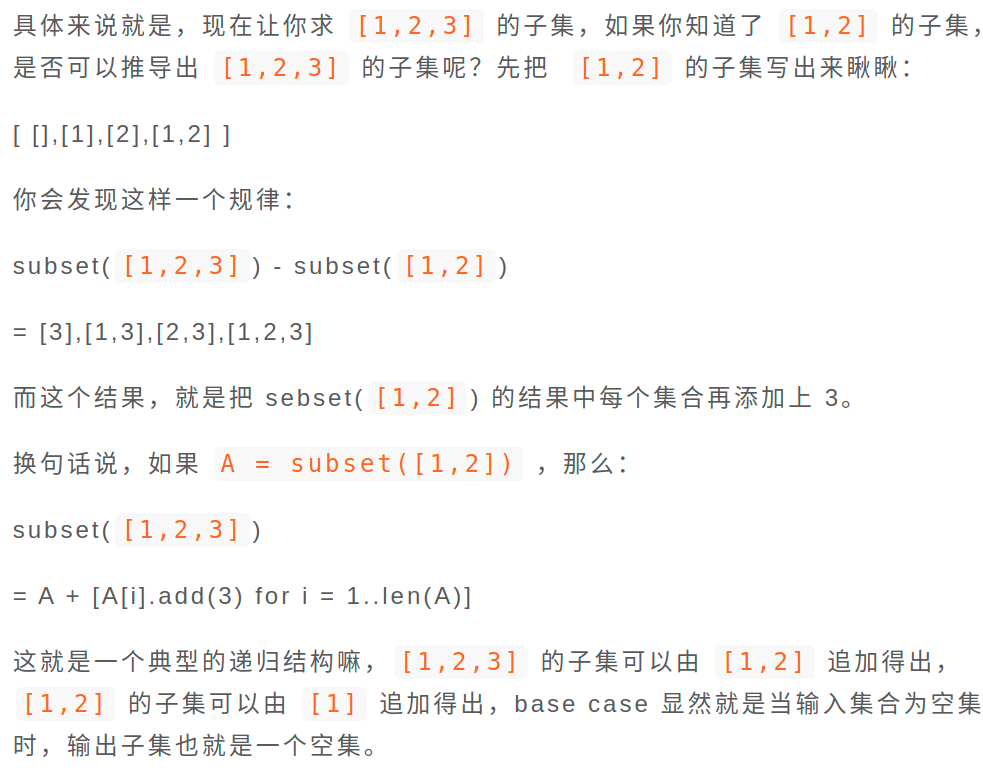
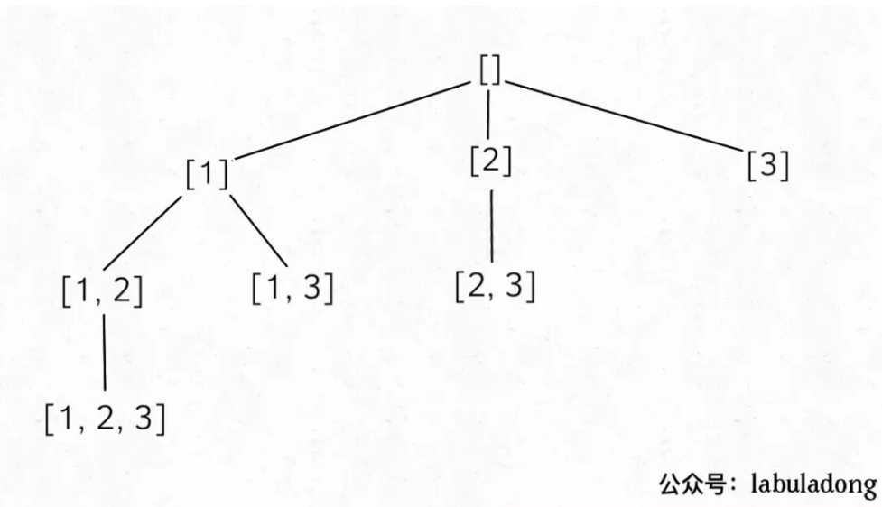
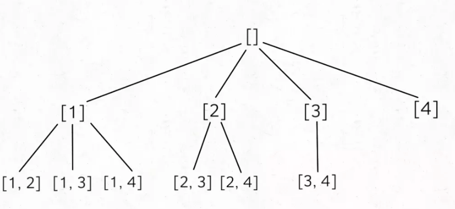

- [概述](#概述)
- [demo](#demo)
  - [全排列](#全排列)
    - [DFS 决策树](#dfs-决策树)
    - [字典序法](#字典序法)
  - [划分为k个相等的子集](#划分为k个相等的子集)
    - [以桶的视角](#以桶的视角)
  - [子集](#子集)
    - [数学归纳法](#数学归纳法)
    - [dfs](#dfs)
  - [组合](#组合)

- 参考：https://labuladong.gitbook.io/algo/mu-lu-ye-3/mu-lu-ye/hui-su-suan-fa-xiang-jie-xiu-ding-ban
# 概述
- **回溯算法**其实就是我们常说的**DFS 算法**，本质上就是一种**暴力穷举**算法。
- 解决一个回溯问题，实际上就是一个决策树的遍历过程。需要思考 3 个问题：
  - **路径**：也就是已经做出的选择。
  - **选择列表**：也就是你当前可以做的选择。
  - **结束条件**：也就是到达决策树底层，无法再做选择的条件。
- 框架
  - 其核心就是 for 循环里面的递归，**在递归调用之前「做选择」，在递归调用之后「撤销选择」**，特别简单
  - 不一定按这样的方式传参，这是在思考的过程要考虑路径和选择列表
```py
result = []
def backtrack(路径, 选择列表):
    if 满足结束条件:
        result.add(路径)
        return

    for 选择 in 选择列表:
        做选择
        backtrack(路径, 选择列表)
        撤销选择
```

# demo
## 全排列
> 高中做法
- 排列【1，2，3】

```
先固定第一位为 1，然后第二位可以是 2，那么第三位只能是 3；然后可以把第二位变成 3，第三位就只能是 2 了；然后就只能变化第一位，变成 2，然后再穷举后两位……
```

### DFS 决策树

<div align="center" style="zoom:80%"></div>

- 为啥说这是决策树呢，因为你在**每个节点上其实都在做决策**
  - 比如说你站在下图的红色节点上：你现在就在做决策，可以选择 1 那条树枝，也可以选择 3 那条树枝。为啥只能在 1 和 3 之中选择呢？因为 2 这个树枝在你身后，这个选择你之前做过了，而全排列是不允许重复使用数字的。
- 路径、选择列表、结束条件
  - [2] 就是 **「路径」**，记录你已经做过的选择；
  - [1,3] 就是 **「选择列表」**，表示你当前可以做出的选择；
  - **「结束条件」** 就是遍历到树的底层，在这里就是选择列表为空的时候。


- **节点的属性**：可以把「路径」和「选择」列表作为决策树上每个节点的属性
<div align="center" style="zoom:80%"></div>

- **其实就是遍历树的问题**。我们定义的 backtrack 函数其实就像一个指针，在这棵树上游走，同时要正确维护每个节点的属性，每当走到树的底层，其「路径」就是一个全排列。
  - 遍历多叉树的框架如下。**前序遍历的代码在进入某一个节点之前的那个时间点执行，后序遍历代码在离开某个节点之后的那个时间点执行**。


```cpp
void traverse(TreeNode root) {
    for (TreeNode child : root.childern)
        // 前序遍历需要的操作
        traverse(child);
        // 后序遍历需要的操作
}
```

<div align="center" style="zoom:80%"></div>
<div align="center" style="zoom:80%"></div>

- 我们**只要在递归之前做出选择，在递归之后撤销刚才的选择**，就能正确得到每个节点的选择列表和路径。

- **不管怎么优化，都符合回溯框架，而且时间复杂度都不可能低于 O(N!)**，因为穷举整棵决策树是无法避免的。这也是回溯算法的一个特点，不像动态规划存在重叠子问题可以优化，**回溯算法就是纯暴力穷举，复杂度一般都很高**。

> 代码
- O(N!)
```cpp
class Solution {
public:
    set<int> hasPick;
    list<int> nowChoose;
    vector<vector<int>> res;
    vector<vector<int>> permute(vector<int>& nums) {
        dfs(nums);
        return res;
    }
    void dfs(vector<int>& nums){
        // 退出条件
        if(nowChoose.size() == nums.size()){
            res.push_back(vector<int>(nowChoose.begin(),nowChoose.end()));
            return;
        }
        for(auto n : nums){
            if(hasPick.find(n) != hasPick.end()){
                continue;
            }
            hasPick.insert(n);
            nowChoose.push_back(n);
            dfs(nums);
            hasPick.erase(n);
            nowChoose.pop_back();
        }
    }
};
```

### 字典序法
<div align="center" style="zoom:80%"></div>

- 以下代码可以处理重复
  - leetcode47

```
class Solution {
public:
    vector<vector<int>> permuteUnique(vector<int>& nums) {
int pre,next;
        vector<vector<int>> res;
        sort(nums.begin(), nums.end());
        res.push_back(vector<int>(nums.begin(), nums.end()));


        while(true){
            next = nums.size()-1;
            pre = next-1;
            // 1.从右到左，找到递增的
            while(pre >= 0){
                if(nums[pre] < nums[next]){
                    break;
                }
                --pre;
                --next;
            }
            if(pre < 0)// 一直没找到的情况
                break;

            // 2.找到比该数大最小且最靠右边的一个。eg:0122的情况找最后一个2
            int i = nums.size()-1;
            while(i >= next){
                if(nums[i] > nums[pre])
                    break;
                --i;
            }
            if(i < next)
                break;

            swap(nums[pre], nums[i]);
            // 3.倒叙
            int start,end;
            start = next;
            end = nums.size()-1;
            while(start < end){
                swap(nums[start], nums[end]);
                ++start;
                --end;
            }

            res.push_back(vector<int>(nums.begin(),nums.end()));
        }
        return res;
    }
};
```

## 划分为k个相等的子集
<div align="center" style="zoom:80%"></div>

- 用背包思想去解题的套路只能用在两个划分上，多个划分解法一般只能通过暴力穷举。

- 将 n 个数字分配到 k 个桶里，我们可以有两种视角：
  - **以数字的视角**：如果我们切换到这 n 个数字的视角，每个数字都要**选择**进入到 k 个桶中的某一个（**选择的是桶**）
  - **以桶的视角**：如果我们切换到这 k 个桶的视角，对于每个桶，都要遍历 nums 中的 n 个数字，然后**选择**是否将当前遍历到的数字装进自己这个桶里（**选择的是数字**）


```java
// 主函数
public boolean canPartitionKSubsets(int[] nums, int k) {
    // 排除一些基本情况
    if (k > nums.length) return false;
    int sum = 0;
    for (int v : nums) sum += v;
    if (sum % k != 0) return false;

    // k 个桶（集合），记录每个桶装的数字之和
    int[] bucket = new int[k];
    // 理论上每个桶（集合）中数字的和
    int target = sum / k;
    // 穷举，看看 nums 是否能划分成 k 个和为 target 的子集
    return backtrack(nums, 0, bucket, target);
}

// 递归穷举 nums 中的每个数字
boolean backtrack(
    int[] nums, int index, int[] bucket, int target) {

    if (index == nums.length) {
        // 检查所有桶的数字之和是否都是 target
        for (int i = 0; i < bucket.length; i++) {
            if (bucket[i] != target) {
                return false;
            }
        }
        // nums 成功平分成 k 个子集
        return true;
    }

    // 穷举 nums[index] 可能装入的桶
    for (int i = 0; i < bucket.length; i++) {
        // 剪枝，桶装装满了
        if (bucket[i] + nums[index] > target) {
            continue;
        }
        // 将 nums[index] 装入 bucket[i]
        bucket[i] += nums[index];
        // 递归穷举下一个数字的选择
        if (backtrack(nums, index + 1, bucket, target)) {
            return true;
        }
        // 撤销选择
        bucket[i] -= nums[index];
    }

    // nums[index] 装入哪个桶都不行
    return false;
}
```

- **如果我们让尽可能多的情况命中剪枝的那个 if 分支，就可以减少递归调用的次数，一定程度上减少时间复杂度**。如何更容易触发剪枝
  - **方法**：提前对 nums 数组排序，把大的数字排在前面，那么大的数字会先被分配到 bucket 中，对于之后的数字，bucket[i] + nums[index] 会更大，更容易触发剪枝的 if 条件

### 以桶的视角
- 以桶的视角进行穷举，每个桶需要遍历 nums 中的所有数字，决定是否把当前数字装进桶中；当装满一个桶之后，还要装下一个桶，直到所有桶都装满为止

## 子集
- https://mp.weixin.qq.com/s/qT6WgR6Qwn7ayZkI3AineA
```
给你一个整数数组 nums ，数组中的元素 互不相同 。返回该数组所有可能的子集（幂集）。

解集 不能 包含重复的子集。你可以按 任意顺序 返回解集。

示例 1：
输入：nums = [1,2,3]
输出：[[],[1],[2],[1,2],[3],[1,3],[2,3],[1,2,3]]


示例 2：
输入：nums = [0]
输出：[[],[0]]
```
### 数学归纳法
<div align="center" style="zoom:80%"></div>

```cpp
class Solution {
public:
    vector<vector<int>> subsets(vector<int>& nums) {
        if(nums.empty()){
            return  {{}};
        }
        int n = nums.back();
        nums.pop_back();
        auto res = subsets(nums);
        int size = res.size();

        for(int i = 0; i < size; ++i){
            res.push_back(res[i]);
            res.back().push_back(n);
        }
        return res;
    }
};
```

### dfs
- 方法1:选or不选（二叉决策树）
- 方法2：如下图所示
  
<div align="center" style="zoom:80%"></div>

## 组合

```
给定两个整数 n 和 k，返回范围 [1, n] 中所有可能的 k 个数的组合。

你可以按 任何顺序 返回答案。
```
- 分析：
  - 路径：K
  - 选择：n
- 决策树
  - k 限制了树的高度，n 限制了树的宽度
<div align="center" style="zoom:80%"></div>

