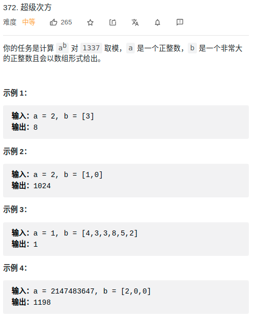

> 难度：简单
- https://labuladong.gitbook.io/algo/mu-lu-ye-3/mu-lu-ye-2/superpower
- 难点1：何处理用数组表示的指数
<div align="center" style="zoom:80%"></div>


> 题目
<div align="center" style="zoom:80%"></div>

> 代码

```cpp
class Solution {
public:
    int superPow(int a, vector<int>& b) {
        if(b.empty())return 1;
        if(a == 1 || a == 0) return a;
        int res;
        res = fastPower(a,b.back(),1337);
        b.pop_back();
        auto aa = superPow(a, b);
        res = (res * fastPower(aa,10,1337)) % 1337;
        return res;
    }
    int fastPower(int a, int b, int mod){
        int res = 1;
        int base = a%mod;

        while(b){
            if(b & 1){
                res = (res * base)%mod;
            }
            base = (base * base) % mod;
            b >>=1;
        }
        return res;
    }
};

```