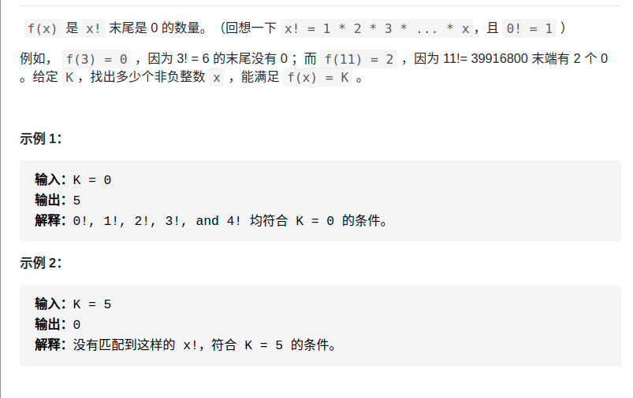

> 难度：中等
- 出现0性质+二分法
  - 因为递增，所以可以用二分法解
> 题目
<div align="center" style="zoom:80%"></div>

> 代码

```cpp
class Solution {
public:
    const long long MAXN = 2ll* INT32_MAX;
    int preimageSizeFZF(int k) {
        return rightFind(k) - leftFind(k) + 1;
    }
    int leftFind(int k){
        long long lo = 0;
        long long hi = MAXN;
        long long mid;
        while (lo < hi){
            mid = (hi + lo)/2;
            auto midK = trailingZeroes(mid);
            if(midK < k){
                lo = mid+1;
            } else if(midK > k){
                hi = mid;
            } else if( midK == k){
                hi = mid;
            }
        }
        return lo;
    }

    int rightFind(int k){
        long long lo = 0;
        long long hi = MAXN;
        long long mid;
        while (lo < hi){
            mid = (hi + lo)/2;
            auto midK = trailingZeroes(mid);
            if(midK < k){
                lo = mid+1;
            } else if(midK > k){
                hi = mid;
            } else if( midK == k){
                lo = mid + 1;
            }
        }
        return lo-1;
    }

    long long trailingZeroes(long long  n) {
        long long base = 5;
        long long res = 0;
        while(n / base){
            res += n / base;
            base *= 5;
        }
        return res;
    }
};
```

```
执行用时：4 ms, 在所有 C++ 提交中击败了18.06%的用户
内存消耗：5.8 MB, 在所有 C++ 提交中击败了69.16%的用户
```