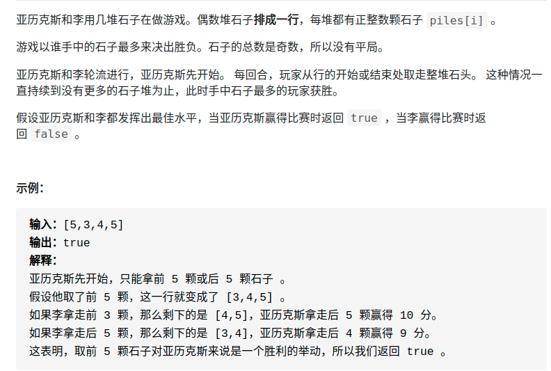

> 难度：简单
- https://labuladong.gitbook.io/algo/mu-lu-ye-3/mu-lu-ye-2/yi-hang-dai-ma-jie-jue-de-zhi-li-ti#er-shi-tou-you-xi
- 因为题目有两个条件很重要：一是石头总共有偶数堆，石头的总数是奇数。这两个看似增加游戏公平性的条件，反而使该游戏成为了一个割韭菜游戏。我们以 piles=[2, 1, 9, 5] 讲解，假设这四堆石头从左到右的索引分别是 1，2，3，4。
- 如果我们把这四堆石头按索引的奇偶分为两组，即第 1、3 堆和第 2、4 堆，那么这两组石头的数量一定不同，也就是说一堆多一堆少。因为石头的总数是奇数，不能被平分。
- **而作为第一个拿石头的人，你可以控制自己拿到所有偶数堆，或者所有的奇数堆**。

> 题目

<div align="center" style="zoom:80%"></div>

> 代码
```cpp
class Solution {
public:
    bool stoneGame(vector<int>& piles) {
        return true;
    }
};
```