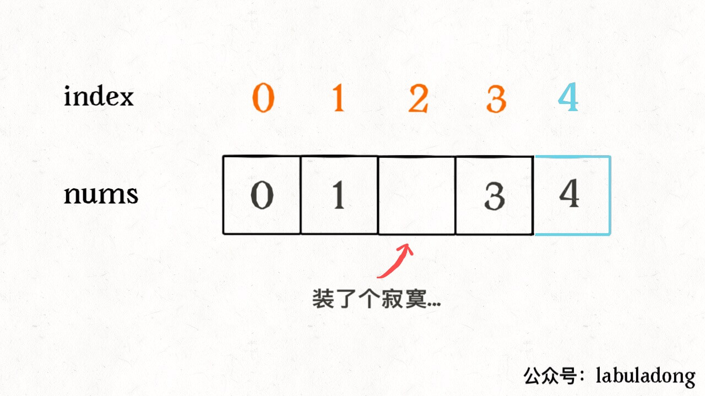
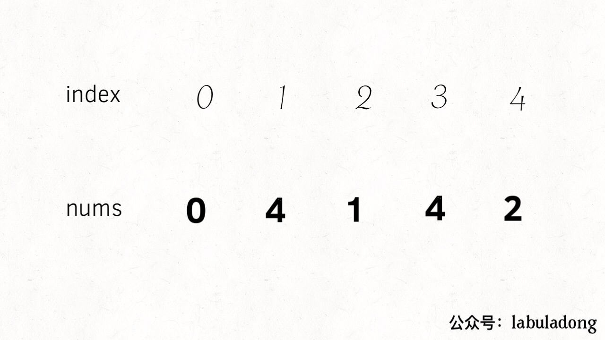
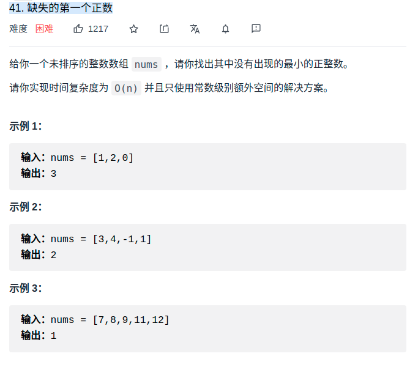
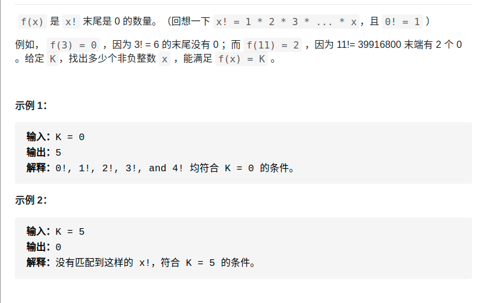

- [常用的位操作](#常用的位操作)
  - [字母转小写](#字母转小写)
  - [字母转大写](#字母转大写)
  - [字母大小写互换](#字母大小写互换)
  - [*消除数字 n 的二进制表示中的最后一个 1](#消除数字-n-的二进制表示中的最后一个-1)
    - [判断一个数是不是 2 的指数](#判断一个数是不是-2-的指数)
    - [判断二进制有多少个1](#判断二进制有多少个1)
- [异或性质](#异或性质)
  - [查找只出现一次的元素](#查找只出现一次的元素)
  - [*判断两个数是否异号](#判断两个数是否异号)
  - [交换两个数](#交换两个数)
  - [寻找缺失的元素（office 53）](#寻找缺失的元素office-53)
  - [同时寻找缺失和重复的元素](#同时寻找缺失和重复的元素)
  - [缺失的第一个正数](#缺失的第一个正数)
- [阶乘性质](#阶乘性质)
  - [升级版](#升级版)
- [素数](#素数)
  - [判断一个数是不是素数](#判断一个数是不是素数)
  - [计算一个范围内的素数 数量](#计算一个范围内的素数-数量)
- [模幂](#模幂)
  - [快速幂](#快速幂)
- [无限序列中随机抽取元素(水塘抽样算法)](#无限序列中随机抽取元素水塘抽样算法)
- [sqrt(x)](#sqrtx)
- [用rand7实现rand10](#用rand7实现rand10)
- [约瑟夫环](#约瑟夫环)
- [判断互质以及最大公约数](#判断互质以及最大公约数)
# 常用的位操作
- https://labuladong.gitbook.io/algo/mu-lu-ye-3/mu-lu-ye-2/chang-yong-de-wei-cao-zuo

## 字母转小写
```cpp
('a' | ' ') = 'a'
('A' | ' ') = 'a'
```
## 字母转大写
```cpp
('b' & '_') = 'B'
('B' & '_') = 'B'
```
## 字母大小写互换
```cpp
('d' ^ ' ') = 'D'
('D' ^ ' ') = 'd'
```


## *消除数字 n 的二进制表示中的最后一个 1
- `n&(n-1)`

<div align="center" style="zoom:80%"></div>

### 判断一个数是不是 2 的指数
```cpp
bool isPowerOfTwo(int n) {
    if (n <= 0) return false;
    return (n & (n - 1)) == 0;
}
```

### 判断二进制有多少个1

```cpp
int hammingWeight(uint32_t n) {
    int res = 0;
    while (n != 0) {
        n = n & (n - 1);
        res++;
    }
    return res;
}
```


# 异或性质
- 性质1：异或运算满足交换律和结合律
  - 如：`2 ^ 3 ^ 2 = 3 ^ (2 ^ 2) = 3 ^ 0 = 3`
- 性质2：一个数和它本身异或，结果为0
## 查找只出现一次的元素
- 前提：其他都出现两次
  - 全部进行异或
```cpp
int singleNumber(vector<int>& nums) {
    int res = 0;
    for (int n : nums) {
        res ^= n;
    }
    return res;
}
```
## *判断两个数是否异号
```cpp
int x = -1, y = 2;
bool f = ((x ^ y) < 0); // true

int x = 3, y = 2;
bool f = ((x ^ y) < 0); // false
```

## 交换两个数
```
int a = 1, b = 2;
a ^= b;
b ^= a;
a ^= b;
```

## 寻找缺失的元素（office 53）
<div align="center" style="zoom:80%"></div>

- 法1：全部排序，找缺失。O(nlogn)
- 法2：加入到set，再遍历set。O(n)
- 法3：位运算
  - **只要把所有的元素和索引做异或运算，成对儿的数字都会消为 0，只有这个落单的元素会剩下**

<div align="center" style="zoom:80%"></div>

```cpp
class Solution {
public:
    int missingNumber(vector<int>& nums) {
        int res = nums.size();
        int index = 0;
        for(auto n : nums){
            res ^= index ^ n;
            ++index;
        }
        return res;
    }
};
```

## 同时寻找缺失和重复的元素
- 注：与异或无关，只是为了对比上一道题
- 题目特征：
  - 值可以当做索引来用（值与索引有一定关系）
- 思路：
  - **将 nums 中的元素变为 [0..N-1]，这样每个元素就和一个数组索引完全对应了，这样方便理解一些**
  - 题目隐藏信息：会导致有两个元素对应到了同一个索引，而且会有一个索引没有元素对应过去
    - **可以通过取负数作为标记**：通过将每个索引对应的元素变成负数，以表示这个索引被对应过一次
  - 结果：取负过程中，发现已经为负，说明是重复的；再遍历一遍，如果为正，表示是缺失的。
<div align="center" style="zoom:80%"></div>
<div align="center" style="zoom:80%"></div>

> 代码

```cpp
class Solution {
public:
    vector<int> findErrorNums(vector<int>& nums) {
        vector<int> res;
        for(int i = 0; i < nums.size(); ++i){
            int index = abs(nums[i])-1;
            if(nums[index] < 0){
                res.push_back(index+1);
                continue;
            }
            nums[index] = -nums[index];
        }

        for(int i = 0; i < nums.size(); ++i){
            if(nums[i] > 0){
                res.push_back(i+1);
                break;
            }
        }
        return res;
    }
};
```
## 缺失的第一个正数
<div align="center" style="zoom:80%"></div>

- 思路：如果数组nums每个值都正好可以对应索引（从1开始的），那么 **没有出现的最小正数** ，就是len(nums)+1。这种情况是没**有出现的最小的正整数** 所能取到的最大值。
  - **因此，没有出现的最小正整数在[1，len(nums)+1] 之间**
    - 故，可以通过在原数组中做标记，标记 取元素所能到达的最大值+1，即`500001`


> 代码
```cpp
class Solution {
public:
    static constexpr int flag = 500001;
    // 思路：将可以作为索引的值，在索引处标记为flag
    int firstMissingPositive(vector<int>& nums) {
        int last = nums.size();
        for(int i = 0; i < nums.size(); ++i){
            while(nums[i] > 0 && nums[i] <= last){
                // 重点：可以将该值作为索引，为了避免 nums[nums[i]]也可以作为索引的，但是被我们用flag替换了，造成逻辑不正确，所以使用while
                int t = nums[i]-1;
                if(nums[t] == flag) break;
                else{
                    nums[i] = flag;
                    swap(nums, i, t);
                }
            }
        }
        for(int i = 0; i < nums.size(); ++i){
            if(nums[i] !=  flag){
                return i+1;
            }
        }
        return nums.size()+1;
    }
    void swap(vector<int> &nums, int i, int j){
        int t = nums[i];
        nums[i] = nums[j];
        nums[j] = t;
    }

};
```

# 阶乘性质
```
给定一个整数 n，返回 n! 结果尾数中零的数量。

示例 1:
输入: 3
输出: 0
解释: 3! = 6, 尾数中没有零。

示例 2:
输入: 5
输出: 1
解释: 5! = 120, 尾数中有 1 个零.

```

- 问题转换1：问**题转化为：n! 最多可以分解出多少个因子 2 和 5？**
  - 因为：两个数相乘结果末尾有 0，一定是因为两个数中有因子 2 和 5，因为 10 = 2 x 5。
- 问题转换2：**n! 最多可以分解出多少个因子 5？**
  - 因为：每个偶数都能分解出因子 2，因子 2 肯定比因子 5 多得多
- 分析：只要是5的倍数可以分解出一个，25 ... 两个，125... 三个.......
- 问题等价于：有多少能被5、25、125整除的，累加起来就是答案。代码如下

```cpp
class Solution {
public:
    int trailingZeroes(int n) {
        int base = 5;
        int res = 0;
        while(n / base){
            res += n / base;
            base *= 5;
        }
        return res;
    }
};
```

## 升级版
<div align="center" style="zoom:80%"></div>

- https://labuladong.gitbook.io/algo/mu-lu-ye-3/mu-lu-ye-2/jie-cheng-ti-mu
- 出现0性质+二分法
  - 因为递增，所以可以用二分法解

```cpp
class Solution {
public:
    const long long MAXN = 2ll* INT32_MAX;
    int preimageSizeFZF(int k) {
        return rightFind(k) - leftFind(k) + 1;
    }
    int leftFind(int k){
        long long lo = 0;
        long long hi = MAXN;
        long long mid;
        while (lo < hi){
            mid = (hi + lo)/2;
            auto midK = trailingZeroes(mid);
            if(midK < k){
                lo = mid+1;
            } else if(midK > k){
                hi = mid;
            } else if( midK == k){
                hi = mid;
            }
        }
        return lo;
    }

    int rightFind(int k){
        long long lo = 0;
        long long hi = MAXN;
        long long mid;
        while (lo < hi){
            mid = (hi + lo)/2;
            auto midK = trailingZeroes(mid);
            if(midK < k){
                lo = mid+1;
            } else if(midK > k){
                hi = mid;
            } else if( midK == k){
                lo = mid + 1;
            }
        }
        return lo-1;
    }

    long long trailingZeroes(long long  n) {
        long long base = 5;
        long long res = 0;
        while(n / base){
            res += n / base;
            base *= 5;
        }
        return res;
    }
};
```

# 素数
## 判断一个数是不是素数
- O(sqrt(N))
```cpp
boo isPrime(int n) {
    // 注意这里的i*i
    for (int i = 2; i*i < n; i++)
        if (n % i == 0)
            // 有其他整除因子
            return false;
    return true;
}
```

## 计算一个范围内的素数 数量
- 利用质因子性质
```
首先从 2 开始，我们知道 2 是一个素数，那么 2 × 2 = 4, 3 × 2 = 6, 4 × 2 = 8... 都不可能是素数了。
然后我们发现 3 也是素数，那么 3 × 2 = 6, 3 × 3 = 9, 3 × 4 = 12... 也都不可能是素数了。
```

```cpp

class Solution {
public:
    int countPrimes(int n) {
        vector<bool> isPrime(n+1,true);
        // 最大数n的分解，最多也只需要看到sqrt(n)，所以遍历到sqrt(n)，就全部被填充排除了
        for(int i  = 2; i*i < n; ++i){
            if(isPrime[i])
                // 如果是素数，则扩散排除
                for(int j = i*2; j < n; j+=i){
                    isPrime[j] = false;
                }
        }

        
        int res = 0;
        for(int i = 2; i < n; ++i){
            if(isPrime[i])
                ++res;
        }
        return res;
    }

};
```

# 模幂
- `(a * b) % k = (a % k)(b % k) % k`
  - 对乘法的结果求模，等价于先对每个因子都求模，然后对因子相乘的结果再求模。

## 快速幂
```cpp
int fastPower(int a, int b, int mod =1337){
    int base = a%mod;
    int res = 1;
    while(b > 0){
        if(b & 1){
            res = (res * base)%mod;
        }
        base = (base * base)%mod;
        b >>= 1;
    }
    return res;
}
```

```
执行用时：8 ms, 在所有 C++ 提交中击败了93.01%的用户
内存消耗：11.3 MB, 在所有 C++ 提交中击败了92.11%的用户
```
# 无限序列中随机抽取元素(水塘抽样算法)
- 特点：
  - 不知道有多少个元素
- 只抽取一个元素的问题
  - 结论：当你遇到第 i 个元素时，应该有 1/i 的概率选择该元素，1 - 1/i 的概率保持原有的选择。
  - 证明：对于第 `i` 个元素，它被选择的概率是`1/n`
- 抽取k个元素的问题
  - 结论：当你遇到第 i 个元素时，应该有 k/i 的概率选择该元素，1 - k/i 的概率保持原有的选择。
  - 证明：对于第 `i` 个元素，它被选择的概率是`k/n`


<div align="center" style="zoom:80%"></div>


<div align="center" style="zoom:80%"></div>

> 只取一个

```cpp
class Solution {
public:
    ListNode *head;
    Solution(ListNode* head) {
        this->head = head;
    }

    int getRandom() {
        ListNode *t = head;
        int res;
        int i = 1;
        while (t!= nullptr){
            // 重点：表示1/i的概率，1/i的概率会选中当前的值
            if(rand()%i == 0){
                res = t->val;
            }
            t = t->next;
            ++i;
        }
        return res;
    }
};
```

> 取K个

```cpp
/* 返回链表中 k 个随机节点的值 */
int[] getRandom(ListNode head, int k) {
    Random r = new Random();
    int[] res = new int[k];
    ListNode p = head;

    // 前 k 个元素先默认选上
    for (int j = 0; j < k && p != null; j++) {
        res[j] = p.val;
        p = p.next;
    }

    int i = k;
    // while 循环遍历链表
    while (p != null) {
        // 生成一个 [0, i) 之间的整数
        int j = r.nextInt(++i);
        // 这个整数小于 k 的概率就是 k/i
        if (j < k) {
            res[j] = p.val;
        }
        p = p.next;
    }
    return res;
}
```

# sqrt(x)
- 法1：二分法
- 法2：袖珍计算器算法

<div align="center" style="zoom:80%"></div>

```cpp
class Solution {
public:
    int mySqrt1(int x) {
        if(x == 0) return 0;
        uint64_t res =  exp(0.5* log(x));
        return (res+1)*(res+1) <= x? res+1 : res;
    }
    int mySqrt(int x) {
        if(x == 0 || x== 1)return x;
        int left,right;
        left = 0;
        right = x;
        // [left,right]，也不一定要区间为空我才退出，看具体的题目，要会变通
        while(left < right){
            uint64_t mid = left + (right - left)/2;
            uint64_t rtn=mid*mid;
            if(rtn > x){
                right = mid;
            }else
                left = mid+1;
        }
        // 重点：为什么要-1，因为只要动过right,right*right>x。最后退出时left == right
        return left-1;
    }
};

```


# 用rand7实现rand10
- 参考：https://leetcode-cn.com/problems/implement-rand10-using-rand7/solution/xiang-xi-si-lu-ji-you-hua-si-lu-fen-xi-zhu-xing-ji/
> 题目

```cpp
已有方法 rand7 可生成 1 到 7 范围内的均匀随机整数，试写一个方法 rand10 生成 1 到 10 范围内的均匀随机整数。

不要使用系统的 Math.random() 方法。

```

> 思路
- 主要想解决的就是，如何等概率。如果反过来，用rand10实现rand7其实很简单，直接`rand10%7+1`，就可以保证rand7是等概论的。
- 现在的情况是用一个小的随机范围求大的，怎么做。
  - 重点： **`(randX() - 1)*Y + randY() 可以等概率的生成[1, X * Y]范围的随机数`**
    - 如何理解：相当于这个公式有两个独立事件，分别为A=`(randX() - 1)*Y` 和 B=`randY()`，假设Y为10，可以理解为在A中取十位，在B中取个位。组合起来的数，在那个范围中，是等概论的。**就有点像取两个指针，两个指针取值是独立的**


> 代码

```cpp
class Solution {
public:
    int rand10() {
        while(true){
            int rtn = ((rand7()-1)*7) + rand7();
            if(rtn <= 40) return rtn%10+1;
            // 优化1：运行到这，说明rtn的范围为41-49，本该舍掉重新来的。
            rtn = ((rtn-40-1)*7) + rand7();
            if(rtn <= 60) return rtn%10+1;
            // 优化2：运行到这，说明rtn的范围为61-63，本该舍掉这三个的
            rtn = ((rtn-60-1)*7) + rand7();
            if(rtn <= 20) return rtn%10+1;
            // 最后只舍掉了一个数，21
        }
    }
};
```

# 约瑟夫环
- 剑指offer 62


# 判断互质以及最大公约数
```cpp
int gcb(int a, int b){
    int ta,tb;
    ta = max(a,b);
    tb = min(a,b);
    while(ta % tb){
        auto t = ta % tb;
        ta = tb;
        tb = t;
    }
    return tb;
}
```