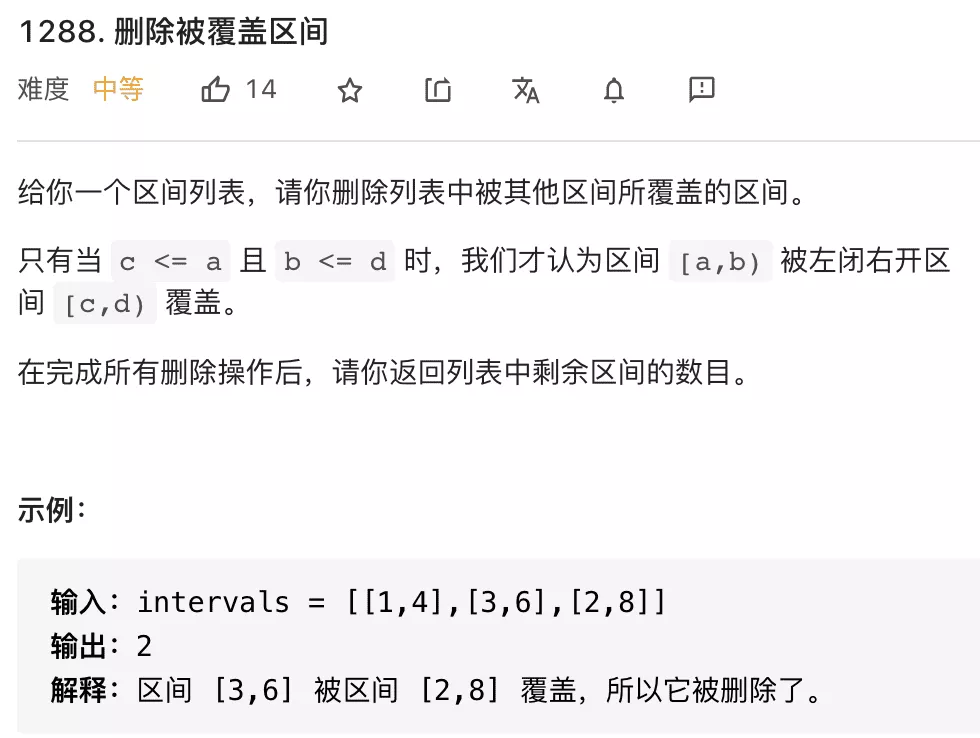
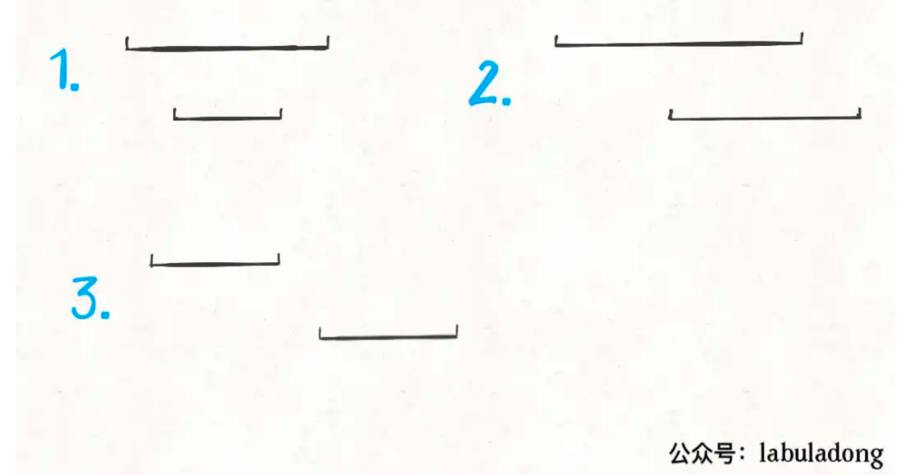
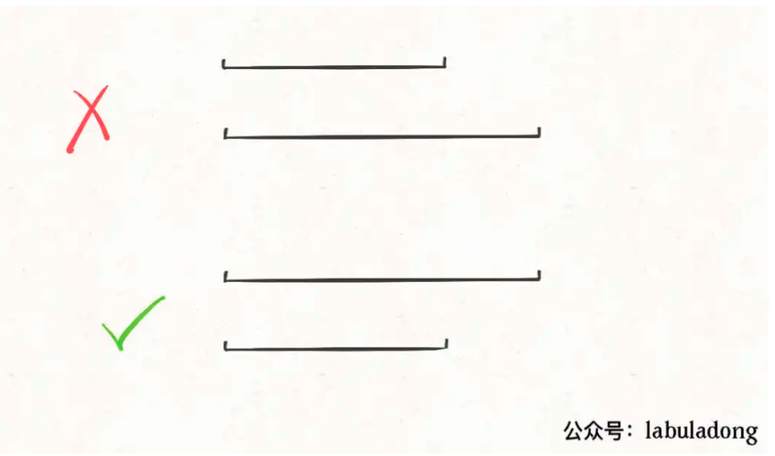
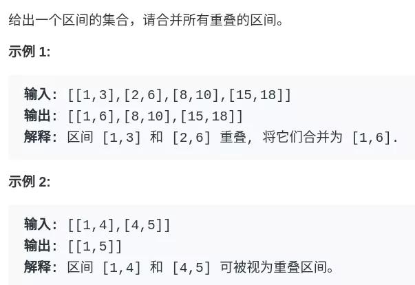
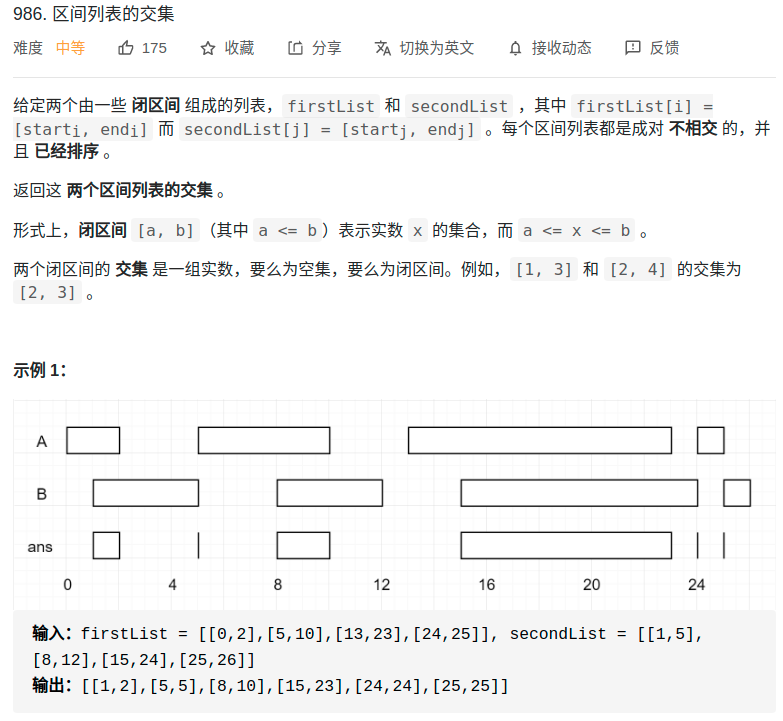

# 概述
- 参考
  - https://mp.weixin.qq.com/s/Eb6ewVajH56cUlY9LetRJw
  - https://labuladong.gitee.io/algo/3/28/102/
- 所谓区间问题，就是线段问题，让你合并所有线段、找出线段的交集等等。主要有两个技巧：
  - 1、**排序**。常见的排序方法就是按照区间起点排序，或者先按照起点升序排序，若起点相同，则按照终点降序排序。当然，如果你非要按照终点排序，无非对称操作，本质都是一样的。
  - 2、**画图**。就是说不要偷懒，勤动手，两个区间的相对位置到底有几种可能，不同的相对位置我们的代码应该怎么去处理。
    - 多画图很重要，一画图，思路就出来了

# leetcode1228:
<div align="center" style="zoom:80%"></div>

> 思路
- **先按左边的升序排序，对于右边则按降序排序**
  - 排序完出现以下三种情况，之所以要按右边降序排是为了避免一种特殊情况。避免覆盖的情况被判断为相交
- 排完序有三种情况
  - 1.覆盖
    - 处理：++res
  - 2.相交
    - 处理：合并，更新right
  - 3.相离
    - 处理：更新left和right
  - 分别对这三种情况进行处理
<div align="center" style="zoom:80%"></div>
<div align="center" style="zoom:80%"></div>


> 代码
```cpp
bool cmp(const vector<int>& a, const vector<int>&b){
    if(a[0] == b[0]){
        return b[1] < a[1];
    }
    return a[0] < b[0];
}

class Solution {
public:
    int removeCoveredIntervals(vector<vector<int>>& intervals) {
        sort(intervals.begin(), intervals.end(), cmp);
        int left = intervals[0][0];
        int right = intervals[0][1];
        int res = 0;

        for(int i = 1; i < intervals.size(); ++i){
            // 情况1.覆盖
            if(intervals[i][1] <= right){
                ++res;
            }else if( intervals[i][0] <=right  && intervals[i][1] > right){
                // 情况2.相交，合并
                right = intervals[i][1];
            }else{
                // 情况3.不相交
                left = intervals[i][0];
                right = intervals[i][1];
            }
        }
        return intervals.size()-res;
    }
};

```
```
执行用时：32 ms, 在所有 C++ 提交中击败了43.97%的用户
内存消耗：11 MB, 在所有 C++ 提交中击败了68.08%的用户
```

## 56. 合并区间
<div align="center" style="zoom:80%"></div>

- 一样的思路
  - 在上道题基础上稍微改下


```cpp
bool cmp(const vector<int>& a, const vector<int>& b){
    if(a[0] == b[0]){
        return b[1] < a[1];
    }
    return a[0] < b[0];
}
class Solution {
public:

    vector<vector<int>> merge(vector<vector<int>>& intervals) {
        vector<vector<int>> res;
        sort(intervals.begin(), intervals.end(), cmp);

        int left = intervals[0][0];
        int right = intervals[0][1];
        int i;
        for(i = 1; i < intervals.size(); ++i){
            if(right >= intervals[i][1]){
                // 覆盖
                continue;
            }else if(intervals[i][0] <= right){
                // 相交
                right = intervals[i][1];
            }else{
                // 相离
                // 将上一个段保存
                res.push_back({left,right});
                left = intervals[i][0];
                right = intervals[i][1];
            }
        }
        res.push_back({left,right});

        return res;
    }
};

```

```
执行用时：12 ms, 在所有 C++ 提交中击败了98.63%的用户
内存消耗：13.8 MB, 在所有 C++ 提交中击败了77.28%的用户
```

## 986. 区间列表的交集
- 已经是拍好序的了。所以只要画图区分以下情况就可以了。

<div align="center" style="zoom:80%"></div>

> 代码


```cpp
class Solution {
public:
    vector<vector<int>> intervalIntersection(vector<vector<int>>& firstList, vector<vector<int>>& secondList) {
        // 左边取最大，右边取最小。后就可以判断有没有相交的
        int left, right;
        vector<vector<int>> res;
        int i = 0, j = 0;
        while(i < firstList.size() && j < secondList.size()){
            auto minRight = min(firstList[i][1], secondList[j][1]);
            auto maxLeft = max(firstList[i][0], secondList[j][0]);
            // 有相交
            if(minRight >= maxLeft){
                res.push_back({maxLeft, minRight});
            }
            // 更新
            if(minRight == firstList[i][1]){
                ++i;
            }else{
                ++j;
            }

        }
        return res;
    }
};
```