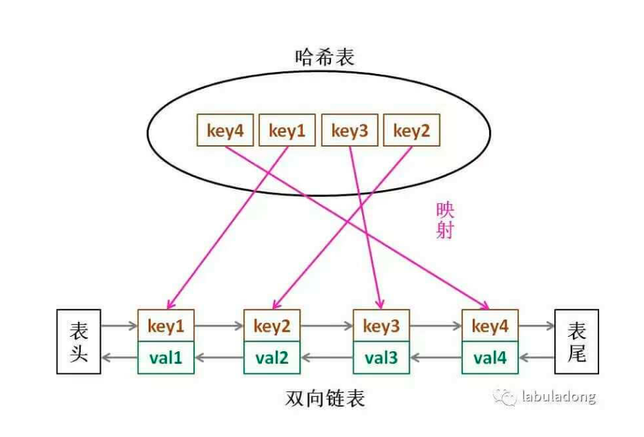

# LRU
- https://labuladong.gitbook.io/algo/mu-lu-ye-1/mu-lu-ye-2/lru-suan-fa
- 题目：https://leetcode-cn.com/problems/lru-cache/submissions/
## 思路
- 对数据结构cache的要求
  - cache必须有时序，用来区分哪个最久没用
    - 链表：一直从链表头部加入元素的话，越靠近头部的元素就是新的数据，越靠近尾部的元素就是旧的数据
  - 必须能够通过key，快速找到value
    - hash
  - 每次访问cache中的某个key，需要将其变为最近使用
    - hash+双向链表+访问。
      - 为什么用双向链表：插入删除快，而且方便。
- **数据结构：哈希链表 LinkedHashMap**

<div align="center" style="zoom:80%"></div>

> 应用接口
```cpp
class LRUCache {
    // 如果关键字 key 存在于缓存中，则返回关键字的值，否则返回 -1 
    int get(int key) {}
    // 如果关键字已经存在，则变更其数据值；如果关键字不存在，则插入该组「关键字-值」
    int put(int key,int value){}
}
```


## 代码

```cpp
struct Node{
    Node(int akey, int aval){
        key = akey;
        val = aval;
    }
    int key;
    int val;
    Node *pre = nullptr,*next = nullptr;
};

class DoubleList{
public:
    int getSize(){
        return size;
    }
    Node* removeNode(Node* target){
        // 如果是head
        if(head == target){
            head = target->next;
        }else{
            target->pre->next = target->next;
        };

        if(tail == target){
            tail = target->pre;
        }else{
            target->next->pre = target->pre;
        }
        --size;
        return target;
    }

    Node* removeTail(){
        return removeNode(tail);
    }
    void insertToHead(Node* n){
        if(head == nullptr){
            head = n;
            tail = n;
        }else{
            head->pre = n;
            n->next = head;
            head = n;
        }
        ++size;
    }

private:
    int size = 0;
    Node *head = nullptr, *tail = nullptr;
};


class HashListEx{
public:
    int getSize(){return size;}
    bool exist(int key){ return index.count(key) != 0;}
    Node* get(int key){

        if(index.count(key) == 0) return nullptr;
        Node* rtn;
        rtn = index[key];
        return rtn;
    }
    void removeNode(Node* n){
        if(index.count(n->key) == 0)
            return;
        index.erase(n->key);
        dl.removeNode(n);
        --size;
    }
    void insertToHead(Node* n){
        index[n->key] = n;
        dl.insertToHead(n);
        ++size;
    }
    void removeTail(){
        auto rtn = dl.removeTail();
        index.erase(rtn->key);
        --size;
    }
private:
    unordered_map<int,Node*> index;
    DoubleList dl;
    int size = 0;
};


class LRUCache {
public:
    LRUCache(int capacity) {
        cap = capacity;
        len = 0;
    }

    int get(int key) {
        // 有的话就返回val，没返回-1
        // 内部需要修改时序了，假设链表尾为最长没有被使用的
        Node *node = hle.get(key);
        if(node == nullptr)return -1;
        hle.removeNode(node);
        hle.insertToHead(node);
        return node->val;
    }

    void put(int key, int value) {
        // 有的话就进行更新，同时进行时序修改
        // 没有的话就进行插入，如果超过的容量，要删除最长时间没用的
        if(hle.exist(key)){
            Node* node = hle.get(key);
            node->val = value;
            // 删除后插入头部
            hle.removeNode(node);
            hle.insertToHead(node);
        } else{
            Node *node = new Node(key,value);
            hle.insertToHead(node);
            ++len;
            if(len > cap){
                hle.removeTail();
                --len;
            }
        }
    }

private:
    int cap;
    int len;
    HashListEx hle;
};
```

```
执行用时：420 ms, 在所有 C++ 提交中击败了41.10%的用户
内存消耗：169.6 MB, 在所有 C++ 提交中击败了16.79%的用户
```
# LFU
- https://mp.weixin.qq.com/s/oXv03m1J8TwtHwMJEZ1ApQ
- LFU 算法相当于是淘汰访问频次最低的数据，如果访问频次最低的数据有多条，需要淘汰最旧的数据
> 分析
- 调用`get(key)`方法时，要返回该`key`对应的`val`。
  - map
- 只要用`get`或者`put`方法访问一次某个`key`，该`key`的`freq`就要加一。
  - 对hashListSet的删除和添加操作
- 如果在容量满了的时候进行插入，则需要将`freq`最小的`key`删除，如果最小的`freq`对应多个`key`，则**删除其中最旧的那一个**
  - `hashListSet 即 map + hashList ，map<index,hashList>`

> 结论
- 用`map`来索引对象
- 用`hashListSet`控制管理`freq`

> 接口
```cpp
```cpp
class LFUCache {
    // 如果关键字 key 存在于缓存中，则返回关键字的值，否则返回 -1。只要存在freq+1
    int get(int key) {}
    // 如果关键字已经存在，则变更其数据值；如果关键字不存在，则插入该组「关键字-值」。只要存在freq+1
    int put(int key,int value){}
}
```


## 代码
```cpp
struct Node{
    Node(int akey, int aval){
        key = akey;
        val = aval;
        freq = 1;
        pre = nullptr;
        next = nullptr;
    }
    int key,val;
    int freq;
    Node *pre,*next;
};
class DoubleList{
public:
    void insertTohead(Node* node){
        if(head == nullptr){
            head = node;
            tail = node;
        }else{
            head->pre = node;
            node->next = head;
            head = node;
        }
    }
    Node* removeNode(Node* n){
        if(n == head){
            head = n->next;
        }else{
            n->pre->next = n->next;
        }
        if(n == tail){
            tail = n->pre;
        }else{
            n->next->pre = n->pre;
        }
        return n;
    }

    Node* removeTail(){
        return removeNode(tail);
    }
private:
    Node *head,*tail;
};

class hashList{
public:
    void addNode(Node* node){
        dl.insertTohead(node);
        index[node->key] = node;
    }
    Node* removeTail(){
        auto rtn = dl.removeTail();
        index.erase(rtn->key);
        return rtn;
    }
    void removeNode(Node* node){
        dl.removeNode(node);
        index.erase(node->key);

    }
    int getSize(){
        return index.size();
    }

private:
    DoubleList dl;
    map<int, Node*> index;
};

class LFUCache {
public:
    LFUCache(int capacity) {
        cap = capacity;
        len = 0;
    }

    int get(int key) {
        // 不存在返回-1
        if(keyToNode.count(key) == 0){
            return -1;
        }
        // 存在就返回，并且freq+1
        Node* rtn;
        rtn = keyToNode[key];
        update(key);
        return rtn->val;
    }

    void put(int key, int value) {
        if(cap == 0) return;
        // 如果已经存在了，则修改val和freq
        if(keyToNode.count(key) != 0){
            keyToNode[key]->val = value;
            update(key);
        }else{
            ++len;
            // 如果不存在，则添加
            keyToNode[key] = new Node(key,value);
            if(len > cap){
                --len;
                auto it = freqToSet.begin();
                auto rtn = it->second.removeTail();
                if(it->second.getSize() == 0)
                    freqToSet.erase(rtn->freq);
                keyToNode.erase(rtn->key);

            }
            freqToSet[1].addNode(keyToNode[key]);
        }
    }
    void update(int key){
        Node* rtn = keyToNode[key];
        //      删除原来所在
        freqToSet[rtn->freq].removeNode(rtn);
        if(freqToSet[rtn->freq].getSize() == 0)
            freqToSet.erase(rtn->freq);
        ++rtn->freq;
        //      加入到新的freq集合
        freqToSet[rtn->freq].addNode(rtn);
    }
private:
    // key到Node(val)的索引
    map<int, Node*> keyToNode;
    // freq到Node(val)的索引，一对多，且还有时序要求
    map<int, hashList> freqToSet;
    int len;
    int cap;
};
```
```
执行用时：568 ms, 在所有 C++ 提交中击败了16.14%的用户
内存消耗：186.4 MB, 在所有 C++ 提交中击败了4.99%的用户
```