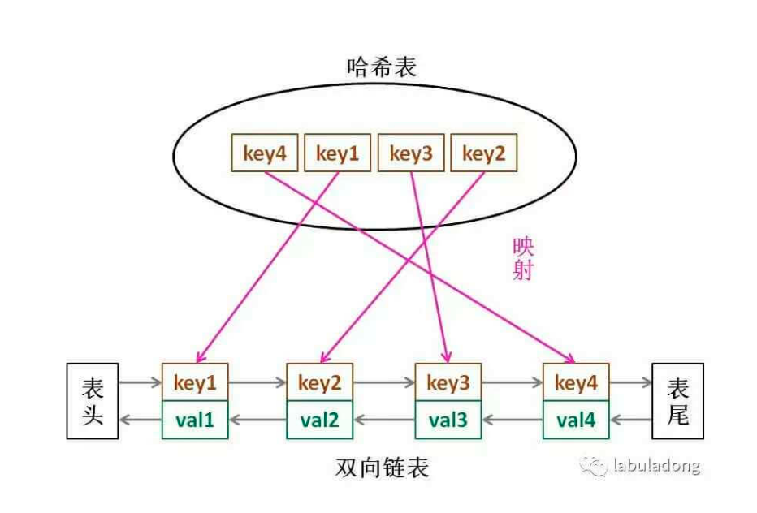

# LRU
- https://labuladong.gitbook.io/algo/mu-lu-ye-1/mu-lu-ye-2/lru-suan-fa
- 题目：https://leetcode-cn.com/problems/lru-cache/submissions/
## 思路
- 对数据结构cache的要求
  - cache必须有时序，用来区分哪个最久没用
    - 链表
  - 必须能够通过key，快速找到value
    - hash
  - 每次访问cache中的某个key，需要将其变为最近使用
    - hash+链表+访问
- **数据结构：哈希链表 LinkedHashMap**

<div align="center" style="zoom:80%"></div>

## 代码

```cpp
struct Node{
    Node(int akey, int aval){
        key = akey;
        val = aval;
    }
    int key;
    int val;
    Node *pre = nullptr,*next = nullptr;
};

class DoubleList{
public:
    int getSize(){
        return size;
    }
    Node* removeNode(Node* target){
        // 如果是head
        if(head == target){
            head = target->next;
        }else{
            target->pre->next = target->next;
        }

        if(tail == target){
            tail = target->pre;
        }else{
            target->next->pre = target->pre;
        }
        --size;
        return target;
    }

    Node* removeTail(){
        return removeNode(tail);
    }
    void insertToHead(Node* n){
        if(head == nullptr){
            head = n;
            tail = n;
        }else{
            head->pre = n;
            n->next = head;
            head = n;
        }
        ++size;
    }

private:
    int size = 0;
    Node *head = nullptr, *tail = nullptr;
};


class HashListEx{
public:
    int getSize(){return size;}
    bool exist(int key){ return index.count(key) != 0;}
    Node* get(int key){

        if(index.count(key) == 0) return nullptr;
        Node* rtn;
        rtn = index[key];
        return rtn;
    }
    void removeNode(Node* n){
        if(index.count(n->key) == 0)
            return;
        index.erase(n->key);
        dl.removeNode(n);
        --size;
    }
    void insertToHead(Node* n){
        index[n->key] = n;
        dl.insertToHead(n);
        ++size;
    }
    void removeTail(){
        auto rtn = dl.removeTail();
        index.erase(rtn->key);
        --size;
    }
private:
    unordered_map<int,Node*> index;
    DoubleList dl;
    int size = 0;
};


class LRUCache {
public:
    LRUCache(int capacity) {
        cap = capacity;
        len = 0;
    }

    int get(int key) {
        // 有的话就返回val，没返回-1
        // 内部需要修改时序了，假设链表尾为最长没有被使用的
        Node *node = hle.get(key);
        if(node == nullptr)return -1;
        hle.removeNode(node);
        hle.insertToHead(node);
        return node->val;
    }

    void put(int key, int value) {
        // 有的话就进行更新，同时进行时序修改
        // 没有的话就进行插入，如果超过的容量，要删除最长时间没用的
        if(hle.exist(key)){
            Node* node = hle.get(key);
            node->val = value;
            // 删除后插入头部
            hle.removeNode(node);
            hle.insertToHead(node);
        } else{
            Node *node = new Node(key,value);
            hle.insertToHead(node);
            ++len;
            if(len > cap){
                hle.removeTail();
                --len;
            }
        }
    }

private:
    int cap;
    int len;
    HashListEx hle;
};
```

```
执行用时：420 ms, 在所有 C++ 提交中击败了41.10%的用户
内存消耗：169.6 MB, 在所有 C++ 提交中击败了16.79%的用户
```