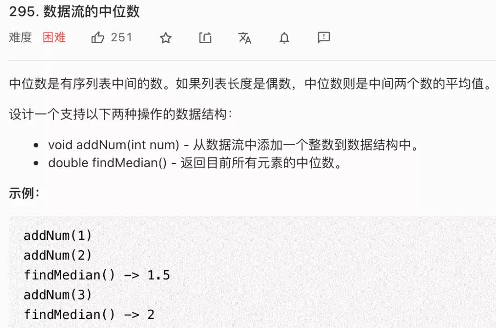
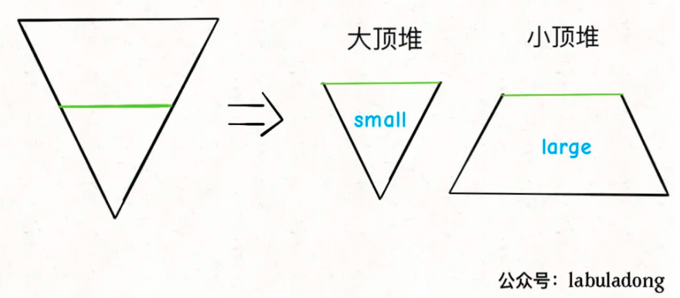

- https://mp.weixin.qq.com/s/oklQN_xjYy--_fbFkd9wMg

<div align="center" style="zoom:60%"></div>

> 分析
- 想要取得中间的两个数

> 思路
- 两个优先队列
- 重点在于怎么去平衡两个优先队列
  - 两个状态：`|smallset| == |largeset|`（状态1） 或 `|smallset|-1 == |largeset|`（状态2）
  - 状态1时添加num：
    - 如果`num<=largetop`，直接放到 `smallset` 中
    - 否则，将`largetop`放到 `smallset` ，后在 `largeset` 中删除，往 `largeset` 中添加 `num`
  - 状态2时添加 `num` ：
    - 如果`num>=smalltop`，直接放到 `smallset` 中
    - 否则，将`smalltop`放到 `largeset` ，后在 `smallset` 中删除，往 `smallset` 中添加 `num`
<div align="center" style="zoom:80%"></div>

> 代码

```cpp
class MedianFinder {
public:
    /** initialize your data structure here. */
    MedianFinder() {

    }

    void addNum(int num) {
        if(small.size() == 0){
            small.push(num);
            return;
        }
        // 注：重点在于怎么去平衡
        if(small.size() == large.size()){
            if (num <= large.top()){
                small.push(num);
            }else{
                auto t = large.top();
                large.pop();
                small.push(t);
                large.push(num);
            }
        }else{
            if (num >= small.top()){
                large.push(num);
            }else{
                auto t = small.top();
                small.pop();
                large.push(t);
                small.push(num);
            }
        }
    }

    double findMedian() {
        if(small.size() > large.size()){
            return small.top();
        }else{
            return double(small.top()+large.top())/2.0;
        }
    }
private:
    priority_queue<int, vector<int>,greater<int>> large;  // 存最大的一半，每次弹出最小的
    priority_queue<int> small;//存最小的一半，每次弹出最大的
//    bool flag = true;//true 放small， false放large
};
```
```
执行用时：316 ms, 在所有 C++ 提交中击败了19.65%的用户
内存消耗：114.3 MB, 在所有 C++ 提交中击败了11.21%的用户
```