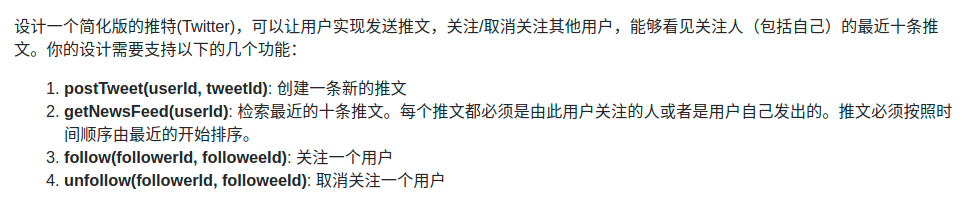

> 难度：中等
- https://labuladong.gitbook.io/algo/mu-lu-ye-1/mu-lu-ye-3/she-ji-twitter
  - 做时也没怎么看
- 不复杂：就是代码比较多
- 主要就是划分好类
- 最难的就是推送：核心是多个链表的合并

> 题目

<div align="center" style="zoom:80%"></div>

> 代码

```cpp
struct Twit{
    Twit(int id, int ts, Twit* n):twitterId(id), timestamp(ts), next(n){
    }
    int twitterId;
    int timestamp;
    Twit *next; // 下一条
};

class User{
public:
    User(int id):userId(id){
    }
    void removeFollow(int id){
        follow.erase(id);
    }
    void addFollow(User* u){
        follow.insert(make_pair(u->getId(), u));
    }
    int getId(){
        return userId;
    }
    void addTwitter(int tweetId, int ts){
        Twit* t = new Twit(tweetId, ts, twitHead);
        twitHead = t;
    }
    map<int, User*>& getFollow() {
        return follow;
    }
    Twit* getTwit() {
        return twitHead;
    }
private:
    int userId;
    // follow
    map<int, User*> follow;
    Twit *twitHead = nullptr;
};
class cmp{
public:
    bool operator()(Twit *t1, Twit *t2){
        return t1->timestamp < t2->timestamp;
    }
};

// 重点：主要用来处理多个链表的合并。有点外排序的味道
class TwitterSend{
public:
    TwitterSend(User *user){
        if(user->getTwit() != nullptr)
            pq.push(user->getTwit());
        for(auto t : user->getFollow()){
            if(t.second->getTwit() != nullptr)
                pq.push(t.second->getTwit());
        }
    }
    Twit* get(){
        if(pq.empty()) return nullptr;
        auto rtn = pq.top();
        pq.pop();
        // 取走后放入下一个节点
        if(rtn->next != nullptr){
            pq.push(rtn->next);
        }
        return rtn;
    }
private:
    priority_queue<Twit*, vector<Twit*>,cmp> pq;
};

class Twitter {
private:
    map<int,User*> users;
    int timestamp = 0;
public:
    /** Initialize your data structure here. */
    Twitter() {

    }

    /** Compose a new tweet. */
    void postTweet(int userId, int tweetId) {
        if(users.count(userId) == 0){
            users[userId] = new User(userId);
        }
        users[userId]->addTwitter(tweetId,timestamp++);
    }

    /** Retrieve the 10 most recent tweet ids in the user's news feed. Each item in the news feed must be posted by users who the user followed or by the user herself. Tweets must be ordered from most recent to least recent. */
    vector<int> getNewsFeed(int userId) {
        if(users.count(userId) == 0){
            users[userId] = new User(userId);
        }
        TwitterSend tsend = TwitterSend(users[userId]);
        vector<int> res;
        for(int i = 0; i < 10; ++i){
            auto t = tsend.get();
            if(t == nullptr) break;
            res.push_back(t->twitterId);
            cout << t->twitterId << " ";
        }
        return res;
    }

    /** Follower follows a followee. If the operation is invalid, it should be a no-op. */
    void follow(int followerId, int followeeId) {
        if(users.count(followerId) == 0){
            users[followerId] = new User(followerId);
        }
        if(users.count(followeeId) == 0){
            users[followeeId] = new User(followeeId);
        }
        users[followerId]->addFollow(users[followeeId]);
    }

    /** Follower unfollows a followee. If the operation is invalid, it should be a no-op. */
    void unfollow(int followerId, int followeeId) {
        if(users.count(followerId) == 0){
            users[followerId] = new User(followerId);
        }
        if(users.count(followeeId) == 0){
            users[followeeId] = new User(followeeId);
        }
        users[followerId]->removeFollow(followeeId);
    }
};
```

```
执行用时：0 ms, 在所有 C++ 提交中击败了100.00%的用户
内存消耗：7 MB, 在所有 C++ 提交中击败了57.06%的用户
```