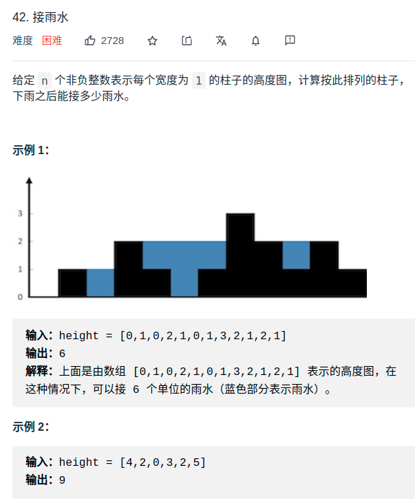

# 法1：暴力法
<div align="center" style="zoom:80%"></div>

- 对于位置 `i`，可以装两格水
  - 因为，位置 `i` 能达到的水柱高度**和其左边的最高柱子、右边的最高柱子有关**

```
water[i] = min(
               # 左边最高的柱子
               max(height[0..i]),  
               # 右边最高的柱子
               max(height[i..end]) 
            ) - height[i]
```
- 由此可写出暴力解法
  - 时间复杂度 O(N^2)

```cpp
int trap(vector<int>& height) {
    int n = height.size();
    int res = 0;
    for (int i = 1; i < n - 1; i++) {
        int l_max = 0, r_max = 0;
        // 找右边最高的柱子
        for (int j = i; j < n; j++)
            r_max = max(r_max, height[j]);
        // 找左边最高的柱子
        for (int j = i; j >= 0; j--)
            l_max = max(l_max, height[j]);
        // 如果自己就是最高的话，
        // l_max == r_max == height[i]
        res += min(l_max, r_max) - height[i];
    }
    return res;
}
```

# 法2：备忘录法
- 上面的过程在寻找右边最高柱子和左边最高柱子的时候，有很多重复计算操作。**可以通过备忘录记录，避免重复操作**
- 开两个数组 `r_max` 和 `l_max` 充当备忘录，`l_max[i]` 表示位置 `i` 左边最高的柱子高度，`r_max[i]` 表示位置 `i` 右边最高的柱子高度。预先把这两个数组计算好，避免重复计算

- 由此可写出备忘录做法
  - 时间复杂度降低为 O(N)，空间复杂度是 O(N)，
```cpp
int trap(vector<int>& height) {
    if (height.empty()) return 0;
    int n = height.size();
    int res = 0;
    // 数组充当备忘录
    vector<int> l_max(n), r_max(n);
    // 初始化 base case
    l_max[0] = height[0];
    r_max[n - 1] = height[n - 1];

    // 把自己也算进去，避免出现负数
    // 从左向右计算 l_max
    for (int i = 1; i < n; i++)
        l_max[i] = max(height[i], l_max[i - 1]);
    // 从右向左计算 r_max
    for (int i = n - 2; i >= 0; i--) 
        r_max[i] = max(height[i], r_max[i + 1]);
    // 计算答案
    for (int i = 1; i < n - 1; i++) 
        res += min(l_max[i], r_max[i]) - height[i];
    return res;
}
```

# 法3：双指针解法
- `l_max` 是 `height[0..left]` 中最高柱子的高度，`r_max` 是 `height[right..end]` 的最高柱子的高度

```cpp
int trap(vector<int>& height) {
    if (height.empty()) return 0;
    int n = height.size();
    int left = 0, right = n - 1;
    int res = 0;

    int l_max = height[0];
    int r_max = height[n - 1];

    while (left <= right) {
        l_max = max(l_max, height[left]);
        r_max = max(r_max, height[right]);

        
        if (l_max < r_max) {// 小的先来，因为都比当前的r_max都小了，right左边的那些更不用看了
            res += l_max - height[left];
            left++; 
        } else {
            res += r_max - height[right];
            right--;
        }
    }
    return res;
}
```