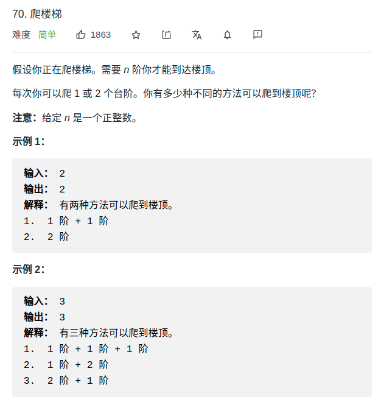

> 题目
- 决策树===> 递归
- 递归优化===>dp
<div align="center" style="zoom:80%"></div>


> 代码

```cpp
class Solution {
public:
    int climbStairs(int n) {
        // 思路：自底向上，备忘录
        // dp[i]：共有i阶时，有dp[i]种方法可以爬到楼顶
        vector<int> dp(n+1,0);
        dp[0] = 1;
        dp[1] = 1;
        for(int i = 2; i <= n; i++){
            dp[i] = dp[i-1]+dp[i-2];
        }
        return dp[n];
    }
};
```