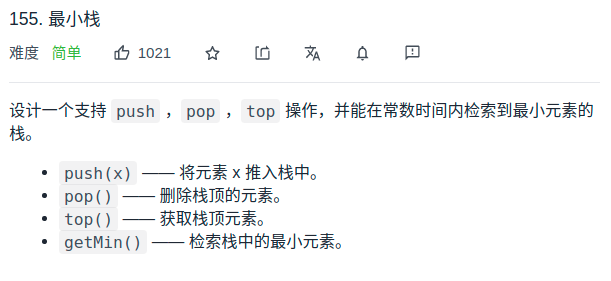

# 题目

<div align="center" style="zoom:80%"></div>


# 代码
- 一个栈同时保存当前值和栈内最小值；`pair<int,int>`
```cpp
class MinStack {
public:
    /** initialize your data structure here. */
    MinStack() {

    }

    void push(int val) {
        if(stk.empty()){
            stk.push({val,val});
        }else{
            stk.push({val,min(val,stk.top().second)});
        }
    }

    void pop() {
        stk.pop();
    }

    int top() {
        return stk.top().first;
    }

    int getMin() {
        return stk.top().second;
    }

private:
    stack<pair<int, int>> stk;
};
```