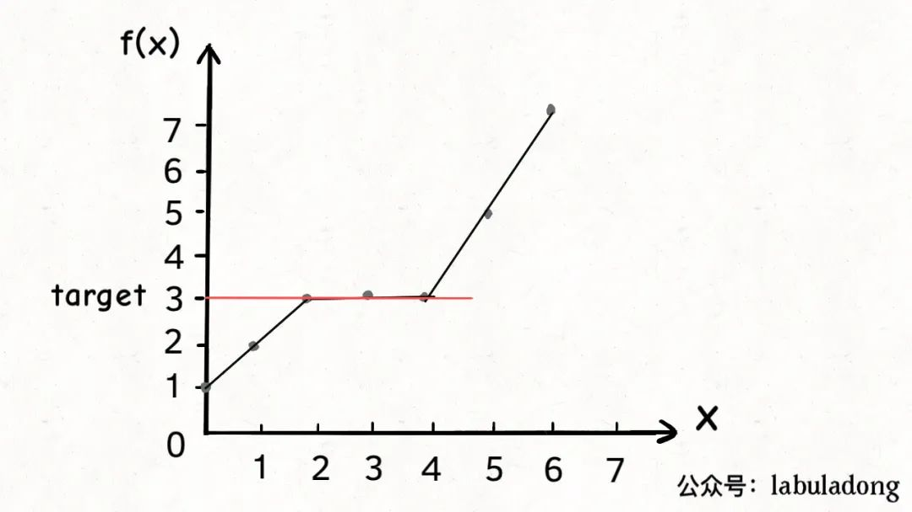
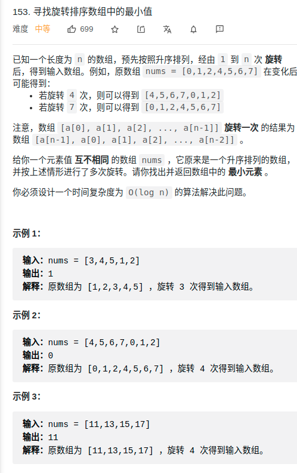
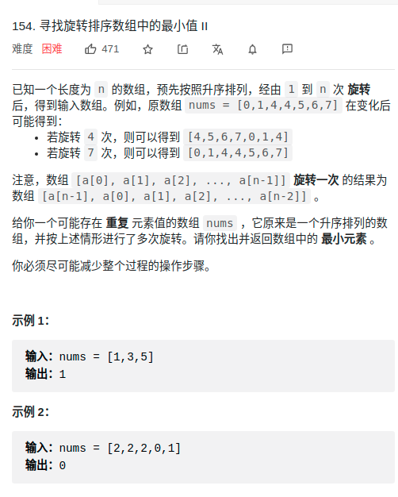
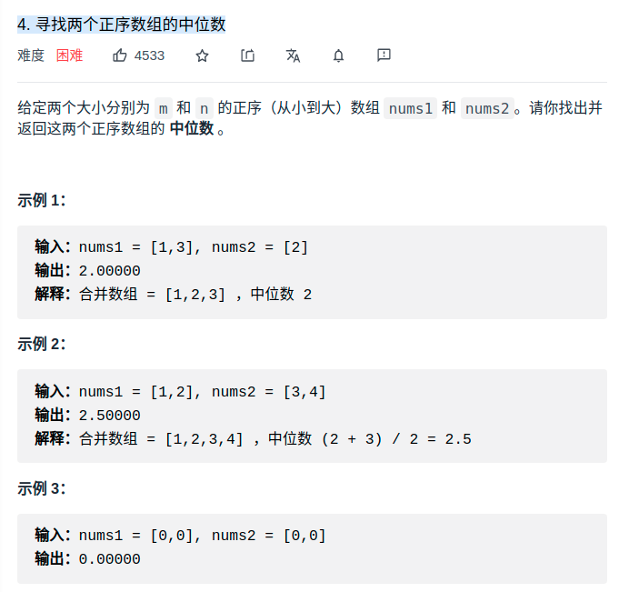
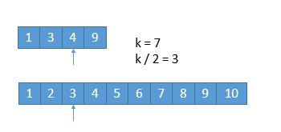
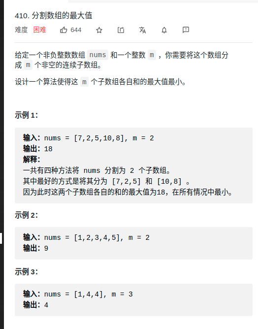
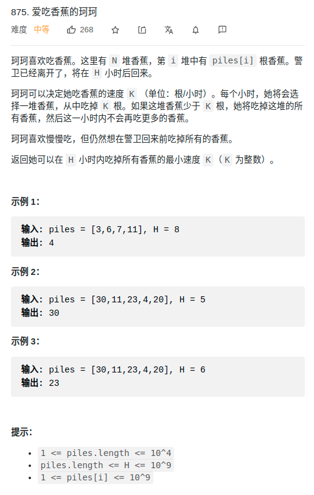
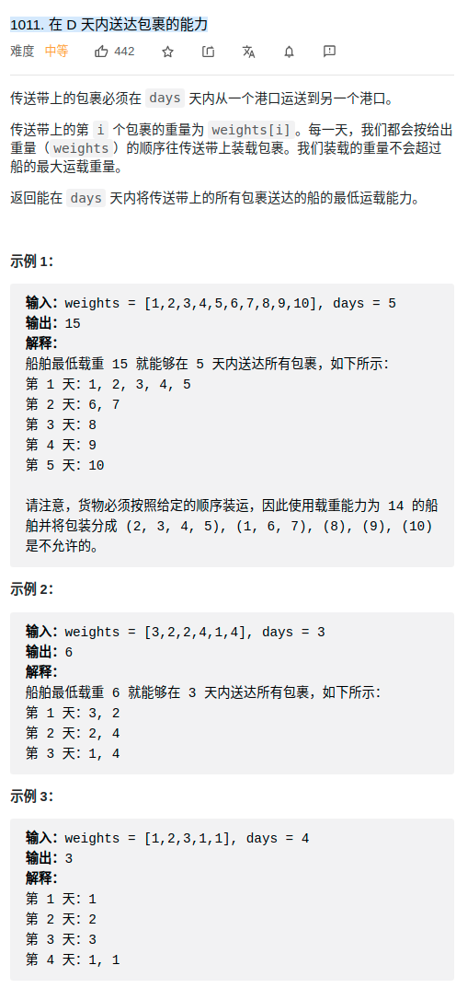

> 参考1：https://labuladong.gitbook.io/algo/mu-lu-ye/er-fen-cha-zhao-xiang-jie  
> 参考2：https://labuladong.gitbook.io/algo/mu-lu-ye-4/er-fen-cha-zhao-pan-ding-zi-xu-lie
> https://www.cnblogs.com/ider/archive/2012/04/01/binary_search.html

- [概述](#概述)
  - [二分搜索问题的泛化](#二分搜索问题的泛化)
  - [模板](#模板)
  - [寻找一个数](#寻找一个数)
  - [寻找左侧边界的二分搜索](#寻找左侧边界的二分搜索)
  - [寻找右侧边界二分法](#寻找右侧边界二分法)
- [进阶](#进阶)
  - [用二分查找法找寻区域](#用二分查找法找寻区域)
  - [在轮转后的有序数组上应用二分查找法](#在轮转后的有序数组上应用二分查找法)
    - [153. 寻找旋转排序数组中的最小值](#153-寻找旋转排序数组中的最小值)
    - [154. 寻找旋转排序数组中的最小值 II](#154-寻找旋转排序数组中的最小值-ii)
  - [4.在两个有序的数组中找他们的中位数](#4在两个有序的数组中找他们的中位数)
  - [将二分法用于单调函数](#将二分法用于单调函数)
    - [410. 分割数组的最大值](#410-分割数组的最大值)
    - [875. 爱吃香蕉的珂珂](#875-爱吃香蕉的珂珂)
    - [1011. 在 D 天内送达包裹的能力](#1011-在-d-天内送达包裹的能力)

# 概述
- **分析二分查找的一个技巧是：不要出现 else，而是把所有情况用 else if 写清楚，这样可以清楚地展现所有细节**。
- 代码中` left + (right - left) / 2 `就和 `(left + right) / 2` 的结果相同，但是有效防止了 `left` 和 `right` 太大直接相加导致溢出。
- 二分法难就难在于 `想到可以用二分法`
- 当 `target` 不存在时，**得到的索引恰好是比 val 大的最小元素索引**。
  - 如果在数组 [0,1,3,4] 中搜索元素 2，算法会返回索引 2，也就是元素 3 的位置，元素 3 是数组中大于 2 的最小元素。
- 个人体会：二分搜索，区间收敛过程，都会有一刻`lo + 1 == hi` 
- 其实二分法是一种递归，只是其是尾递归，所以可以不用栈
- 用于将 `o(n)` 变为 `log(n)`

## 二分搜索问题的泛化
- 首先，你要从题目中抽象出一个自变量`x`，一个关于x的函数`f(x)`，以及一个目标值 `target`
- 还需要满足以下条件
  - f(x)必须是在x上的**单调函数**（单调增单调减都可以）
  - 题目是让你计算满足约束条件f(x) == target时的 x 的值

<div align="center" style="zoom:80%"></div> 

```cpp
// 函数 f 是关于自变量 x 的单调递增函数
int f(int x, int[] nums) {
    return nums[x];
}

int left_bound(int[] nums, int target) {
    if (nums.length == 0) return -1;
    int left = 0, right = nums.length;

    while (left < right) {
        int mid = left + (right - left) / 2;
        if (f(mid, nums) == target) {
            // 当找到 target 时，收缩右侧边界
            right = mid;
        } else if (f(mid, nums) < target) {
            left = mid + 1;
        } else if (f(mid, nums) > target) {
            right = mid;
        }
    }
    return left;
}
```
> 框架

```cpp
// 函数 f 是关于自变量 x 的单调函数
int f(int x) {
    // ...
}

// 主函数，在 f(x) == target 的约束下求 x 的最值
int solution(int[] nums, int target) {
    if (nums.length == 0) return -1;
    // 问自己：自变量 x 的最小值是多少？
    int left = ...;
    // 问自己：自变量 x 的最大值是多少？
    int right = ... + 1;

    while (left < right) {
        int mid = left + (right - left) / 2;
        if (f(mid) == target) {
            // 问自己：题目是求左边界还是右边界？
            // ...
        } else if (f(mid) < target) {
            // 问自己：怎么让 f(x) 大一点？
            // ...
        } else if (f(mid) > target) {
            // 问自己：怎么让 f(x) 小一点？
            // ...
        }
    }
    return left;
}
```
1. **确定x, f(x), target分别是什么，并写出函数f的代码**。
2. **找到x的取值范围作为二分搜索的搜索区间，初始化left和right变量**。
3. **根据题目的要求，确定应该使用搜索左侧还是搜索右侧的二分搜索算法，写出解法代码**。


## 模板
```cpp
int binarySearch(int[] nums, int target) {
    int left = 0, right = ...;

    // 区间无任何元素，则退出while循环
    while(...) {
        int mid = left + (right - left) / 2;
        if (nums[mid] == target) {
            ...
        } else if (nums[mid] < target) {
            left = ...
        } else if (nums[mid] > target) {
            right = ...
        }
    }
    return ...;
}
```
##  寻找一个数
```cpp
int binarySearch(vector<int> nums, int target){
    int left, right, mid;
    left = 0;
    right = nums.size()-1;  // 注意
    while ( left <= right ) {
        mid = left + (right - left)/2;
        if ( target < nums[mid] )
            right = mid - 1; // 注意
        else if ( target > nums[mid] )
            left = mid + 1; // 注意
        else if( target == nums[mid] )
            return mid;
    }
    return  -1;
}
```
- **区间定义**：[left，right]为每次进行搜索的区间
  - 所以不需要包括已经判断过的值，无论left更新还是right更新都不会直接以mid替代，因为mid已经判断过不合适
- 为什么是 `right = nums.size()-1; `
  - 因为是左闭右闭区间 **[left, right]**

- 为什么 `while` 是 `<=`
  - 因为区间为空，循环终止。区间为空的时候为 **[right+1, right]**

- 为什么`left = mid + 1，right = mid - 1`
  - 因为搜索区间是左闭右闭区间 **[left, right]**。如果接下来是搜索 **[left, mid]**，那么mid已经知道不符合，肯定不用继续搜索

## 寻找左侧边界的二分搜索
- 特殊性质：**当 val 不存在时，得到的索引恰好是比 val 大的最小元素索引**。（感觉这么说不是很好，还是要依赖具体实现）
  - https://labuladong.gitbook.io/algo/mu-lu-ye-4/er-fen-cha-zhao-pan-ding-zi-xu-lie
```cpp
int binarySearch(vector<int> nums, int target){
    int left, right, mid;
    left = 0;
    right = nums.size();  // 注意
    while ( left < right ) {
        mid = left + (right - left)/2;
        if ( target < nums[mid] )
            right = mid; // 注意
        else if ( target > nums[mid] )
            left = mid + 1; // 注意
        else if( target == nums[mid] )
            right=mid; // 搜素左侧的关键
    }
    // return left; // 重点1.这种做法有特殊作用

    // 退出一定 left == right
    // 所有都比其大
    if ( left == nums.size() ) return -1;
    return nums[left] == target ? left : -1;
}
```
> 左闭右开情况下分析
- (个人总结)性质1：区间缩小到某一刻，肯定会有 `left + 1 == right` 的情况。最后退出的情况，肯定是 `left == right`
- (个人总结)性质2：`(left+right)/2`有偏向 `left` 的特性
- (个人总结)性质3：只要`right != nums.size()`，就有`nums[right] >= target`
- (个人总结)经验：不要去揣测`left`的情况，因为`mid+1`是不确定的。
- (个人总结)经验：`left=mid+1`是必要的，不然容易出现死循环。

- 如果在重点1中退出，如何理解该返回值？
  - 特例：target比所有的都大，`left == right`退出，过程中`right`没机会动，所以`left`为 `nums.size()`
  - 其他情况：因为`nums[right] >= target`，又因为退出时`left == right`，又因为偏左性质，所以最后分两种情况
    - 数组中有target：left为target再数组中最左边元素的下标
    - 数组中没有target：`left == right && nums[right] >= target`得，**left为刚好比target大的元素的位置**，也可以认为 **`left` 为 nums 中比target小的元素个数**
- 为什么 left = mid + 1，right = mid ？和之前的算法不一样？
  - ，因为我们的「搜索区间」是 `[left, right)` 左闭右开，所以当 `nums[mid]` 被检测之后，下一步的搜索区间应该去掉 mid 分割成两个区间，即 `[left, mid)` 或 `[mid + 1, right)`
> 左闭右闭的代码
```cpp
int binarySearch(vector<int> nums, int target){
    int left, right, mid;
    left = 0;
    right = nums.size()-1;  // 注意
    while ( left <= right ) {
        mid = left + (right - left)/2;
        if ( target < nums[mid] )
            right = mid-1; // 注意
        else if ( target > nums[mid] )
            left = mid + 1; // 注意
        else if( target == nums[mid] )
            right=mid-1; // 搜素左侧的关键
    }
    // 所有都比其大
    if ( left == nums.size() ) return -1;
    return nums[left] == target ? left : -1;
}
```
- 尝试用上面的分析去分析，可以很快得出为什么是这样写
## 寻找右侧边界二分法
> 左闭右开
```cpp
int binarySearch(vector<int> nums, int target){
    int left, right, mid;
    left = 0;
    right = nums.size();  // 注意
    while ( left < right ) {
        mid = left + (right - left)/2;
        if ( target < nums[mid] )
            right = mid; // 注意
        else if ( target > nums[mid] )
            left = mid + 1; // 注意
        else if( target == nums[mid] )
            left = mid + 1; // 搜素右侧的关键
    }
    if(left == 0) return -1;
    return nums[left-1] == target ? left-1 : -1;
}
```

> 左闭右闭的代码
```cpp
int binarySearch(vector<int> nums, int target){
    int left, right, mid;
    left = 0;
    right = nums.size()-1;  // 注意
    while ( left <= right ) {
        mid = left + (right - left)/2;
        if ( target < nums[mid] )
            right = mid - 1; // 注意
        else if ( target > nums[mid] )
            left = mid + 1; // 注意
        else if( target == nums[mid] )
            left = mid + 1; // 搜素右侧的关键
    }
    if(left == 0) return -1;
    return nums[left-1] == target ? left-1 : -1;
}

```


# 进阶
## 用二分查找法找寻区域
- 思路
  - 左侧边界寻找+右侧边界寻找
  - done

## 在轮转后的有序数组上应用二分查找法

### 153. 寻找旋转排序数组中的最小值
<div align="center" style="zoom:80%"></div> 

- 区间定义：最小值所在区间，所以当这个区间的容量为1，就是结果
- 画图分析可能情况，寻找共同点
- 这里的退出条件不再是区间为空。**而是区间里只剩下一个元素**
- 这种情况下使用左闭右闭区间比较简单
```cpp
int findMin(vector<int>& nums) {
    int left, right;
    left = 0;
    right = nums.size()-1;
    // 注：这里返回的是一个只有一个元素的区间，这个元素就是最小的元素。这种情况最好用左闭右闭，比较简单
    while(left < right){
        int mid = left + (right - left) /2;
        if( nums[mid] <= nums[right]){   // 最小值在左边
            right = mid;
        } else{ // mid不可能是最小值
            left = mid+1;
        }
    }
    return nums[left];
}
```

### 154. 寻找旋转排序数组中的最小值 II
<div align="center" style="zoom:80%"></div> 
<div align="center" style="zoom:80%"></div> 

- **区间定义**：[lo,hi] 为旋转点所在区间
- **当 nums[m] > nums[j] 时**： m 一定在 左排序数组 中，即旋转点 x 一定在[m+1,j]闭区间内，因此执行 i = m + 1
- **当 nums[m] < nums[j] 时**： m 一定在 右排序数组 中，即旋转点 x 一定在[i,m]闭区间内，因此执行 j = m 
- **当 nums[m] == nums[j] 时**：无法判断，--j减小范围

```cpp
class Solution {
public:
    int findMin(vector<int>& nums) {
        int lo = 0;
        int hi = nums.size()-1;
        while(lo < hi){
            int mid = lo + (hi-lo)/2;
            if(nums[mid] < nums[hi]){
                hi = mid;
            }else if(nums[mid] > nums[hi]){
                lo = mid+1;
            }else{
                hi--;// 难点
            }
        }
        return nums[lo];
    }
};
```

## 4.在两个有序的数组中找他们的中位数
> 题目
- 要求限制：时间复杂度为 `O(log (m+n))`
<div align="center" style="zoom:80%"></div>

> 思路
- 找到中位数====>如果可以这两个数组中第k小的数，就好了。（要求log级别，想到二分法，一半一半的排除不可能的结果）
- 参考：https://leetcode-cn.com/problems/median-of-two-sorted-arrays/solution/xiang-xi-tong-su-de-si-lu-fen-xi-duo-jie-fa-by-w-2/
  - 如何找到第k小的数
- 当要找的是第7小的数。步骤如下
  - 比较两个数组（假设a,b两数组）的第 k/2 个数字，如果 k 是奇数，向下取整
  - 如下图所示，设`a[k/2 -1] > b[k/2-1]`，则可以排除`b[k/2-1]`以前的所有数，其不可能为第 `k` 小的数。
  - 更新k的值，因为排除了一部分了（接近一半）。再这里`k=7-3=4`，以此类推
  - 当`k==1`，比较两个数，拿最小的即可
  - 当 **只剩一个数组**的时候，直接用k来作为偏移索引。


<div align="center" style="zoom:100%"></br><span>比较</span></div>
<div align="center" style="zoom:100%"></br><span>更新k值</span></div>
<div align="center" style="zoom:100%"></br></div>
<div align="center" style="zoom:100%"></br><span>比较两个数，拿最小的即可</span></div>

- 特殊情况
  - 当`k/2 -1`造成数组越界怎么办？指向最后一个元素就好了。
<div align="center" style="zoom:100%"></br><span>越界则指向最后一个</span></div>
<div align="center" style="zoom:100%"></br></div>


> 代码


```cpp

class Solution {
public:
    double findMedianSortedArrays(vector<int>& nums1, vector<int>& nums2) {
        // 要找到第k大的数，从1开始
        int k = (nums1.size() + nums2.size()+ 1)/2 ; // (2 +3) /2
        if((nums1.size() + nums2.size()) & 1)
            return getKth(nums1, nums2, 0, nums1.size(), 0, nums2.size(), k);
        else
            return (getKth(nums1, nums2, 0, nums1.size(), 0, nums2.size(), k)+
            getKth(nums1, nums2, 0, nums1.size(), 0, nums2.size(), k+1))/2.0;
    }

private:
    // [l1,r1), [l2,r2)
    // 获取第k小的值
    int getKth(vector<int>& nums1, vector<int>& nums2, int l1, int r1, int l2, int r2, int k){
        // 只剩下一个数组有数的情况
        if(l1 == r1)
            return nums2[l2+k-1];
        if(l2 == r2)
            return nums1[l1+k-1];
        if(k == 1){
            return min(nums1[l1], nums2[l2]);
        }

        // 数组两边各取的数量为t
        int t = k/2;
        int pos1,pos2;
        // 判断边界，如果越界了就取数组最后一个
        if(l1+t > r1) pos1 = r1-1;
        else pos1 = l1+t-1; // 注意-1
        if(l2+t > r2) pos2 = r2-1;
        else pos2 = l2+t-1;
        if(nums1[pos1] < nums2[pos2]){// pos1 out
            return getKth(nums1, nums2, pos1+1, r1, l2, r2, k-pos1+l1-1);
        }else{
            return getKth(nums1, nums2, l1, r1, pos2+1, r2, k-pos2+l2-1);
        }
    }
};
```

## 将二分法用于单调函数
- https://mp.weixin.qq.com/s/0OaNLfQznaJAkjx870xRLQ
- **想用二分查找技巧优化算法，首先要把 for 循环形式的暴力算法写出来，如果算法中存在如下形式的 for 循环**
  - **如果 func(i) 函数是在 i 上单调的函数，一定可以使用二分查找技巧优化 for 循环**
    - 410

```cpp
// func(i) 是 i 的单调函数（递增递减都可以）
int func(int i);

// 形如这种 for 循环可以用二分查找技巧优化效率
for (int i = 0; i < n; i++) {
    if (func(i) == target)
        return i;
}
```

- 因为这个逻辑和「在有序数组中查找一个元素」是完全一样的。
  - 在**有序数组 nums** 中查找某一个数 target。既然 nums 是有序数组，你把 nums[i] 看做函数调用，是不是可以理解为 nums 在参数 i 上是单调的？这是不是和之前说的 func(i) 函数完全一样？

```cpp
// nums 是一个有序数组
int[] nums;
// target 是要搜索的元素
int target;

// 搜索 target 在 nums 中的索引
for (int i = 0; i < nums.length; i++) {
    if (nums[i] == target)
        return i;
}
```

### 410. 分割数组的最大值

<div align="center" style="zoom:100%"></br></div>


- suppose
  - sumMaxMin：m个子数组各自和的最大值的最小值
  - mMin：给定一个子数组和的最大阈值sumMax，至少需要将数组分割成mMin块
- 分析：
  - m越大，sumMaxMin越小，即存在单调减关系。
  - sumMax越大，mMin越小
  - 给定m，难以计算sumMaxMin，除非使用dfs暴力破解
  - 但是反过来，如果给定 sumMax 可以容易计算 mMin
    - 比如说` nums = [7,2,5,10]`，若限制 `max = 10`，则 `split` 函数返回 3，即 `nums` 数组最少能分割成三个子数组，分别是 `[7,2],[5],[10]`
    - **如果我们找到一个最小 max 值，满足 split(nums, max) 和 m 相等，那么这个 max 值不就是符合题意的「最小的最大子数组和」**
  
- 区间定义：结果的取值区间，即 sumMaxMin 的取值区间

```cpp
class Solution {
public:
    int splitArray(vector<int>& nums, int m) {
        auto start = getMax(nums);
        auto end = getSum(nums)+1;

        int lo = start;
        int hi = end;
        // [lo,hi], 退出后 lo+1 == hi
        while(lo < hi){
            int mid = lo + (hi-lo)/2;
            auto n = split(nums, mid);
            // 需要 hi 尽量靠左，找到最小的sumMax，使得
            // split(nums,sumMax) == m
            if(n == m){
                hi = mid;
            }else if( n > m){
                lo = mid+1;
            }else if( n < m){
                hi = mid;
            }
        }
        return hi;
    }

    // 给定最大的子数组和的阈值，返回最少可以分割成几份
    // maxMin 越大，return 越小，单调减性质
    int split(vector<int>nums, int maxMin){
        int count = 1;
        int sum = 0;
        for(int i = 0; i < nums.size(); ++i){
            sum += nums[i];
            if(sum > maxMin){
                sum = nums[i];
                count++;
            }
        }
        return count;
    }

    // 用于计算起始区间
    int getMax(vector<int>& nums){
        int res = 0;
        for(auto a : nums){
            res = a > res ? a : res;
        }
        return res;
    }

    int getSum(vector<int>& nums){
        int res = 0;
        for(auto a : nums){
            res += a;
        }
        return res;
    }

};
```

### 875. 爱吃香蕉的珂珂
<div align="center" style="zoom:100%"></br></div>

1. 定义f：在猴子吃香蕉的速度为k的前提下，返回保卫至少需要离开H小时；k 越大 f(piles,k) 越小
2. 定义边界：`[1, max(piles)]`
3. 考虑二分写法; [lo, hi]，break时 lo == hi, 剩下的最后一个就是答案
   1. **区间定义**： [lo, hi] 为结果可选区间。
   2. 需要求得f(piles, mid) == h，最小的k，所以靠左
   3. 如何让 f 变大 ===> hi = mid;
   4. 如何让 f 变小 ===> lo = mid + 1;


```cpp
class Solution {
public:
    // 1. 定义f: 在猴子吃香蕉的速度为k的前提下，保卫至少需要离开H小时，k 越大 f(piles,k) 越小.
    int f(vector<int>& piles, int k){
        int res = 0;
        for(auto a : piles){
            res = res + (a+k-1) / k;
        }
        return res;
    }
    int minEatingSpeed(vector<int>& piles, int h) {
        // 2. 定义边界
        int lo = 1;
        int hi = 0;
        for(auto p : piles){
            hi = hi < p ? p : hi;
        }
        // 3. 考虑二分写法; [lo, hi]，break时 lo+1 == hi
        while(lo < hi){
            int mid = (lo+hi)/2;
            int hm = f(piles, mid);
            if(hm == h){
                // 需要求得f(piles, mid) == h，最小的k，所以靠左
                hi = mid;
            }else if(hm < h){
                // 如何让hm变大
                hi = mid;
            }else{
                // 如何让hm变小
                lo = mid+1;
            }
        }
        return hi;
    }
};
```

### 1011. 在 D 天内送达包裹的能力

<div align="center" style="zoom:100%"></br></div>

1. 定义：给定运载能力 p, 返回至少需要的运载天数 f(weights, p); p 越大 f 越小
2. 确定边界;lo 取 weights 中最大的， hi 取sum(weights)
3. 判断二分写法； [lo, hi] 表示可能的结果范围，应该取尽可能小的结果


```cpp
class Solution {
public:
    // 1. 定义：给定运载能力 p, 返回至少需要的运载天数 f(weights, p); p 越大 f 越小
    int f(vector<int> weights, int p){
        int res = 0;
        int t = 0;
        for( auto w : weights){
            if(t < w){
                ++res;
                t = p;
                t -= w;
            }else
                t -= w;
        }
        return res;
    }
    int shipWithinDays(vector<int>& weights, int days) {
        sort(weights.begin(), weights.end());
        // 2. 确定边界
        int lo = 0,hi = 0;
        // lo 取 weights 中最大的， hi 取sum(weights)
        for( auto w : weights){
            hi += w;
            lo = lo < w ? w : lo;
        }
        // 3. 判断二分写法； [lo, hi] 表示可能的结果范围，应该取尽可能小的结果
        while(lo < hi){
            int mid = (lo + hi) /2;
            int dm = f(weights, mid);
            if(dm == days){
                hi = mid;
            }else if(dm < days){
                hi = mid;
            }else if(dm > days){
                lo = mid+1;
            }
        }
        return hi;
    }
};

```