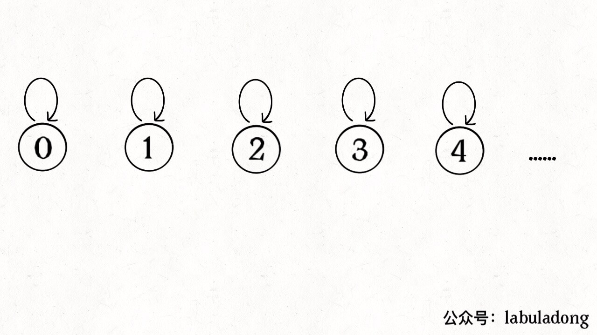

> https://labuladong.gitbook.io/algo/mu-lu-ye-1/mu-lu-ye-3/unionfind-suan-fa-xiang-jie

- [概述](#概述)
  - [实现](#实现)
  - [优化：平衡优化](#优化平衡优化)
  - [优化：路径压缩](#优化路径压缩)
- [应用](#应用)
  - [DFS 的替代方案](#dfs-的替代方案)
    - [130. 被围绕的区域](#130-被围绕的区域)
  - [判断合法等式（优美解法）](#判断合法等式优美解法)
    - [990. 等式方程的可满足性](#990-等式方程的可满足性)
  - [128.最长连续序列](#128最长连续序列)

# 概述
- 主要是解决图论中「动态连通性」问题的

> 接口
```cpp
class UF {
    /* 将 p 和 q 连接 */
    public void union(int p, int q);
    /* 判断 p 和 q 是否连通 */
    public boolean connected(int p, int q);

    /* 返回图中有多少个连通分量 */
    public int count();
}
```

> 连通的性质

1. 自反性：节点 `p` 和 `p` 是连通的。
2. 对称性：如果节点 `p` 和 `q` 连通，那么 `q` 和 `p` 也连通。
3. 传递性：如果节点 `p` 和 `q` 连通， `q` 和 `r` 连通，那么 `p` 和 `r` 也连通。

> 连通分量
- 判断连通作用：编译器判断同一个变量的不同引用，比如社交网络中的朋友圈计算等等

- 10个连通分量
<div align="center" style="zoom:60%"></div>

- 8个连通分量
<div align="center" style="zoom:60%"></div>

## 实现
- 用森林来表示连通性，用数组来表示森林
<div align="center" style="zoom:60%"></div>

- `union`：如果某两个节点被连通，则让其中的（任意）一个节点的根节点接到另一个节点的根节点上
<div align="center" style="zoom:60%"></div>

- `connected`：这样，如果节点 p 和 q 连通的话，它们一定拥有相同的根节点
<div align="center" style="zoom:60%"></div>

> 代码
```cpp
class UF {
    // 记录连通分量
    private int count;
    // 节点 x 的节点是 parent[x]
    private int[] parent;

    /* 构造函数，n 为图的节点总数 */
    public UF(int n) {
        // 一开始互不连通
        this.count = n;
        // 父节点指针初始指向自己
        parent = new int[n];
        for (int i = 0; i < n; i++)
            parent[i] = i;
    }

    public void union(int p, int q) {
    int rootP = find(p);
    int rootQ = find(q);
    if (rootP == rootQ)// 注意2：判断是不是已经连通的
        return;
    // 注意1：将两棵树合并为一棵
    parent[rootP] = rootQ;
    // parent[rootQ] = rootP 也一样
    count--; // 两个分量合二为一
    }

    public boolean connected(int p, int q) {
        int rootP = find(p)int q) {
        int rootP = find(p);
        int rootQ = find(q);
        return rootP == rootQ;
    };
    }

    // 返回某个节点 x 的根节点 
    private int find(int x) {
        // 根节点的 parent[x] == x
        while (parent[x] != x)
            x = parent[x];
        return x;
    }

    /* 返回当前的连通分量个数 */
    public int count() { 
        return count;
    }
}
```

> 复杂度分析
- `connected` 和 `union` 中的复杂度都是 `find` 函数造成的，所以说它们的复杂度和 `find` 一样
- **时间复杂度就是树的高度**
  - 一般都是取最坏情况，所以find的时间复杂度为`O(n)`

<div align="center" style="zoom:60%"></div>

## 优化：平衡优化
- 目标：小的树，接到大的树
- 实现：引入一个数组，来记录每棵树包含的节点数量，这里称为“重量”
  - 重点在`union`时怎么优化

```cpp
class UF {
    private int count;
    private int[] parent;
    // 新增一个数组记录树的“重量”
    private int[] size;

    public UF(int n) {
        this.count = n;
        parent = new int[n];
        // 最初每棵树只有一个节点
        // 重量应该初始化 1
        size = new int[n];
        for (int i = 0; i < n; i++) {
            parent[i] = i;
            // 注意：
            size[i] = 1;
        }
    }
    public void union(int p, int q) {
        int rootP = find(p);
        int rootQ = find(q);
        if (rootP == rootQ)
            return;

        // 重点1：小树接到大树下面，较平衡
        if (size[rootP] > size[rootQ]) {
            parent[rootQ] = rootP;
            size[rootP] += size[rootQ];
        } else {
            parent[rootP] = rootQ;
            size[rootQ] += size[rootP];
        }
        count--;
    }
}
```

## 优化：路径压缩
- 目标：能否进一步压缩树的高度，使其为常量。使得`find`的时间复杂度为O(1)

> 优化代码
- 思路：x的父亲变为x的父亲的父亲。这样原来的父亲就变为兄弟了。
```Cpp
private int find(int x) {
    while (parent[x] != x) {
        // 进行路径压缩
        parent[x] = parent[parent[x]];
        x = parent[x];
    }
    return x;
}
```

<div align="center" style="zoom:60%"></div>

# 应用
> https://labuladong.gitbook.io/algo/mu-lu-ye-1/mu-lu-ye-3/unionfind-suan-fa-ying-yong

- 算法本身不难，能不能应用出来主要是看抽象问题的能力，**是否能够把原始问题抽象成一个有关图论的问题**
## DFS 的替代方案
- **很多使用 DFS 深度优先算法解决的问题，也可以用 Union-Find 算法解决**
- 主要思路是适时增加虚拟节点，想办法让元素「分门别类」，建立动态连通关系

### 130. 被围绕的区域
<div align="center" style="zoom:60%"></div>

> 思路1：dfs
- 处理4条变上的 `O`，遇到 `O` 用dfs将其相邻的 `O` 给赋值为特殊字符 `#`
- 最后遍历整个空间，把剩下的`O`全部改为`X`,`#`改为O


> 并查集
1. 定义一个dummy并查集节点，所有外边的"`O`"都与该点**union**。
2. 扫描其他剩下的，如果是"`O`"则与其附近4个方向的"`O`"**union**
3. 全部扫描一遍，如果是"`O`"，判断是否与dummy相连（调用`connected`接口）
<div align="center" style="zoom:60%"></div>


## 判断合法等式（优美解法）
### 990. 等式方程的可满足性
- 先处理等式，让相等的两个`union`
- 再判断不等式，让不等式判断`connected`
<div align="center" style="zoom:60%"></div>


## 128.最长连续序列
<div align="center" style="zoom:60%"></div>

- 思路：
  - 题目要求时间O(n)
    - 不能排序
    - 要用特殊的数据结构，而且对于插入之类的操作是O(1)的
  - 直觉：题目有点连通性的味道————并查集

> 代码
```cpp
class UF{
public:
    UF(int n):count(n), parent(n), treeSize(n,1), maxts(1){
        for(auto i = 0; i < n; ++i){
            parent[i] = i;
        }
    }

    void Union(int x, int y){
        auto lroot = find(x);
        auto rroot = find(y);

        if(lroot == rroot) return;

        if(treeSize[lroot] > treeSize[rroot]){
            parent[rroot] = lroot;
            treeSize[lroot] += treeSize[rroot];
            maxts = max(maxts, treeSize[lroot]);
        }else if(treeSize[lroot] <= treeSize[rroot]){
            parent[lroot] = rroot;
            treeSize[rroot] += treeSize[lroot];
            maxts = max(maxts, treeSize[rroot]);
        }
    }

    bool Connected(int x, int y){
        auto lroot = find(x);
        auto rroot = find(y);
        if(lroot == rroot) true;
        return false;
    }
    int getMaxTreeSize(){
        return maxts;
    }


private:
    // 找x的根
    int find(int x){
        while(parent[x] != x){
            parent[x] = parent[parent[x]];
            x = parent[x];
        }
        return x;
    }

    vector<int> parent;
    vector<int> treeSize;
    vector<int> count;
    int maxts;
};


class Solution {
public:
    int longestConsecutive(vector<int>& nums) {
        if(nums.size() == 0)return 0;
        int pos = 0;
        UF uf(nums.size());
        for(auto &n : nums){
            if(record.count(n))
                continue;
            record[n] = pos;
            // 判断相邻的两个数是否存在，存在则将其连接
            if(record.count(n-1))
                uf.Union(record[n-1], pos);
            if(record.count(n+1))
                uf.Union(record[n+1],pos);
            ++pos;
        }
        return uf.getMaxTreeSize();
    }

private:
    // 值-----并查集节点
    unordered_map<int,int> record;
};

```