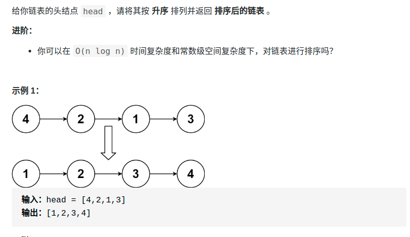

> 难度：中等
- 有点难顶
- 思路：大概思路就是自底向上归并（规模从1开始，到partLen >= len就停止）
  - 1.先按partLen进行切片（要把结尾切断，即`end->next = nullptr`）
  - 2.切出两段后进行归并，归并后记得连上一个切片的开始
  - 3.循环1，2知道不能再切了

- 一开始用快慢指针，发现真的太复杂了，还不如按部就班好。没必要提升一点点效率，把代码搞这么复杂

- 要善于使用头指针
> 题目
<div align="center" style="zoom:80%"></div>

> 代码

```cpp
class Solution {
public:
    // return {head, tail}
    pair<ListNode*,ListNode*> Merge(ListNode* l1, ListNode *l2){
        if(l1 == nullptr && l2 == nullptr)
            return {nullptr, nullptr};
        ListNode *head, *tail;
        head = new ListNode(0);
        tail = head;
        ListNode *it1, *it2;
        it1 = l1;
        it2 = l2;
        while(it1 != nullptr && it2 != nullptr){
            if(it1->val <= it2->val){
                tail->next = it1;
                it1 = it1->next;
            }else {
                tail->next = it2;
                it2 = it2->next;
            }
            tail = tail->next;
        }
        if(it1 != nullptr){
            tail->next = it1;
        }
        if(it2 != nullptr){
            tail->next = it2;
        }
        while(tail->next != nullptr){
            tail = tail->next;
        }
        return {head->next,tail};

    }
    ListNode* sortList(ListNode* head) {
        int partLen = 1;
        ListNode *it = head;
        ListNode* res = head;
        int len = 0;
        while(it != nullptr){
            ++len;
            it = it->next;
        }
        // 总的思路：分裂链表，之后归并
        // partLen部分都是排序好的一小段，从1开始。
        while(partLen < len){
            ListNode *next = res;
            ListNode *nextPre = new ListNode(0,res);
            // next为下一个处理的起点
            while(next) {
                ListNode *cur = next;
                ListNode *preCur = nullptr;
                ListNode *l1,*l2;

                // 寻找链表片段
                int i = 0;
                l1 = cur;
                while(cur != nullptr && i < partLen){
                    preCur = cur;
                    cur = cur->next;
                    ++i;
                }
                if(cur == nullptr){
                    nextPre->next = next;   // 注意，必须连接，不然就丢失了
                    break;
                }
                preCur->next = nullptr; //切断

                // 寻找另一链表片段
                i = 0;
                l2 = cur;
                while(cur != nullptr && i < partLen){
                    preCur = cur;
                    cur = cur->next;
                    ++i;
                }
                preCur->next = nullptr;

                // 归并
                auto rtn = Merge(l1,l2);

                // 与归并完的链表连接处理
                if(next == res) res = rtn.first;
                nextPre->next = rtn.first;
                nextPre = rtn.second;
                next = cur;
            }
            partLen*=2;
        }
        return res;
    }
};
```

> 更简洁的做法
- 利用了头指针，简化代码
```java
class Solution {
    public ListNode sortList(ListNode head) {
        if (head == null || head.next == null)
            return head;
        ListNode fast = head.next, slow = head;
        while (fast != null && fast.next != null) {
            slow = slow.next;
            fast = fast.next.next;
        }
        ListNode tmp = slow.next;
        slow.next = null;

        // 1. split
        ListNode left = sortList(head);
        ListNode right = sortList(tmp);

        // 2. merge
        ListNode h = new ListNode(0);
        ListNode res = h;
        while (left != null && right != null) {
            if (left.val < right.val) {
                h.next = left;
                left = left.next;
            } else {
                h.next = right;
                right = right.next;
            }
            h = h.next;
        }
        h.next = left != null ? left : right;
        return res.next;
    }
}
```