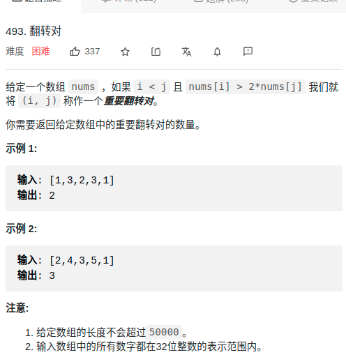
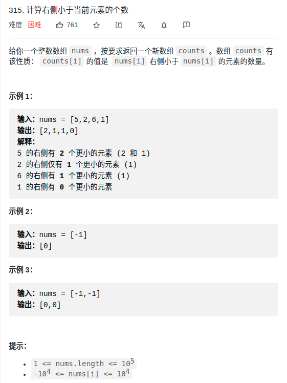
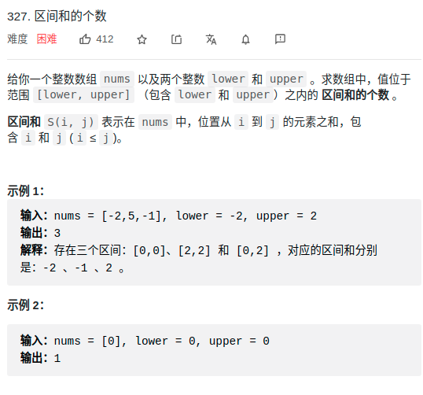

# 493. 翻转对
> 难度：简单
- 思路：
  - 归并排序 + 二分法

> 题目
<div align="center" style="zoom:80%"></div>

> 代码

```cpp
class Solution {
public:
    vector<int> temp;
    int res=0;
    int reversePairs(vector<int>& nums) {
        temp.resize(nums.size());
        sort(nums, 0, nums.size());
        return res;
    }
    void sort(vector<int>&nums, int lo, int hi){
        if(lo+1 >= hi) return;
        int mid = (lo+hi)/2;
        sort(nums, lo, mid);
        sort(nums, mid, hi);

        mergeAndCheck(nums, lo, mid, mid, hi);
    }
    void show(vector<int>& nums, int lo, int hi){
        while(lo < hi){
            cout << nums[lo] << " ";
            ++lo;
        }
    }

    // 二分查找
    int binarySearch(vector<int>& nums, int start, int end, int64_t target){
        // [lo,hi)
        int lo = start;
        int hi = end;
        /// 1. [lo,hi)下，二分查找 lo 的赋值必须 mid+1，否则会死循环
        /// 2. 只要 lo 变动过， lo-1 一定有，target > nums[lo-1]*2
        /// 3. 只要hi变动过，保证 target <= nums[hi]*2，
        /// 4. 而最终 lo == hi，所以 lo 和 hi 所在位置，为第一个使得 target <= nums[hi]*2 的地方
        while(lo < hi){
            int mid = lo +(hi - lo)/2;
            if(target > nums[mid]*2){
                lo = mid+1;
            }else if(target < nums[mid]*2){
                hi = mid;
            }else if(nums[mid]*2 == target){
                hi = mid;
            }
        }
        return hi-start;
    }


    void mergeAndCheck(vector<int>& nums, int lo1, int hi1, int lo2, int hi2){
        int pos = lo1;
        int start = lo1;
        int end = hi2;

        /// 添加的新操作，通过二分查找，在右有序数组中找到符合条件的结果数，加私货
        // 计算结果
        for(int i = lo1; i < hi1; ++i){
            res += binarySearch(nums, lo2, hi2, nums[i]);
//            for(int j = lo2; j < hi2; ++j){
//                if(nums[i] > int64_t (nums[j])*2)
//                    ++res;
//                else
//                    break;
//            }
        }

        /// 归并排序框架
        while(lo1 < hi1 && lo2 < hi2){
            if(nums[lo1] < nums[lo2]){
                temp[pos++] = nums[lo1++];
            }else{
                temp[pos++] = nums[lo2++];
            }
        }

        while(lo1 < hi1){
            temp[pos++] = nums[lo1++];
        }
        while(lo2 < hi2){
            temp[pos++] = nums[lo2++];
        }

        for(pos = start; pos != end; ++pos){
            nums[pos] = temp[pos];
        }
    }
};

```

# 315. 计算右侧小于当前元素的个数
> 难度：中等
- 需要加入辅助数组
> 题目
<div align="center" style="zoom:80%"></div>

> 代码
```cpp
class Solution {
public:
    /// 私料，辅助结构，将问题转化为对齐的归并
    /// 目的：需要记录值的原索引位置
    struct Pair{
        int index;
        int val;
    };
    vector<Pair> temp;

    /// 结果
    vector<int> count;

    vector<int> countSmaller(vector<int>& nums) {
        temp.resize(nums.size());
        count.resize(nums.size());
        vector<Pair> pairs;
        /// 将数组转化为辅助数组
        for(int i = 0; i < nums.size(); ++i){
            pairs.push_back(Pair{i, nums[i]});
        }
        sort(pairs, 0, nums.size());
        return count;
    }
    void sort(vector<Pair>& pairs, int lo, int hi){
        if( lo+1 >= hi ){
            return;
        }
        int mid = (lo + hi)/2;
        sort(pairs, lo, mid);
        sort(pairs, mid, hi);
        mergeAndDeal(pairs, lo, mid, mid, hi);
    }


    void mergeAndDeal(vector<Pair>& pairs, int lo1, int hi1, int lo2, int hi2){
        int pos = lo1;
        int start = lo1;
        int end = hi2;

        /// 归并套路，顺便处理所求
        while(lo1 < hi1 && lo2 < hi2){
            if(pairs[lo1].val > pairs[lo2].val){
                temp[pos++] = pairs[lo2++];
            }else{
                temp
                ++start;
            /// 注意这里是 <= 号，要让空间尽可能大
            while(end < hi2 && pre[end] - pre[i] <= upper_)[pos++] = pairs[lo1];
                count[pairs[lo1].index]+= lo2-hi1;
                ++lo1;
            }
        }

        while(lo1 < hi1){
            temp[pos++] = pairs[lo1];

            count[pairs[lo1].index]+= lo2-hi1;
            ++lo1;
        }

        while(lo2 < hi2){
            temp[pos++] = pairs[lo2++];
        }

        pos = start;
        while(pos < hi2){
            pairs[pos] = temp[pos];
            ++pos;
        }

    }
};
```

# 327. 区间和的个数
> 难度：困难
- 区间和：想到前缀数组
- 为什么要归并

> 题目
<div align="center" style="zoom:80%"></div>

> 代码

```cpp
class Solution {
public:
    int lower_;
    int upper_;
    int res = 0;
    vector<int> temp;
    int countRangeSum(vector<int>& nums, int lower, int upper) {
        temp.resize(nums.size()+1);
        lower_ = lower;
        upper_ = upper;
        /// 前缀和数组，总大小是 nums.size()+1
        vector<int> pre(nums.size()+1);
        for(int i = 0; i < nums.size(); ++i){
            pre[i+1] = pre[i] + nums[i];
        }

        sort(pre, 0 , pre.size());
        return res;
    }

    void sort(vector<int>& pre, int lo, int hi){
        if(lo+1 >= hi) return;
        int mid = (lo + hi) /2;
        sort(pre, lo, mid);
        sort(pre, mid, hi);
        mergeAndDeal(pre, lo, mid, mid , hi);
    }

    void mergeAndDeal(vector<int>& pre, int lo1, int hi1, int lo2, int hi2){
        int start = lo2;
        int end = lo2;

        /// 注意分析[0,0]这种情况是怎么一回事，得益于前缀和多出的那一个元素
        /// 额外私料，求取结果
        for(int i = lo1; i < hi1; ++i){
            /// 注意这里是 < 号
            while(start < hi2 && pre[start]-pre[i] < lower_)
                ++start;
            /// 注意这里是 <= 号，要让空间尽可能大
            while(end < hi2 && pre[end] - pre[i] <= upper_)
                ++end;
//            cout << i << " " <<  start << " " << end << endl;
            res += end-start;
        }


        /// 归并套路
        start = lo1;
        int pos = lo1;
        while(lo1 < hi1 || lo2 < hi2){
            if(lo1 >= hi1){
                temp[pos++] = pre[lo2++];
            }else if(lo2 >= hi2){
                temp[pos++] = pre[lo1++];
            }else if(pre[lo1] < pre[lo2]){
                temp[pos++] = pre[lo1++];
            }else{
                temp[pos++] = pre[lo2++];
            }
        }
        pos = start;
        while(pos != hi2){
            pre[pos] = temp[pos];
            pos++;
        }


    }
};
```