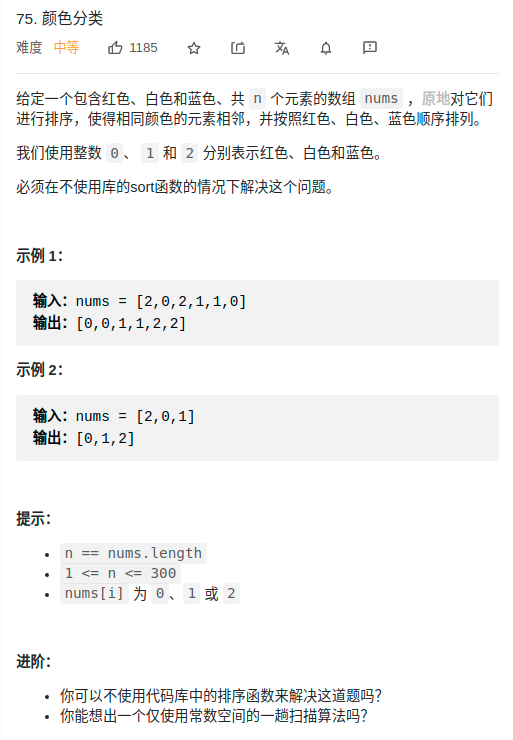

> 难度：中等
- 思路1：记录个数
  - 时间复杂度O(n)
  - 空间复杂度O(1)

- 思路2：partition 快排思想，这里因为只有三种数，连 锚点数 都可以不用选


> 题目

<div align="center" style="zoom:80%"></div>

> 代码

```cpp
class Solution {
public:
    void sortColors(vector<int>& nums) {
        // 分别指向不是 0 和 2 的临界线
        int p0,p2;
        p0 = 0; p2 = nums.size()-1;
        int i = 0;

        // 保证：<=i的部分已经排好序
        // 0的区间 [0,p0）
        // 1的区间[p0,i)
        // 2的区间[p2+1, len)
        while(i <= p2){
            if(nums[i] == 0)
                swap(nums[p0++],nums[i++]);
            else if( nums[i] == 1)
                ++i;
            else{
                // 注意i不要++避免以下情况
                //       p0    i     p2
                // 0 0 0 1 1 1 2 1 1 0
                swap(nums[p2--],nums[i]);
            }
        }
    }
};
```