- [概述](#概述)
- [区间问题](#区间问题)
  - [435.无重叠区间](#435无重叠区间)
  - [452.用最少数量的箭引爆气球](#452用最少数量的箭引爆气球)
  - [1024. 视频拼接](#1024-视频拼接)
- [跳跃游戏](#跳跃游戏)
  - [55. 跳跃游戏](#55-跳跃游戏)
  - [45. 跳跃游戏 II](#45-跳跃游戏-ii)
- [134. 加油站](#134-加油站)
- [135. 分发糖果](#135-分发糖果)


# 概述
- 贪心：**每一步都做出一个局部最优的选择，最终的结果就是全局最优**
  - 贪心算法可以认为是**动态规划算法的一个特例**，相比动态规划，使用贪心算法需要满足更多的条件（贪心选择性质），但是效率比动态规划要高
- 特点：基本也都是求最值


# 区间问题
- https://labuladong.gitee.io/algo/3/28/102/
## 435.无重叠区间
> 题目
<div align="center" style="zoom:80%">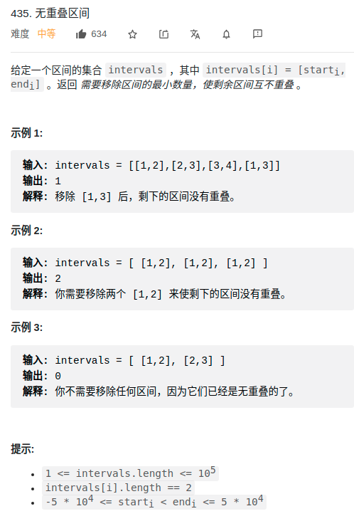</div>


- 这类题目一般先画图，然后分析题目，需要根据题意，进行某项规则的排序
  - 排序可以为贪心做保证
  - 分析：**求最少需要移除的区间数量<=====>互相不重叠的区间，最多有多少个**
- 贪心：
  - 总目标：在不重叠的情况下，尽可能的多取
  - 构造可贪心条件：根据end进行升序排序
  - 贪心体现：**每次取可选区间（不会与已选区间重合的）最早结束的**

> 代码

```cpp
class Solution {
public:
    struct cmp{
        bool operator () (vector<int> &a, vector<int> b){
            return a[1] < b[1];
        }
    };
    int eraseOverlapIntervals(vector<vector<int>>& intervals) {
        // 1. 构造贪心条件
        sort(intervals.begin(), intervals.end(), cmp());

        // 记录已有多少个不重复区间
        int res = 0;   

        while(i < intervals.size()){
            ++res;
            int j = i+1;
            // 过滤掉到可选区间之前的所有相交的区间
            while(j < intervals.size() && intervals[i][1] > intervals[j][0])
                ++j;
            // 2. 贪心体现：去当前能取区间的的最早结束的一个（排序已经保证该区间是能取到最早结束的）
            i = j;
        }
        return intervals.size()-res;
    }
};

```

## 452.用最少数量的箭引爆气球

> 题目


<div align="center" style="zoom:80%">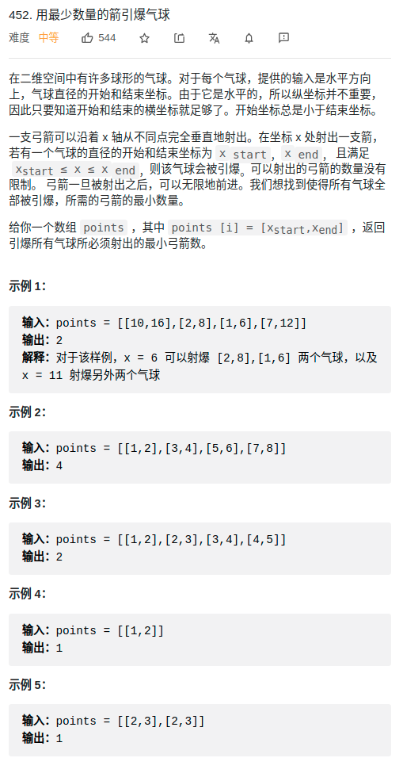</div>

- 分析：**求必须射出的最小弓箭数 <====> 互相不重叠的区间，最多有多少个**
  - 互补重叠的区间 必须用一枪，其他重叠部门都可以在其他重叠的区间顺便打了
  - 等同上面的解法
- 贪心：
  - 总目标：求得 互相不重叠的区间，最多有多少个
  - 贪心保证：按右边区间升序排序
  - 贪心体现：每次取右边区间最小的，只要和该区间有重合的，都可以一枪打爆


```cpp
 struct ops{
    bool operator()(vector<int> v1,vector<int> v2){
        return v1[1] < v2[1];
    }
};

class Solution {
public:
    int findMinArrowShots(vector<vector<int>>& points) {
        int i = 0;
        int res = 0; // 记录当前未相交集合有多少个，因为最少有多少个气球需要被单独射击 <=====> i = 0;
        // 找出最多的不相交区间，就是答案
        // 1.先排序
        sort(points.begin(),points.end(),ops());
        //
        while( i < points.size() ){
            int j = i+1;
            ++res;
            while( j < points.size() && points[j][0] <= points[i][1] ){
                ++j;
            }
            i = j;
        }
        return res;
    }
};
```

## 1024. 视频拼接
- 参考：https://labuladong.gitee.io/algo/3/28/104/

<div align="center" style="zoom:80%">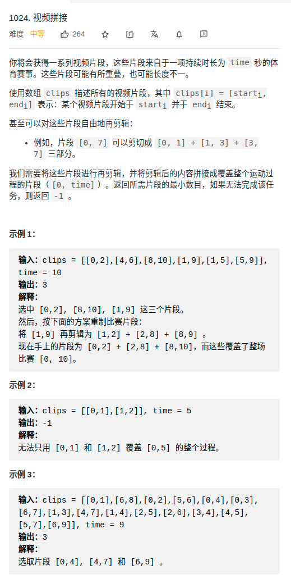</div>


- 贪心：**选取的片段最少(每次选取 片段的潜力最大)====>在选取区间的每一次选取要使得片段的结束点尽可能远**
  - 总目标：选取的片段最少
  - 贪心保证：按起点升序，终点降序
  - （贪心体现）每一步：比较所有起点小于等去 clips[0][1] 的区间，根据贪心策略，它们中**终点最大的那个区间就是第二个会被选中的视频**


<div align="center" style="zoom:80%">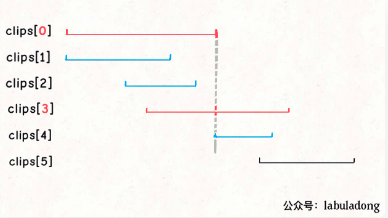</div>


```cpp
class Solution {
public:
    struct cmp{
        bool operator()(vector<int> &a, vector<int> &b){
            if( a[0] < b[0]){
                return true;
            }else if( a[0] == b[0]){
                return a[1] > b[1];
            }else{
                return false;
            }
        }
    };
    int videoStitching(vector<vector<int>>& clips, int time) {
        sort(clips.begin(), clips.end(), cmp());
        for(auto a : clips){
            cout << a[0] << " " << a[1] << endl;
        }
        int curRight = 0;   // 决定下一个可选区间(,curRight]
        int res = 0;        // 记录选择视频的个数
        int nextRight = 0;  // 记录在当前可选区间中，最优潜力的点的结束时间
        int i = 0;          // 遍历
        while(i < clips.size() && clips[i][0] <= curRight){
            // 在第 res 个视频区间内，贪心选择下一个视频
            while(i <clips.size() &&  clips[i][0] <= curRight){
                nextRight = max(nextRight, clips[i][1]);
                ++i;
            }
            ++res;// 找到视频，更新结果
            curRight = nextRight;
            if(curRight >= time){
                return res;
            }
        }
        return -1;
    }
};
```


# 跳跃游戏

## 55. 跳跃游戏
- 分析：**能不能到达最后一个下标 <=====> 能跳跃的最大长度是不是超过了最后一个下标，即求能跳跃的最大长度**

- 贪心：
  - 总目标：求能跳跃的最大长度，记为 Fast，通过局部最优最终要求得该全局最优。
  - 可选区间：从当前位置跳跃，所能到达的区间为可选区间
  - (贪心本质，局部最优)每一步：选取所能到达的point，潜力最大的（即可以跳最远的）
  - 限制：
    - `i <= Fast`


<div align="center" style="zoom:80%">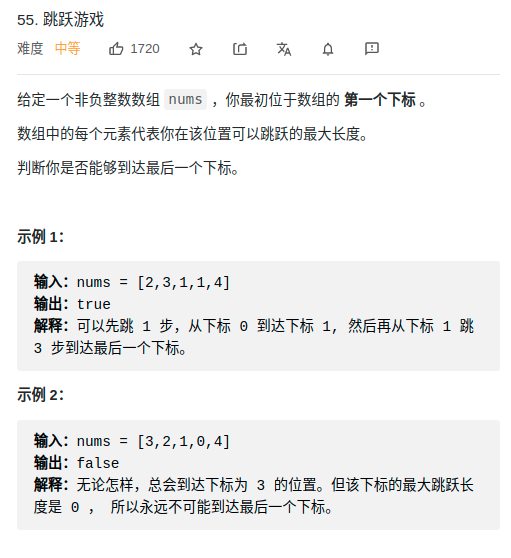</div>

```cpp
class Solution {
public:
    bool canJump(vector<int>& nums) {
        int fast = 0;// 记录能跳到的最远距离，全局最优
        int i = 0;
        while(i < nums.size()){
            if(i > fast)
                return false;
            // 计算局部最优，更新全局最优
            fast = max(fast, i+nums[i]);
            ++i;
        }
        return fast >= nums.size() -1;
    }
};
```


## 45. 跳跃游戏 II


<div align="center" style="zoom:80%">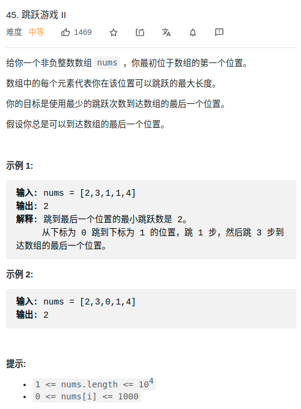</div>

- 分析：**保证可以到达最后一个位置，问最少需要跳几次 <===> 每次跳跃跳到潜力最大的一个，就可以保证跳最少次**

- 贪心：
  - 总目标：全局最优记为res，即跳跃的最小次数；每一次跳跃都跳到潜力最大的point，最终得到的结果就是跳跃的最小次数
  - 可选区间：从当前位置跳跃，可以跳到的区间
  - （贪心体现，局部最优）每一步：每一次选取可选区间中**潜力最大的为下一跳**（也就是说，**从当前位置跳跃到的那个点，在当前能跳跃到的所有点当中，能跳的更远**）
  - 限制：
    - 计算下一跳 跳的多远的时候，如果算到了结果，直接返回


```cpp
class Solution {
public:
    int jump(vector<int>& nums) {
        if(nums.size() == 1) return 0;
        int fastNext = 0; // 下一跳的最远位置
        int fastCur;  // 当前跳的最远位置
        int res = 0;        // 结果
        int i = 1;          // (cur, fastCur]试探位置
        fastCur = 0 + nums[0];
        if(fastCur >= nums.size()-1)
            return res+1;
        while(i < nums.size()-1){
            if(i > fastCur){
                // 在(cur, fastCur] 之间选择一跳
                ++res;
                fastCur = fastNext;
            }
            fastNext = max(fastNext,nums[i] + i);
            ++i;
            if(fastNext >= nums.size()-1){
                // 说明再经两跳就能到达结果， cur -第一跳-> i -第二跳-> dst
                return res+2;
            }
        }
        return res;
    }
};
```

> labuladong 解法

```cpp
int jump(int[] nums) {
    int n = nums.length;
    int end = 0;        // 记录当前可选区间
    int farthest = 0;   // 计算最大潜力
    int jumps = 0;      // 当前跳跃次数
    for (int i = 0; i < n - 1; i++) {
        farthest = Math.max(nums[i] + i, farthest);
        if (end == i) {
            jumps++;
            end = farthest;
        }
    }
    return jumps;
}
```
<div align="center" style="zoom:80%">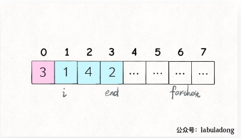</div>

# 134. 加油站
- 不是严格的贪心，倒像是利用了数学性质

<div align="center" style="zoom:80%">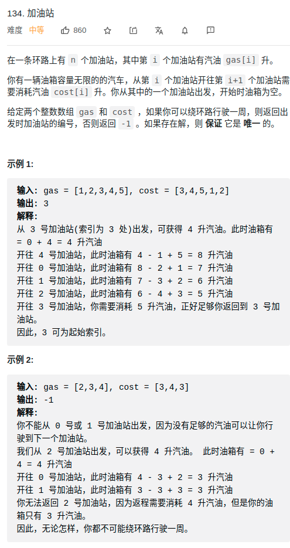</div>

- 将 `gas[i] - cost[i]` 作为经过站点 i 的油量变化值，题目描述的场景就被抽象成了一个环形数组，数组中的第 i 个元素就是 `gas[i] - cost[i]`。
  - **如果把这个「最低点」作为起点，就是说将这个点作为坐标轴原点，就相当于把图像「最大限度」向上平移了**
<div align="center" style="zoom:80%">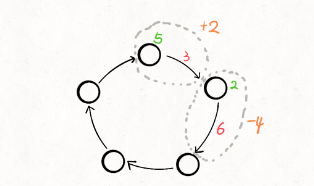</div>

<div align="center" style="zoom:80%">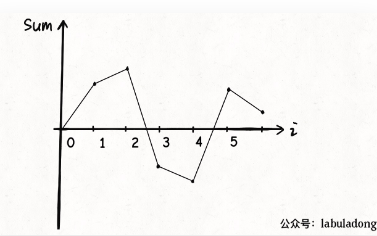</div>


<div align="center" style="zoom:80%">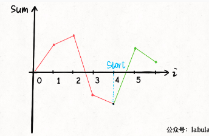</div>
<div align="center" style="zoom:80%">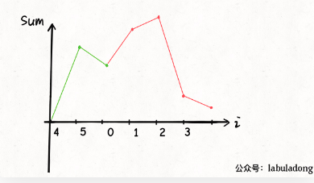</div>

- 假设油量为 tank， 则 `tank += gas[i] - cost[i]`，需要保证大于0，如果小于0，则表示没油了
- 性质：
  - 如果 gas_sum >= cost_sum，肯定有解（即使得tank都在x轴上方就行了）；如果gas_sum <= cost_sum，肯定无解
  - 如果从i开到j之后就开不动了（tank < 0），则从[i,j)之间的哪个个点出发都是开不到j的。


> 数学性质解法_找极小值

```cpp
class Solution {
public:
    int canCompleteCircuit(vector<int>& gas, vector<int>& cost) {
        int minPoint=-1;    // 注意，设置为-1
        int minVal=0;
        int tank = 0;
        for(int i = 0; i <gas.size(); ++i){
            tank += gas[i]-cost[i];
            if(tank < minVal){
                minVal = tank;
                minPoint = i;
            }
        }
        if(tank < 0) return -1;
        else return minPoint+1;

    }
};

```


> 贪心解法
- 贪心：能否开到 ===> 是不是能保证整个过程tank > 0
  - （贪心体现）每一步：都得保证 `tank += gas[i] - cost[i] >=0`，如果不行，以 i+1 作为新的start
  - 难点：最难的就是理解为什么选了新起点，遍历到数组尾部就够了，而不用循环遍历
    - 利用了数学上的性质。

```cpp
int canCompleteCircuit(int[] gas, int[] cost) {
    int n = gas.length;
    int sum = 0;
    for (int i = 0; i < n; i++) {
        sum += gas[i] - cost[i];
    }
    if (sum < 0) {
        // 总油量小于总的消耗，无解
        return -1;
    }
    // 记录油箱中的油量
    int tank = 0;
    // 记录起点
    int start = 0;
    for (int i = 0; i < n; i++) {
        tank += gas[i] - cost[i];
        if (tank < 0) {
            // 无法从 start 走到 i
            // 所以站点 i + 1 应该是起点
            tank = 0;
            start = i + 1;
        }
    }
    return start == n ? 0 : start;
}
```

# 135. 分发糖果

<div align="center" style="zoom:80%">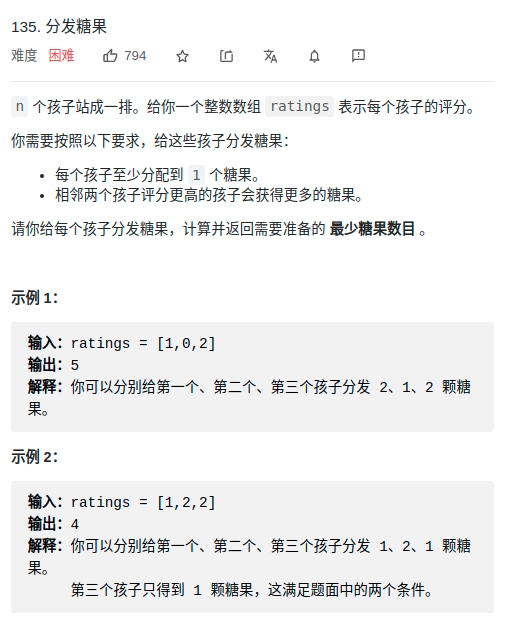</div>


- 贪心：
  - 贪心保证：减少规则。将题目规则拆分为 **左规则和右规则**，假设A在B的左边，A、B
    - 左规则：rating_B > rating_A，B的糖比A多
    - 右规则：rating_A < rating_B，A的糖比B多
  - 贪心本质：
    - 对于左规则：总目标为给的糖果最少。在满足左规则下，每个学生的最少糖果数leftCount[]
      - 先给所有学生1颗糖
      - 贪心体现：如果右边比左边分数高，则右边比左边多1颗，
    - 对于右规则：总目标为给的糖果最少。在满足右规则下，每个学生的最少糖果数rightCount[]
      - 先给所有学生1颗糖
      - 贪心体现：如果左边比右边分数高，则左边比右边多1颗，
    - 归并结果：`res[i] = max(leftCount[i], rightCount[i])`


```cpp
class Solution {
public:
    int candy(vector<int>& ratings) {
        vector<int> left,right;
        int res = 0;
        left.resize(ratings.size());
        right.resize(ratings.size());

        int i=1;
        left[0] = 1;
        for(; i < ratings.size(); ++i){
            if(ratings[i-1] < ratings[i]){
                left[i] = left[i-1]+1;
            }else{
                // ratings[i-1] >= ratings[i]
                left[i] = 1;
            }
        }

        i = ratings.size()-2;
        right[ratings.size()-1] = 1;
        for(; i >=0 ; --i){
            if(ratings[i] > ratings[i+1]){
                right[i] = right[i+1]+1;
            }else{
                // ratings[i-1] >= ratings[i]
                right[i] = 1;
            }
        }

        // 归并，取最大
        for(int i = 0; i < ratings.size(); ++i){
            res += max(left[i], right[i]);
        }
        return res;

    }
};
```