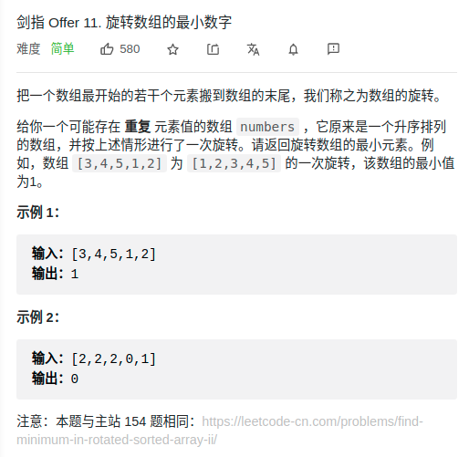

> 难度：中等
- 二分法

> 题目
<div align="center" style="zoom:80%"></div>

> 代码

```cpp
class Solution {
public:
    int minArray(vector<int>& numbers) {
        int lo = 0;
        int hi = numbers.size()-1;
        while(lo < hi){
            int mid = lo + (hi-lo)/2;
            if(numbers[mid] < numbers[hi]){
                hi = mid;
            }else if(numbers[mid] > numbers[hi]){
                // mid 不可能是最小值
                lo = mid+1;
            }else{
                hi--;
            }
        }
        return numbers[lo];
    }
};
```