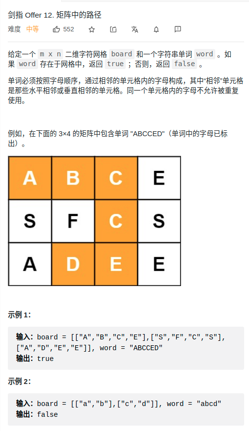

> 难度：简单
- dfs+剪枝
> 题目
<div align="center" style="zoom:80%"></div>

> 代码

```cpp
class Solution {
public:
    bool exist(vector<vector<char>>& board, string word) {
        for(int i = 0; i < board.size(); ++i){
            for(int j = 0; j < board[0].size(); ++j){
                if(dfs(board, i, j, word, 0))
                    return true;
            }
        }
        return false;
    }
    bool checkBound(vector<vector<char>> &board, int xt, int yt){
        return xt < board.size() && xt >= 0 && yt < board[0].size() && yt >= 0;
    }

    bool dfs(vector<vector<char>>& board, int x, int y, string& word, int strPos){
        if(strPos+1 == word.size() && word[strPos] == board[x][y]) return true;
        if(board[x][y] != word[strPos]) return false;

//        cout << x << " "  << y << " " << board[x][y]  << endl;
        auto t = board[x][y];
        board[x][y] = '0';
        for(int i = 0; i < 4; ++i){
            if(checkBound(board, x+dist[i][0], y+dist[i][1]) && board[x+dist[i][0]][y+dist[i][1]] != '0'){
                if(dfs(board, x+dist[i][0], y+dist[i][1], word, strPos+1))
                    return true;
            }
        }
        board[x][y] = t;
        return false;
    }

    int dist[4][2]{{0,1},{1,0},{-1,0},{0,-1}};

};

```