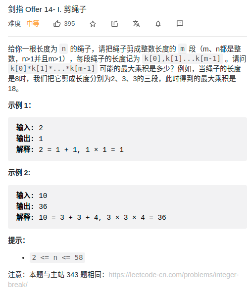

> 难度：中等
- 求最值==>DP
  - dp[i] : 长度为 i 的绳子，所能剪成的最大长度

- 对长度为 i 的绳子进行切割，第一次切割出的长度假设为 j，那么有两种情况；i 为 “状态”，j 为 “选择”，有两种情况：
  - 将 i 拆分成 j 和 i-j 的和，且 i-j 不再拆分成多个正整数，此时的乘积是 j×(i−j)；
  - 将 i 拆分成 j 和 i-j 的和，且 i-j 要拆分成多个正整数，此时的乘积是 j×dp[j-i]；


> 题目
<div align="center" style="zoom:80%"></div>

> 代码

```cpp
class Solution {
public:
    int cuttingRope(int n) {
        // dp[i] : 长度为 i 的绳子，所能剪成的最大长度
        vector<int> dp(n+1);
        dp[1] = 1;
        for(int i = 2;i <= n; ++i){
            // 至少要剪一次
            int maxVal = 0;
            for(int j = 1; i - j>=1 && j <=3; ++j){
                maxVal = max(maxVal, max(j * dp[i-j], j *(i-j)));
            }
            dp[i] = maxVal;
        }
        return dp[n];

    };
};
```

> 优化
- 当 j = 4时，`dp[i-4] * 4 = dp[i-2-2] * 2 * 2  <= dp[i-2] * 2`
  - 因为 dp[i-2] = max(dp[i-2-j]*j, (i-2-j) * j)
- 当 j = 5时，`dp[i-5] * 5 = dp[i-2-3] * 3 * 2  <= dp[i-2] * 2`
  - 因为 dp[i-2] = max(dp[i-2-j]*j, (i-2-j) * j)


- 所以，dp时，只需要遍历 j =1,2,3的情况


```cpp
class Solution {
public:
    int cuttingRope(int n) {
        // dp[i] : 长度为 i 的绳子，所能剪成的最大长度
        vector<int> dp(n+1);
        dp[1] = 1;
        for(int i = 2;i <= n; ++i){
            // 至少要剪一次
            int maxVal = 0;
            for(int j = 1; i - j>=1 && j <=3; ++j){
                maxVal = max(maxVal, max(j * dp[i-j], j *(i-j)));
            }
            dp[i] = maxVal;
        }
        return dp[n];

    };
};
```