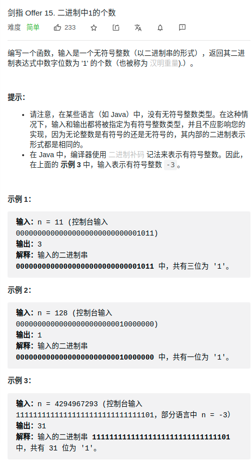

> 难度：简单
- 数学性质


> 题目
<div align="center" style="zoom:80%"></div>

> 代码

```cpp
class Solution {
public:
    int hammingWeight(uint32_t n) {
        int res = 0;
        while(n){
            n &=(n-1);
            ++res;
        }
        return res;
    }
};
```