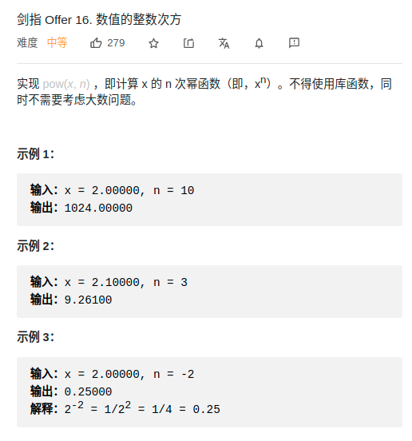

> 难度：简单

- 快速幂

> 题目
<div align="center" style="zoom:80%"></div>

> 代码

```cpp

class Solution {
public:
    double myPow(double x, int n) {
        double res = 1;
        long b = n;
        bool flag = n < 0 ? true : false;
        if(flag) b = -b;
        while(b){
            if(b & 1){
                res *= x;
            }
            x*= x;
            b >>= 1;
        }
        return flag? 1/res : res;
    }
};

```