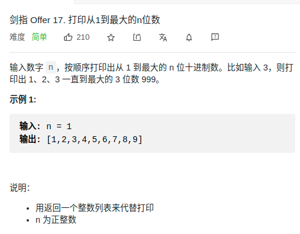

> 难度：
- ??

> 题目
<div align="center" style="zoom:80%"></div>

> 代码

```cpp

class Solution {
public:
    vector<int> printNumbers(int n) {
        if(n == 0) return {};
        int maxVal = 9;
        vector<int> res;
        while(--n){
            maxVal = maxVal * 10 +9;
        }
        for(int i = 1; i <= maxVal; ++i){
            res.push_back(i);
        }
        return res;
    }
};
```