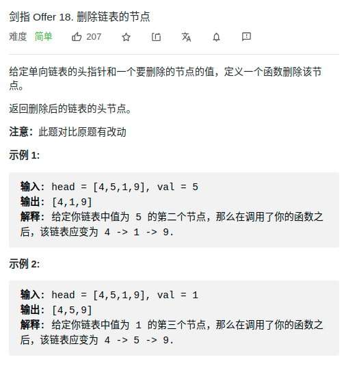

> 难度：简单

> 题目
  <div align="center" style="zoom:80%"></div>

> 代码

```cpp
class Solution {
public:
    ListNode* deleteNode(ListNode* head, int val) {
        ListNode* dummy = new ListNode();
        dummy->next = head;
        auto it = dummy;
        while(it->next != nullptr){
            if(it->next->val == val){
                it->next = it->next->next;
                break;
            }
            it = it->next;
        }
        return dummy->next;
    }
};
```