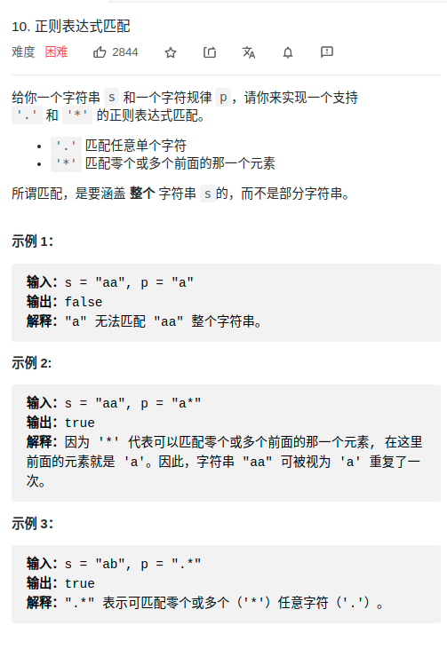

> 难度： 中等
- 思路：dp

> 题目
<div align="center" style="zoom:80%"></div>

> 代码

```cpp
class Solution {
public:
    bool isMatch(string s, string p) {
        auto res =  dp(s,0,p,0);
        return res;
    }
    unordered_map<string, bool> record;
    bool dp(string &s, int i, string &p, int j){
        cout << i << "," << j << endl;
        // base case
        if(j == p.size() && s.size() == i) return true;
        if(s.size() == i){
            // a 也能被 ab*c*匹配，所以要对这种特殊情况进行处理
            if((p.size()-j)%2 == 1)return false;
            for(int i = j; j < p.size(); j+=2){
                if(p[j+1] != '*') return false;
            }
            return true;
        }

        // trim
        if(record.count(std::to_string(i)+',' + std::to_string(j)))
            return record[std::to_string(i)+',' + std::to_string(j)];

        bool res = false;
        if(s[i] == p[j] || p[j] == '.'){
            if(j+1 < p.size()&&p[j+1] == '*')
                res = dp(s,i+1,p,j) || dp(s, i, p, j+2);
            else
                res = dp(s,i+1,p,j+1);
        }else{
            if(j+1 < p.size()&&p[j+1] == '*')
                res =dp(s,i,p,j+2);
            else
                res = false;
        }
        record[std::to_string(i)+',' + std::to_string(j)] = res;
        return res;

    }
};
```