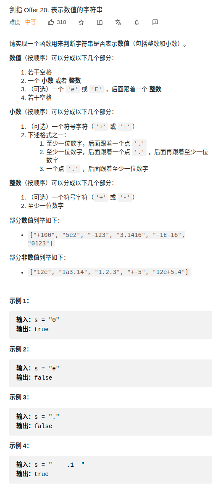

> 难度：简单
- 大量 if else

> 题目
<div align="center" style="zoom:80%"></div>

> 代码

```cpp
class Solution {
public:
    bool isNumber(string s) {
        if(s == "") return false;

        bool flag1 = false; // + - flag
        bool flag2 = false; // E e flag, after must int
        bool flag3 = false; // . flag
        bool notEnd = false;// 不能结束
        bool mustInt = false;// 必须整型
        bool frontNum = false;// 表示前面是一个数
        bool requireDig = false;
        int start= 0 ;
        int end = s.size()-1;
        while(start <= end && (s[start] == ' ' || s[end] == ' ')){
            if(s[start] == ' ') ++start;
            if(s[end] == ' ') --end;
        }
        if(start > end) return false;
        s = s.substr(start, end-start+1);

        for(int i = 0; i < s.size(); ++i){
            if(s[i] == ' ') return false;
            else if(s[i] == '+' || s[i] == '-'){
                if(flag1) return false; // 不能已经出现 '-'，在没出现 e之前
                if(frontNum) return false;// 前面如果是一个数，不能出现
                if(requireDig) return false;
                flag1 = true;
                notEnd = true;
            }else if(s[i] == 'e' || s[i] == 'E'){
                if(!frontNum|| flag2) return false;
                frontNum = false;
                flag2 = true;
                
                requireDig = false;
                flag1 = false;// 可再次出现 + -
                notEnd = true;
                mustInt = true;
            }else if(s[i] == '.') {
                if(mustInt || flag3) return false;
                if(!frontNum) notEnd = true;
                flag3 = true;
                requireDig = true;
            }else if(isdigit(s[i])) {
                requireDig = false;
                notEnd = false;
                frontNum = true;
            }else{
                return false;
            }
        }
        if(notEnd) return false;
        return true;
    }
};
```