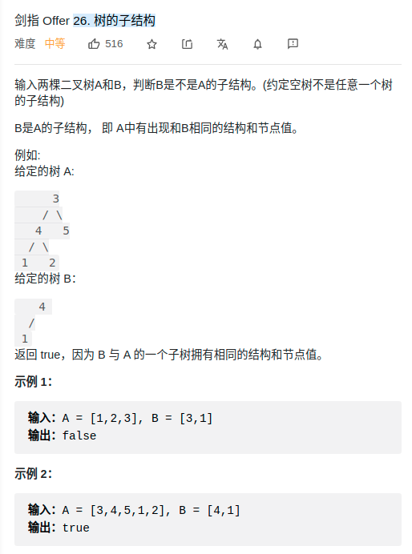

> 难度：中等
- 注意不是子树，而是子结构，不能用序列化那套


> 题目


<div align="center" style="zoom:80%"></div>


> 代码

```cpp
class Solution {
public:
    // def: 如果是，返回true
    bool isSubStructure(TreeNode* A, TreeNode* B) {
        if(B == nullptr) return false;
        if(A == nullptr) return false;
        return check(A,B) || isSubStructure(A->left, B) || isSubStructure(A->right, B);    }
    bool check(TreeNode* a, TreeNode *b){
        if(!a && !b) return true;
        if(!b) return  true;
        if(!a) return false;
        
        // cout << a->val << " " << b->val << endl;
        return a->val ==b->val &&check(a->left,b->left) && check(a->right, b->right);
    }

};

```