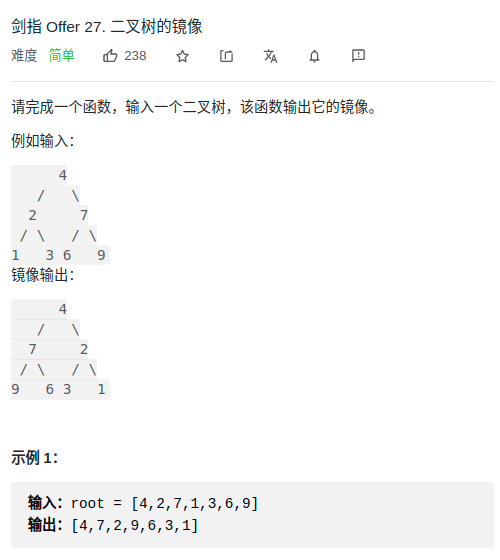

> 难度:简单


> 题目


<div align="center" style="zoom:80%"></div>

> 代码

```cpp
class Solution {
public:
    TreeNode* mirrorTree(TreeNode* root) {
            if(root == nullptr) return nullptr;
            auto lp = mirrorTree(root->left);
            auto rp = mirrorTree(root->right);

            root->left = rp;
            root->right = lp;
            return root;
    }
};
```