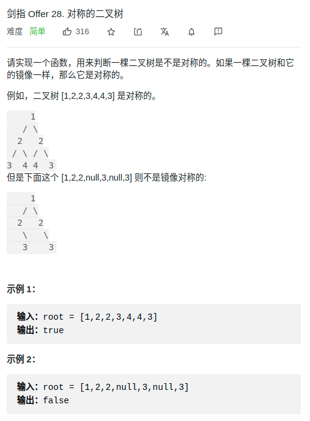

> 难度：jiandan

> 题目
<div align="center" style="zoom:80%"></div>

> 代码

```cpp
class Solution {
public:
    bool isSymmetric(TreeNode* root) {
        if(!root)return true;
        return check(root->left, root->right);
    }
    bool check(TreeNode* t1, TreeNode *t2){
        if(t1 == NULL && t2 == NULL) return true;
        if(t1 == NULL || t2 == NULL) return false;
        return t1->val == t2->val && check(t1->left, t2->right) && check(t1->right, t2->left);
    }
};
```