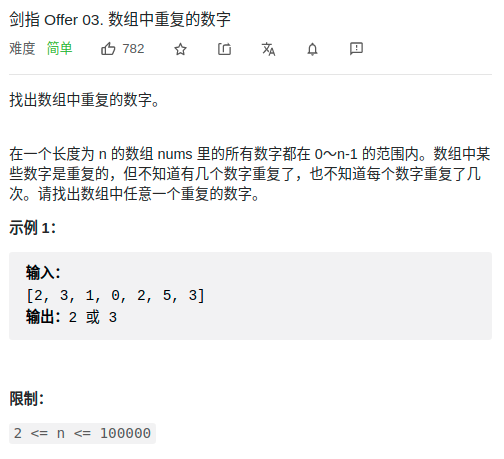

> 难度：简单
- 思路
  - hash表
  - 排序
  - **原地交换**
    - 令值与索引相同


> 题目
- 注意题目说的：数字的范围再0~n-1，这种往往可以利用其索引来特殊处理
<div align="center" style="zoom:80%"></div>


> 代码

```cpp
class Solution {
public:
    int findRepeatNumber(vector<int>& nums) {
        int i = 0;
        while(i < nums.size()){
            if(nums[i] == i)
                while(i < nums.size() &&nums[i] == i){
                    ++i;
                }
            else {
                while (i < nums.size() && nums[i] != i) {
                    // 原地交换
                    if (nums[i] == nums[nums[i]]) return nums[i];
                    swap(nums[i], nums[nums[i]]);
                }
                ++i;
            }
        }
        assert(false);
        return 0;
    }
};
```