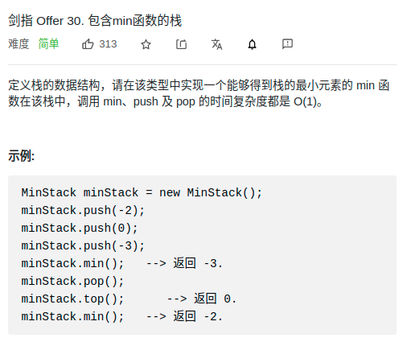

> 难度：简单
- 单调栈

> 题目
<div align="center" style="zoom:80%"></div>

> 代码

```cpp
class MinStack {
public:
    /** initialize your data structure here. */
    MinStack() {

    }

    void push(int x) {
        data_.push(x);
        if(min_.empty() || min_.top() >= x)
            min_.push(x);
    }
    void pop() {
        auto t = data_.top();
        data_.pop();
        if(t == min_.top()) min_.pop();
    }

    int top() {
        return data_.top();
    }

    int min() {
        return min_.top();
    }

private:
    stack<int> data_;
    stack<int> min_;
};
```