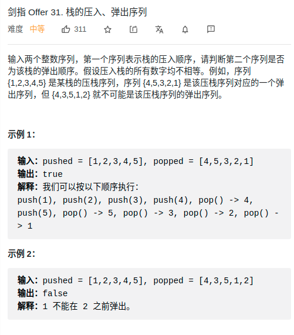

> 难度：简单
- 思路：
  - 通过一个辅助栈，模拟出入栈过程，如果最终模拟不出来，则return false

> 题目
<div align="center" style="zoom:80%"></div>

> 代码
```cpp
class Solution {
public:
    stack<int> st;
    bool validateStackSequences(vector<int>& pushed, vector<int>& popped) {
        int lo = 0;
        for(int i = 0;i < pushed.size(); ++i){
            st.push(pushed[i]);

            // 与出栈数组的索引位置相等，循环迭代出栈
            while(!st.empty() && st.top() == popped[lo]){
                // cout << st.top();
                st.pop();
                ++lo;
            }
        }
        // 最终如果不能全部出栈，则说明不通过
        if(lo != popped.size()) return false;
        return true;
    }
};
```